# Vue-CLI4 创建 Vue 项目

## 1. 准备工作

### 1.1 安装 Node.js

安装过程很简单，在官网下载安装包，点击安装，一直下一步直到安装完成即可，新版本的 Node.js 会自动添加环境变量，不需要再手动添加环境变量，如有疑问，可自行前往环境变量查看。

Node.js 官网：[https://nodejs.org/zh-cn/](https://nodejs.org/zh-cn/)

出现下图所示表示 Node 安装完成。

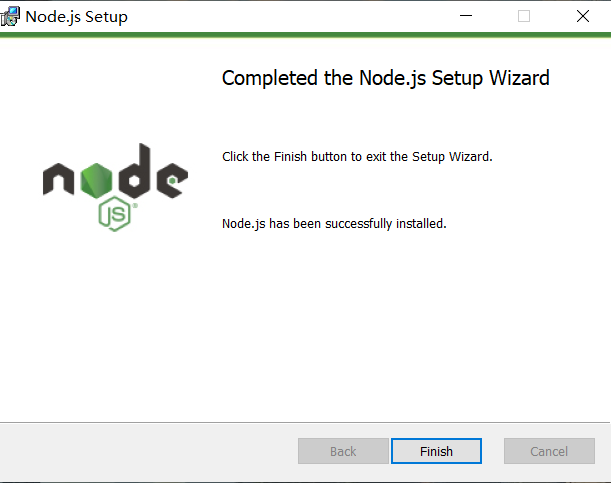

### 1.2 检查安装的 Node.js 是否成功及其版本号

进入 cmd（Windows+R 进入运行界面，输入 cmd 回车即可）窗口，在 cmd 窗口中输入命令：

    node -v

若出现 Node.js 的版本号，则表示 Node.js 安装成功

### 1.3 检查 npm 版本，并修改镜像为淘宝镜像

安装 Node 后会自动安装 npm，可以通过命令查看 npm 的版本号

    npm -v

若出现 npm 的版本号，即表示 npm 已经安装成功

在命令行输入如下命令，配置 npm 镜像为淘宝镜像(注意，目前淘宝的镜像源地址已更换为 https://registry.npmmirror.com/)

    <!-- npm config set registry https://registry.npm.taobao.org -->
    npm config set registry https://registry.npmmirror.com/

设置之后可通过如下命令查看是否成功配置为淘宝镜像

    npm config get registry

若出现淘宝镜像的 URL 路径则表示配置淘宝镜像成功

当然，也可以安装 cnpm，通过 cnpm 来执行 npm 命令，安装 cnpm 命令如下

    npm install -g cnpm --registry=https://registry.npmmirror.com/
    //--registry=https://registry.npmmirror.com/ 为淘宝的镜像地址，下载过慢时可以添加此地址
    cnpm -v  //查看cnpm是否安装成功及其版本号，若出现版本号则表示安装成功。

出现如下图所示，表示环境准备工作完成

## 2. 安装 Vue-CLI4.5

因为 Vue-CLI4.5 和之前的 3.0 以下的老版本不一样，安装命令也有所不同。

    npm install -g @vue/cli    //全局安装vue-cli最新版本

安装过程中若下载过慢，可以使用 cnpm 进行安装，或采取上述方式，在命令后加上淘宝镜像地址

安装之后查看 Vue-CLI 是否安装成功及其版本号

    vue -V   //注意，此时需要使用大写的-V，小写的-v会报错


## 3. 创建 Vue 项目

### 3.1 进入创建项目目录

根据自己的需要进入想要创建 Vue 项目的目录，然后通过 cmd 窗口执行命令

（可通过在目录窗口上方的路径地址栏中输入 cmd 进入当前目录，也可以从 c 盘逐步进入当前目录）

    vue create test001   //创建项目，test001位项目名，项目名中不允许出现大写字母

### 3.2 选择自定义配置

通过键盘中的向下箭头控制，选择 Manually select features 手动配置

如下图所示。


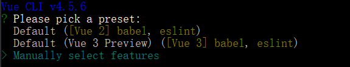

手动配置选项解释

<div class="table-box"><table><thead><tr><th>序号</th><th>选项</th><th>描述</th><th>选择</th></tr></thead><tbody><tr><td>1</td><td>Choose Vue version</td><td>选择Vue版本</td><td>Y</td></tr><tr><td>2</td><td>Babel</td><td>vue项目中普遍使用es6语法，但有时我们的项目需要兼容低版本浏览器，这时就需要引入babel插件，将es6转成es5</td><td>Y</td></tr><tr><td>3</td><td>TypeScript</td><td>TypeScript通过添加类型来扩展JavaScript。通过了解JavaScript，TypeScript可以节省您捕获错误的时间并在运行代码之前提供修复。任何浏览器，任何操作系统，任何运行JavaScript的地方。 完全开源</td><td></td></tr><tr><td>4</td><td>Progressive Web App (PWA) Support</td><td>渐进式Web应用程序（PWA）支持</td><td></td></tr><tr><td>5</td><td>Router</td><td>路由</td><td></td></tr><tr><td>6</td><td>Vuex</td><td>Vuex 是一个专为 Vue.js 应用程序开发的状态管理模式。它采用集中式存储管理应用的所有组件的状态，并以相应的规则保证状态以一种可预测的方式发生变化</td><td></td></tr><tr><td>7</td><td>CSS Pre-processors</td><td>CSS预处理器，预处理器：比如要用sass或者cssNext就要按照人家规定的语法形式，就是用人家的语法去编写，然后人家把你编写的代码转成css。</td><td></td></tr><tr><td>8</td><td>Linter / Formatter</td><td>格式化程序</td><td>Y</td></tr><tr><td>9</td><td>Unit Testing</td><td>单元测试</td><td></td></tr><tr><td>10</td><td>E2E Testing</td><td>端到端（end-to-end）</td><td></td></tr></tbody></table></div>

### 3.3 选择手动配置中的选项

向上向下箭头控制方向，空格进行选中，可选择如下配置，引入 Router 和 Vuex 以及 CSS 预处理器，选择完成回车即可


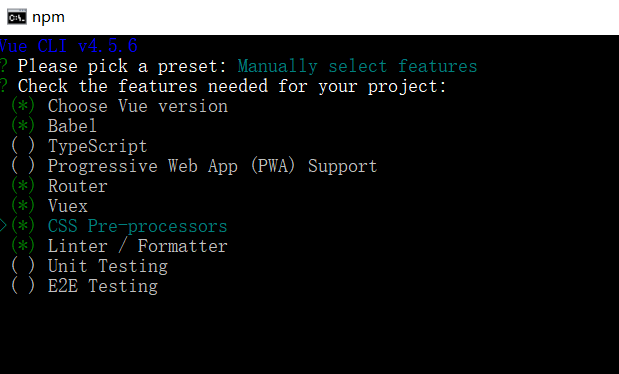

### 3.4 选择 Vue 版本

Vue 3 的生态截止目前(2021-04-08)还不太健全，建议非尝鲜项目选择 Vue 2.x。

### 3.5 选择是否使用历史模式

此处建议选择不使用，即输入 N，选择使用 hash 模式

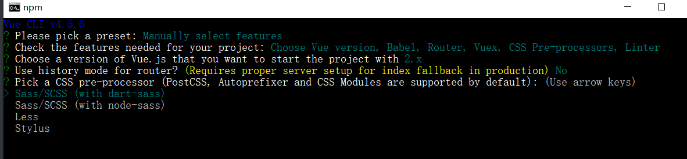

### 3.6 选择 CSS 预处理器

此处建议选择 Sass/SCSS(with dart-sass)，即直接选择回车即可。

node-sass 是自动编译实时的，dart-sass 需要保存后才会生效


### 3.7 选择 eslint 校验规则

此处建议选择默认配置，即直接回车即可。

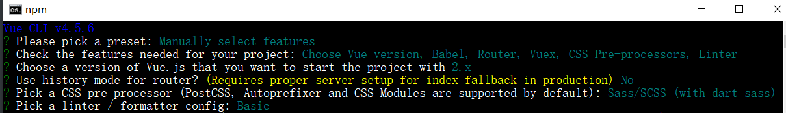

### 3.8 选择什么时候进行代码校验

此处建议选择第一个，即直接回车即可

Lint on save 保存时检查， Lint and fix on commit 提交时检查

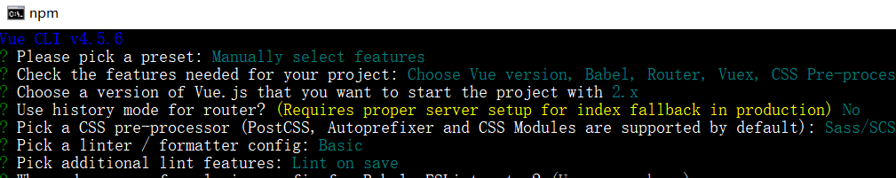

### 3.9 选择如何存放配置

此处建议选择第二个配置，即存放到 package.json 文件中。

In dedicated config files 存放到独立文件中，In package.json 存放到 package.json 中

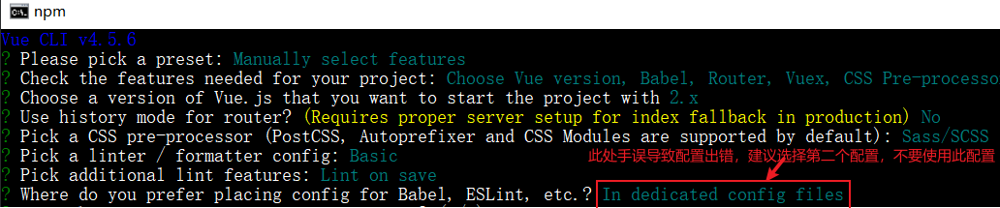

### 3.10 选择是否保存本次配置

建议选择 N，即不保存，否则以后创建项目修改不配置不太方便

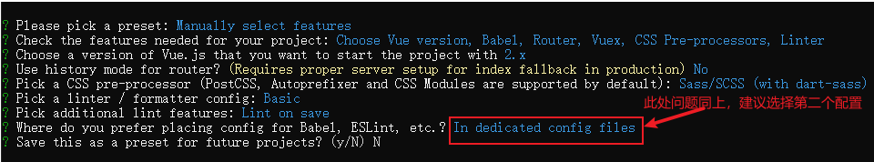

### 3.11 等待创建项目

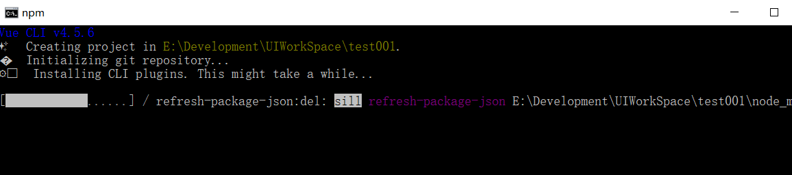

若出现如下界面，表示项目创建完成。

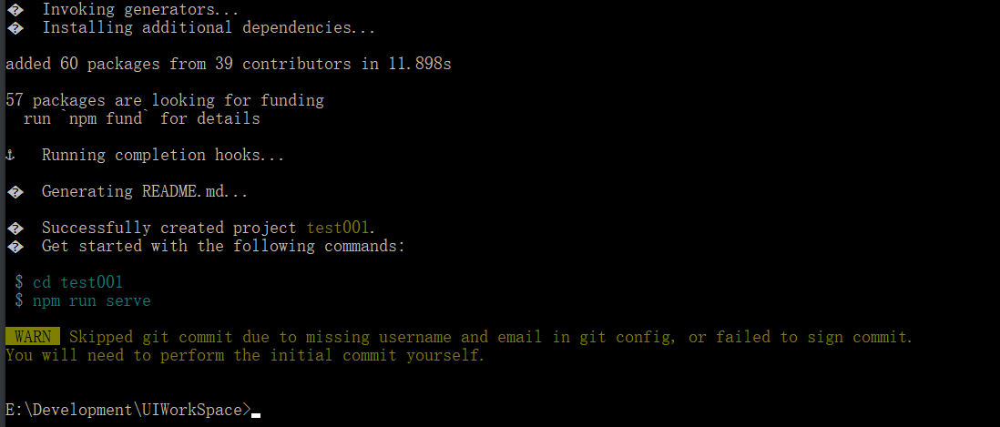

## 4. 运行创建的 Vue 项目

### 4.1 进入创建的 Vue 项目的目录

此处选择进入 test001(即创建的项目 test001 的目录)

### 4.2 在项目目录下执行命令运行项目

```
npm run serve
```

### 4.3 在浏览器中查看项目运行是否成功

在浏览器中打开上述 Vue 项目部署的地址，看到下图所示即表示项目创建运行成功。

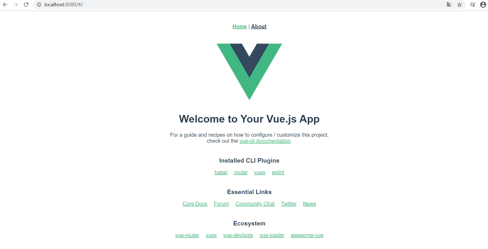

## 5. 也可以通过 vscode 打开项目，并运行项目

### 5.1 打开文件夹

在页面左上角选择 File,在下拉菜单中选择 Open Folder(打开文件夹)


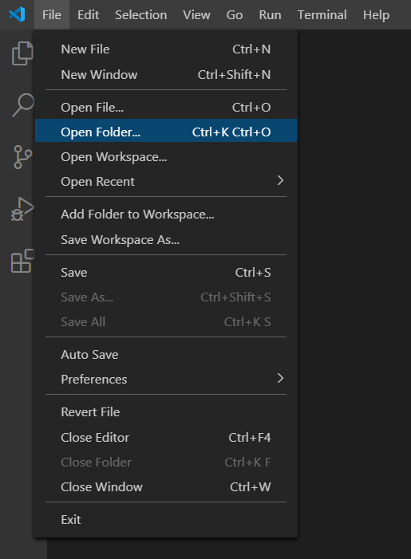

### 5.2 打开控制台

找到项目所在目录，打开，然后在页面上方选择打开新的控制台（Terminal）
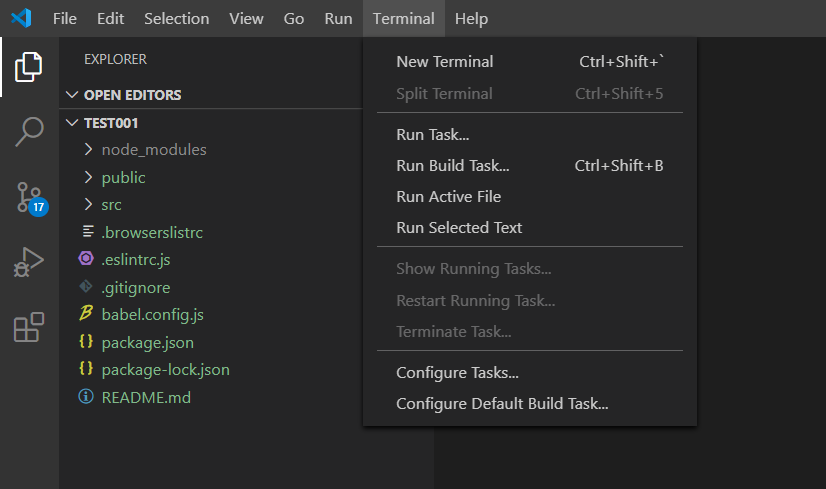
```
npm run serve   //在控制台输入此命令即可,具体命令可在package.json文件的scripts中查看
```

项目执行命令查看（vue-cli-service serve 对应的前面的属性即为 npm run 后面的属性，例如，下图中项目执行命令为 `npm run serve` ）

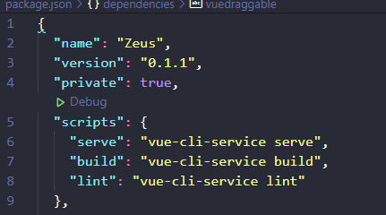

### 5.3 查看项目是否运行成功

点击项目部署地址在浏览器中打开，若出现如下图所示页面，表示项目创建运行成功
