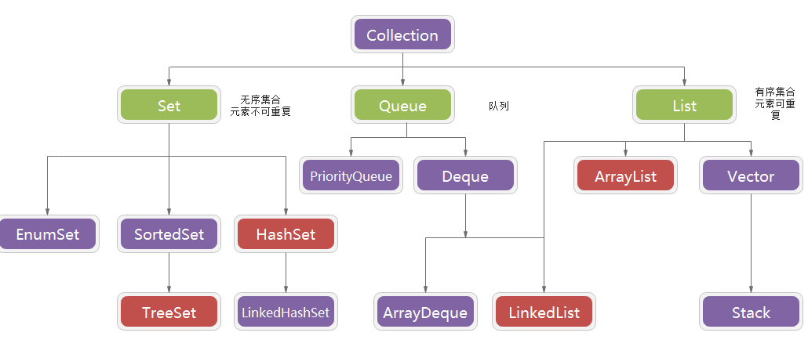
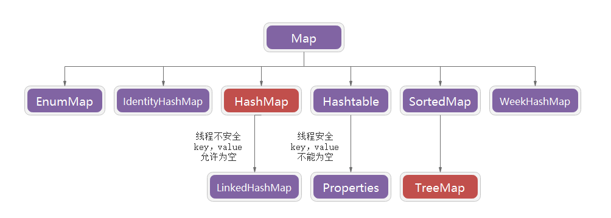

# Java 集合

## 分类

- 普通集合
- 同步集合
- 并发集合

## 普通集合

### Connection 接口


**List 有序,可重复**

```
ArrayList
优点: 底层数据结构是数组，查询快，增删慢。
缺点: 线程不安全，效率高

LinkedList
优点: 底层数据结构是双向链表，查询慢，增删快。
缺点: 线程不安全，效率高

Vector
优点: 底层数据结构是数组，查询快，增删慢。
缺点: 线程安全，效率低
```

**Set 无序,唯一**

```
HashSet
底层数据结构是哈希表。(无序,唯一)
如何来保证元素唯一性?
1.依赖两个方法：hashCode()和equals()

LinkedHashSet
底层数据结构是链表和哈希表。(FIFO插入有序,唯一)
1.由链表保证元素有序
2.由哈希表保证元素唯一

TreeSet
底层数据结构是红黑树。(唯一，有序)
```

### Map 接口

（key-value 的键值对，key 不允许重复，value 可重复，重复时会覆盖前一个 key）

**Map 中的 key：无序的、不可重复的，value：无序的、可重复的**

```
HashMap：无序的，效率高，但不是线程安全的，key和value都允许为null。

TreeMap：有序的，底层使用红黑树，保证按照添加的key-value对进行排序，实现排序遍历。此时考虑key的自然排序或定制排序。

LinkedHashMap：作为HashMap的子类，保证在遍历map元素时，可以按照添加的顺序实现遍历。因为它在原有的HashMap底层结构基础上，添加了一对指针，指向前一个和后一个。对于频繁的遍历操作，此类执行效率高于HashMap。

HashTable：线程安全的，但是效率低，不允许null值。

Map 集合即没有实现于 Collection 接口，也没有实现 Iterable 接口，所以不能对 Map 集合进行 for-each 遍历。
```


## 同步集合

同步集合可以简单地理解为通过 synchronized 来实现同步的集合。如果有多个线程调用同步集合的方法，它们将会串行执行。

- 1. Vector 是线程安全的，源码中有很多的 synchronized 可以看出，而 ArrayList 不是。导致 Vector 效率无法和 ArrayList 相比

- 2. ArrayList 和 Vector 都采用线性连续存储空间，当存储空间不足的时候，ArrayList 默认增加为原来的 50%，Vector 默认增加为原来的一倍

- 3. Vector 可以设置 capacityIncrement，而 ArrayList 不可以，从字面理解就是 capacity 容量，Increment 增加，容量增长的参数

- 4. Stack 是继承于 Vector，基于动态数组实现的一个线程安全的栈

- 5. arrayList、vector、Stack 的共性特点：随机访问速度快，插入和移除性能较差(这是数组的特点，三者的底层均为数组实现)

- 6. HashMap 是非 synchronized 的，而 Hashtable 是 synchronized 的。这说明 Hashtable 是线程安全的，而且多个线程可以共享一个 Hashtable

- 7. 由于 Hashtable 是线程安全的，也是 synchronized 的，所以在单线程环境下比 HashMap 要慢

- 8. HashMap 可以存在 null 的键值(key)和值(value),但是 Hashtable 是不可以的

**同步集合在单线程的环境下能够保证线程安全，但是通过 synchronized 同步方法将访问操作串行化，导致并发环境下效率低下。而且同步集合在多线程环境下的复合操作（迭代、条件运算如没有则添加等）是非线程安全，需要客户端代码来实现加锁。**

## 并发集合

并发集合 是 jdk5.0 重要的特性，增加了并发包 java.util.concurrent.\*。Java 内存模型、volatile 变量及 AbstractQueuedSynchronizer(简称 AQS 同步器)，是并发包众多实现的基础。

```
常见的并发集合：

1. ConcurrentHashMap：线程安全的HashMap的实现
2. CopyOnWriteArrayList：线程安全且在读操作时无锁的ArrayList
3. CopyOnWriteArraySet：基于CopyOnWriteArrayList，不添加重复元素
4. ArrayBlockingQueue：基于数组、先进先出、线程安全，可实现指定时间的阻塞读写，并且容量可以限制
5. LinkedBlockingQueue：基于链表实现，读写各用一把锁，在高并发读写操作都多的情况下，性能优于ArrayBlockingQueue
```
