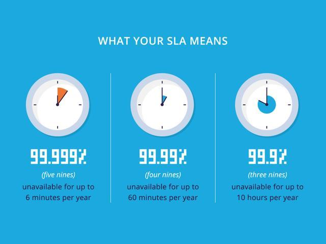
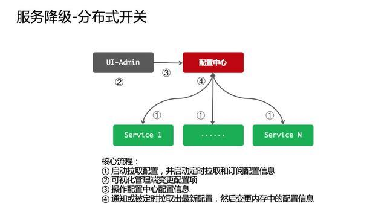
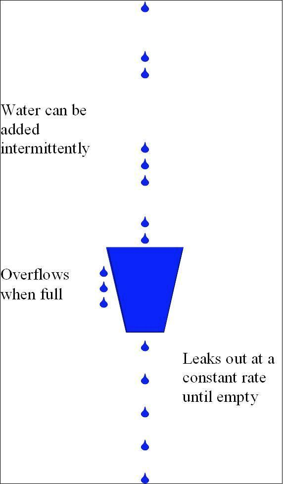
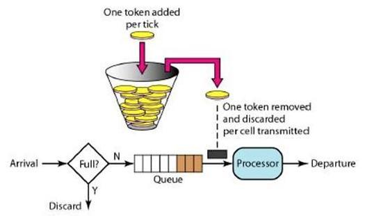
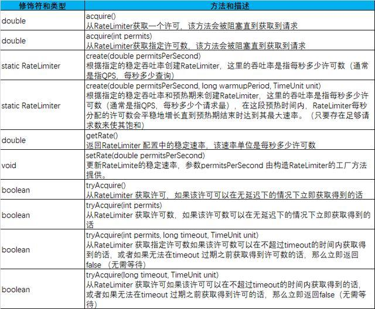

63分59秒1000亿，如何抗住双11高并发流量？
=========================

**前言**
====

今年双 11 全民购物狂欢节进入第十一个年头，1 分 36 秒，交易额冲到 100 亿 ！比 2018 年快了近 30 秒，比 2017 年快了近 1 分半！这个速度再次刷新天猫双 11 成交总额破 100 亿的纪录。  
那么如何抗住双 11 高并发流量？接下来让我们一起来聊聊高可用的“大杀器”限流降级技术。

服务等级协议
======

我们常说的 N 个 9，就是对 SLA 的一个描述。SLA 全称是 Service Level Agreement，翻译为服务水平协议，也称服务等级协议，它表明了公有云提供服务的等级以及质量。  
例如阿里云对外承诺的就是一个服务周期内集群服务可用性不低于 99.99%，如果低于这个标准，云服务公司就需要赔偿客户的损失。

做到 4 个 9 够好了吗
=============

对互联网公司来说，SLA 就是网站或者 API 服务可用性的一个保证。  
9 越多代表全年服务可用时间越长服务更可靠，4 个 9 的服务可用性，听起来已经很高了，但对于实际的业务场景，这个值可能并不够。  
我们来做一个简单的计算，假设一个核心链路依赖 20 个服务，强依赖同时没有配置任何降级，并且这 20 个服务的可用性达到 4 个 9，也就是 99.99%。  
那这个核心链路的可用性只有 99.99 的 20 次方=99.8%，如果有 10 亿次请求则有 3,000,000 次的失败请求，理想状况下，每年还是有 17 小时服务不可用。  


这是一个理想的估算，在实际的生产环境中，由于服务发布，宕机等各种各样的原因，情况肯定会比这个更差。  
对于一些比较敏感的业务，比如金融，或是对服务稳定要求较高的行业，比如订单或者支付业务，这样的情况是不能接受的。  
微服务的雪崩效应

除了对服务可用性的追求，微服务架构一个绕不过去的问题就是服务雪崩。  
在一个调用链路上，微服务架构各个服务之间组成了一个松散的整体，牵一发而动全身，服务雪崩是一个多级传导的过程。  
首先是某个服务提供者不可用，由于大量超时等待，继而导致服务调用者不可用，并且在整个链路上传导，继而导致系统瘫痪。

限流降级怎么做
=======

如同上面我们分析的，在大规模微服务架构的场景下，避免服务出现雪崩，要减少停机时间，要尽可能的提高服务可用性。  
提高服务可用性，可以从很多方向入手，比如缓存、池化、异步化、负载均衡、队列和降级熔断等手段。  
缓存以及队列等手段，增加系统的容量。限流和降级则是关心在到达系统瓶颈时系统的响应，更看重稳定性。  
缓存和异步等提高系统的战力，限流降级关注的是防御。限流和降级，具体实施方法可以归纳为八字箴言，分别是限流，降级，熔断和隔离。

限流和降级
=====

限流顾名思义，提前对各个类型的请求设置最高的 QPS 阈值，若高于设置的阈值则对该请求直接返回，不再调用后续资源。  
限流需要结合压测等，了解系统的最高水位，也是在实际开发中应用最多的一种稳定性保障手段。  
降级则是当服务器压力剧增的情况下，根据当前业务情况及流量对一些服务和页面有策略的降级，以此释放服务器资源以保证核心任务的正常运行。  
从降级配置方式上，降级一般可以分为主动降级和自动降级。主动降级是提前配置，自动降级则是系统发生故障时，如超时或者频繁失败，自动降级。  
其中，自动降级，又可以分为以下策略：  
超时降级  
失败次数降级  
故障降级  
在系统设计中，降级一般是结合系统配置中心，通过配置中心进行推送，下面是一个典型的降级通知设计。  


熔断隔离
====

如果某个目标服务调用慢或者有大量超时，此时熔断该服务的调用，对于后续调用请求，不在继续调用目标服务，直接返回，快速释放资源。  
熔断一般需要设置不同的恢复策略，如果目标服务情况好转则恢复调用。  
服务隔离与前面的三个略有区别，我们的系统通常提供了不止一个服务，但是这些服务在运行时是部署在一个实例，或者一台物理机上面的。  
如果不对服务资源做隔离，一旦一个服务出现了问题，整个系统的稳定性都会受到影响！服务隔离的目的就是避免服务之间相互影响。

一般来说，隔离要关注两方面，一个是在哪里进行隔离，另外一个是隔离哪些资源。

何处隔离：一次服务调用，涉及到的是服务提供方和调用方，我们所指的资源，也是两方的服务器等资源，服务隔离通常可以从提供方和调用方两个方面入手。

隔离什么：广义的服务隔离，不仅包括服务器资源，还包括数据库分库，缓存，索引等，这里我们只关注服务层面的隔离。

降级和熔断的区别
========

服务降级和熔断在概念上比较相近，通过两个场景，谈谈我自己的理解。

熔断，一般是停止服务：典型的就是股市的熔断，如果大盘不受控制，直接休市，不提供服务，是保护大盘的一种方式。

降级，通常是有备用方案：从北京到济南，下雨导致航班延误，我可以乘坐高铁，如果高铁票买不到，也可以乘坐汽车或者开车过去。

两者的区别：降级一般是主动的，有预见性的，熔断通常是被动的，服务 A 降级以后，一般会有服务 B 来代替，而熔断通常是针对核心链路的处理。

在实际开发中，熔断的下一步通常就是降级。

常用限流算法设计
========

刚才讲了限流的概念，那么怎样判断系统到达设置的流量阈值了？这就需要一些限流策略来支持，不同的限流算法有不同的特点，平滑程度也不同。

计数器法  
计数器法是限流算法里最简单也是最容易实现的一种算法。  
假设一个接口限制一分钟内的访问次数不能超过 100 个，维护一个计数器，每次有新的请求过来，计数器加一。  
这时候判断，如果计数器的值小于限流值，并且与上一次请求的时间间隔还在一分钟内，允许请求通过，否则拒绝请求，如果超出了时间间隔，要将计数器清零。

```
public class CounterLimiter {

    //初始时间
    private static long startTime = System.currentTimeMillis();

    //初始计数值
    private static final AtomicInteger ZERO = new AtomicInteger(0);

    //时间窗口限制
    private static final long interval = 10000;

    //限制通过请求
    private static int limit = 100;

    //请求计数
    private AtomicInteger requestCount = ZERO;

    //获取限流
    public boolean tryAcquire() {

        long now = System.currentTimeMillis();

        //在时间窗口内
        if (now < startTime + interval) {

            //判断是否超过最大请求
            if (requestCount.get() < limit) {
                requestCount.incrementAndGet();
                return true;
            }
            return false;

        } else {

            //超时重置
            startTime = now;
            requestCount = ZERO;
            return true;
        }

    }
}
```

计数器限流可以比较容易的应用在分布式环境中，用一个单点的存储来保存计数值，比如用 Redis，并且设置自动过期时间，这时候就可以统计整个集群的流量，并且进行限流。  
计数器方式的缺点是不能处理临界问题，或者说限流策略不够平滑。  
假设在限流临界点的前后，分别发送 100 个请求，实际上在计数器置 0 前后的极短时间里，处理了 200 个请求，这是一个瞬时的高峰，可能会超过系统的限制。  
计数器限流允许出现 2\*permitsPerSecond 的突发流量，可以使用滑动窗口算法去优化，具体不展开。

漏桶算法
====

假设我们有一个固定容量的桶，桶底部可以漏水（忽略气压等，不是物理问题），并且这个漏水的速率可控的，那么我们可以通过这个桶来控制请求速度，也就是漏水的速度。  
我们不关心流进来的水，也就是外部请求有多少，桶满了之后，多余的水会溢出。  
漏桶算法的示意图如下：  


将算法中的水换成实际应用中的请求，可以看到漏桶算法从入口限制了请求的速度。  
使用漏桶算法，我们可以保证接口会以一个常速速率来处理请求，所以漏桶算法不会出现临界问题。  
这里简单实现一下，也可以使用 Guava 的 SmoothWarmingUp 类，可以更好的控制漏桶算法：

```
public class LeakyLimiter {

    //桶的容量
    private int capacity;

    //漏水速度
    private int ratePerMillSecond;

    //水量
    private double water;

    //上次漏水时间
    private long lastLeakTime;

    public LeakyLimiter(int capacity, int ratePerMillSecond) {

        this.capacity = capacity;
        this.ratePerMillSecond = ratePerMillSecond;
        this.water = 0;
    }

    //获取限流
    public boolean tryAcquire() {

        //执行漏水，更新剩余水量
        refresh();

        //尝试加水，水满则拒绝
        if (water + 1 > capacity) {
            return false;
        }

        water = water + 1;
        return true;

    }

    private void refresh() {
        //当前时间
        long currentTime = System.currentTimeMillis();

        if (currentTime > lastLeakTime) {

            //距上次漏水的时间间隔
            long millisSinceLastLeak = currentTime - lastLeakTime;
            long leaks = millisSinceLastLeak * ratePerMillSecond;

            //允许漏水
            if (leaks > 0) {
                //已经漏光
                if (water <= leaks) {
                    water = 0;
                } else {
                    water = water - leaks;
                }
                this.lastLeakTime = currentTime;
            }
        }
    }
}
```

令牌桶算法
=====

漏桶是控制水流入的速度，令牌桶则是控制留出，通过控制 Token，调节流量。  
假设一个大小恒定的桶，桶里存放着令牌（Token）。桶一开始是空的，现在以一个固定的速率往桶里填充，直到达到桶的容量，多余的令牌将会被丢弃。  
如果令牌不被消耗，或者被消耗的速度小于产生的速度，令牌就会不断地增多，直到把桶填满。后面再产生的令牌就会从桶中溢出。  


最后桶中可以保存的最大令牌数永远不会超过桶的大小，每当一个请求过来时，就会尝试从桶里移除一个令牌，如果没有令牌的话，请求无法通过。

```
public class TokenBucketLimiter {

    private long capacity;
    private long windowTimeInSeconds;
    long lastRefillTimeStamp;
    long refillCountPerSecond;
    long availableTokens;

    public TokenBucketLimiter(long capacity, long windowTimeInSeconds) {
        this.capacity = capacity;
        this.windowTimeInSeconds = windowTimeInSeconds;
        lastRefillTimeStamp = System.currentTimeMillis();
        refillCountPerSecond = capacity / windowTimeInSeconds;
        availableTokens = 0;
    }

    public long getAvailableTokens() {
        return this.availableTokens;
    }

    public boolean tryAcquire() {

        //更新令牌桶
        refill();

        if (availableTokens > 0) {
            --availableTokens;
            return true;
        } else {
            return false;
        }
    }

    private void refill() {
        long now = System.currentTimeMillis();

        if (now > lastRefillTimeStamp) {

            long elapsedTime = now - lastRefillTimeStamp;

            int tokensToBeAdded = (int) ((elapsedTime / 1000) * refillCountPerSecond);

            if (tokensToBeAdded > 0) {
                availableTokens = Math.min(capacity, availableTokens + tokensToBeAdded);
                lastRefillTimeStamp = now;
            }
        }
    }
}
```

这两种算法的主要区别在于漏桶算法能够强行限制数据的传输速率，而令牌桶算法在能够限制数据的平均传输速率外，还允许某种程度的突发传输。

在令牌桶算法中，只要令牌桶中存在令牌，那么就允许突发地传输数据直到达到用户配置的门限，因此它适合于具有突发特性的流量。

漏桶和令牌桶的比较
=========

漏桶和令牌桶算法实现可以一样，但是方向是相反的，对于相同的参数得到的限流效果是一样的。  
主要区别在于令牌桶允许一定程度的突发，漏桶主要目的是平滑流入速率，考虑一个临界场景，令牌桶内积累了 100 个 Token，可以在一瞬间通过。  
但是因为下一秒产生 Token 的速度是固定的，所以令牌桶允许出现瞬间出现 permitsPerSecond 的流量，但是不会出现 2\*permitsPerSecond 的流量，漏桶的速度则始终是平滑的。

使用 RateLimiter 实现限流
===================

Google 开源工具包 Guava 提供了限流工具类 RateLimiter，该类基于令牌桶算法实现流量限制，使用方便。  
RateLimiter 使用的是令牌桶的流控算法，RateLimiter 会按照一定的频率往桶里扔令牌，线程拿到令牌才能执行。  
比如你希望自己的应用程序 QPS 不要超过 1000，那么 RateLimiter 设置 1000 的速率后，就会每秒往桶里扔 1000 个令牌，看下方法的说明：  


RateLimter 提供的 API 可以直接应用，其中 acquire 会阻塞，类似 JUC 的信号量 Semphore，tryAcquire 方法则是非阻塞的：

```
public class RateLimiterTest {

    public static void main(String[] args) throws InterruptedException {

        //允许10个，permitsPerSecond
        RateLimiter limiter = RateLimiter.create(10);

        for(int i=1;i<20;i++){
            if (limiter.tryAcquire(1)){
                System.out.println("第"+i+"次请求成功");
            }else{
                System.out.println("第"+i+"次请求拒绝");
            }
        }
    }
}

```

**总结**
====

本文从服务可用性开始，分析了在业务高峰期通过限流降级保障服务高可用的重要性。  
接下来分别探讨了限流，降级，熔断，隔离的概念和应用，并且介绍了常用的限流策略。
