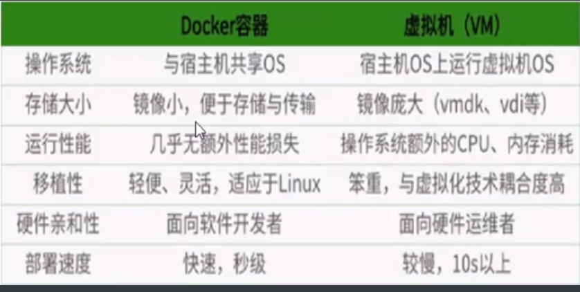

# 启动 Docker 容器测试 helloworld 及 Docker 和虚拟机的区别

## 启动 docker 后台容器，测试运行 helloWorld

```
//使用下面的命令运行helloWorld
docker run hello-world
//成功会出现下方信息
Unable to find image 'hello-world:latest' locally
latest: Pulling from library/hello-world
1b930d010525: Pull complete
Digest: sha256:5df8ca8a7e309c256d60d7971ea14c27672fc0d10c5f303856d7bc48f8cc17ff
    Status: Downloaded newer image for hello-world:latest

Hello from Docker!
    This message shows that your installation appears to be working correctly.
```

## Docker 和虚拟机的区别

<!--  -->

<!--  -->


