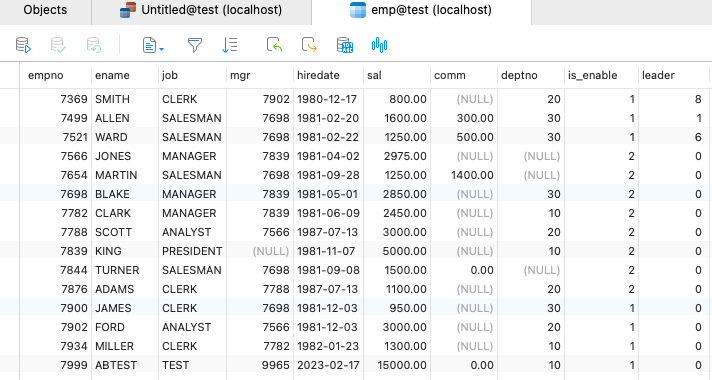
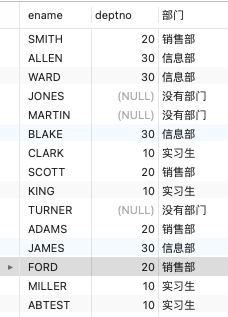
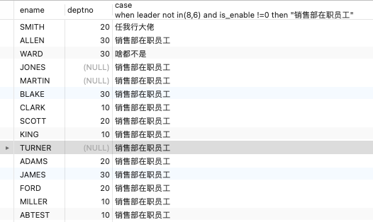

**如果你想查看更多 Mysql 常用函数及操作语法格式可以在以下文章找找哦**

- [Mysql常用操作语句汇总](./59.Mysql常用操作语句汇总.md)

- [Mysql常用函数的汇总](./01.Mysql常用函数汇总.md)

case 的作用
--------

*   if 的高级版，类似Java 里面的  switch ... case 
*   通过条件表达式匹配 case 对应的值，然后执行对应的操作

简单的 case 的语法格式
--------------

只有一个条件表达式

```
CASE  <表达式>
   WHEN <值1> THEN <操作>
   WHEN <值2> THEN <操作>
   ...
   ELSE <操作>
END;
```

#### 语法格式说明

*   将 <表达式> 的值 逐一和 每个 when 跟的 <值> 进行比较
*   如果跟某个<值>想等，则执行它后面的 <操作> ，如果所有 when 的值都不匹配，则执行 else 的操作
*   如果 when 的值都不匹配，且没写 else，则会报错

先看看emp表有什么数据
------------



简单 case 的栗子：
------------

根据部门id进行判断部门名称

```
SELECT ename,deptno,
CASE
        deptno 
        WHEN 10 THEN
        "实习生" 
        WHEN 20 THEN
        "销售部" 
        WHEN 30 THEN
        "信息部" 
        WHEN 40 THEN
        "财务部" ELSE "没有部门" 
    END AS "部门" 
FROM
    emp;
```



可搜索 case 的语法格式
--------------

```
CASE
    WHEN <条件1> THEN <操作>
    WHEN <条件2> THEN <操作>
    ...
    ELSE <操作>
END;
```

#### 语法格式说明

*   每个 <条件> 都是独立的，可以用 and 来连接多个查询条件
*   不同 <条件> 是互不关联且互不影响的

可搜索 case 的栗子
------------

每个条件都是不一样的，可以任意指定查询条件，可简单可复杂

```
select ename,deptno,
case 
when leader not in(8,6) and is_enable !=0 then "销售部在职员工"
when deptno  = 7521 and leader  = 0 then "信息部大佬"
when leader  = 8 then "任我行大佬"
else "啥都不是"
end
from emp;
```



重点
--

**记得结尾要加 end ！！！！**
**记得结尾要加 end ！！！！**
**记得结尾要加 end ！！！！**
