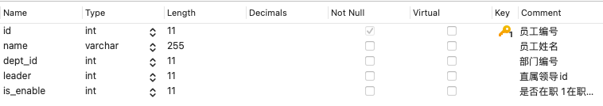

**如果你想查看更多 Mysql 常用函数及操作语法格式可以在以下文章找找哦**

- [Mysql常用操作语句汇总](./59.Mysql常用操作语句汇总.md)

- [Mysql常用函数的汇总](./01.Mysql常用函数汇总.md)

**前言**
------

*   终于讲完基础的查询语句了...这篇讲的就是插入数据
*   insert 属于DML语句（数据操纵语句）

insert ... values 的语法格式
-----------------------

```
INSERT INTO <表名> [ <列名1> [ , … <列名n>] ]
VALUES (值1) [… , (值n) ];
```

#### 语法格式说明

*   <列名>：可以不指定，默认指定表的所有列名
*   values：字段有多少个，值就要有多少个，且顺序要对应，否则会报错

insert .. set 的语法格式
-------------------

这个用的不多哈，了解为主；

```
INSERT INTO <表名>
SET <列名1> = <值1>,
        <列名2> = <值2>,
        …
```

两种语法格式的区别
---------

 insert .. values 可以插入任意行数据，而 insert ... set 每次只能插入一行数据

看看 emp 表的结构，方便后面栗子演示
--------------------



栗子一：不指定字段，添加记录
--------------

```
INSERT INTO emp
VALUES
    ( "20", "员工1", 3, 1, 1 );
```

栗子二：指定所有字段，添加记录
---------------

```
INSERT INTO emp ( id, NAME, dept_id, leader, is_enable )
VALUES
    ( "20", "员工1", 3, 1, 1 );
```

上面两个栗子添加的记录数据是一样的哦，只是一个指定了所有字段，另一个是不指定任何字段

#### 知识点

*   指定多个字段时，字段的顺序可以随意，不需要按照表定义的顺序来写，但要**保证 values 的顺序和字段的顺序相同**！
*   指定的字段**不用加**单引号或者双引号，否则会报错

#### 常见错误写法

特别在写代码的时候，经常需要字符串连接，一不留意就会用引号把字段名括起来，这样是不对的哦！

```
INSERT INTO emp ( 'id', 'name' )
VALUES
    ( "20", "员工1");

报错信息：
INSERT INTO emp ( 'id', 'name' )
VALUES
    ( "20", "员工1")
> 1064 - You have an error in your SQL syntax; check the manual that corresponds to your MySQL server version for the right syntax to use near ''id', 'name' )
VALUES
    ( "20", "员工1")' at line 1
> Time: 0s
```

栗子三：复制表数据来插入
------------

```
INSERT INTO emp ( id, NAME, dept_id, leader, is_enable ) SELECT
15,
NAME,
dept_id,
leader,
is_enable 
FROM
    emp 
WHERE
    id = 1;
```

#### 主要的语法格式

```
insert into <表名> [<字段名>,<字段名>..] select ....
```

**注意：** 如果是复制表数据的话，**不用加 values()** ！
