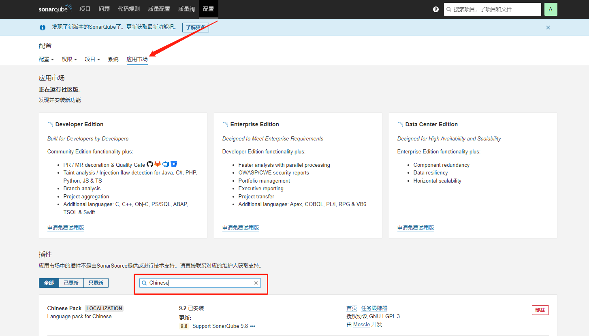
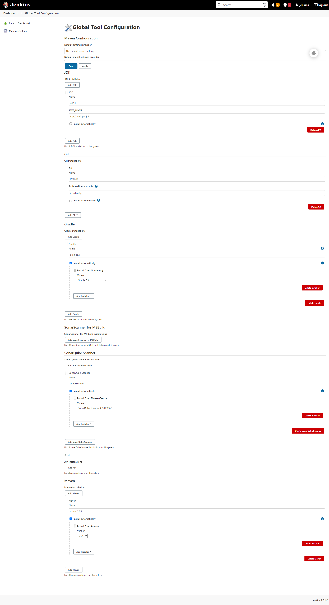

持续代码审查平台搭建（Sonarqube+Jenkins+Gitlab）
 
**目录**
##### <a href="#前言">前言</a>
##### <a href="#前提条件">前提条件</a>
##### <a href="#Sonarqube安装">Sonarqube安装</a>
##### <a href="#Jenkins安装">Jenkins安装</a>

# 前言
代码审查可以尽早发现 Bug 和设计中存在的问题，问题发现得越晚，修复的代价越大。代码审查把问题的发现尽量提前，减少项目维护成本和提高工作效能。

代码审查分为人工审查和机器审查，本篇主要讲解机器审查的平台搭建，集成三个开源工具Sonarqube+Jenkins+Gitlab来实现静态代码审查。

# 前提条件

### 一、安装java
```
1. 下载java，安装（注意系统版本32、64）
2. 解压压缩包，将压缩包移动至/usr/local/目录下：
3. 配置环境变量：vi /etc/profile,在文件末尾加入如下内容：
export JAVA_HOME=/usr/local/jdk1.8.0_211 
export CLASSPATH=.:$JAVA_HOME/lib:$JRE_HOME/lib:$CLASSPATH 
export PATH=$JAVA_HOME/bin:$JRE_HOME/bin:$PATH 
export JRE_HOME=$JAVA_HOME/jre
4. 使环境变量生效：source /etc/profile
```

### 二、安装gradle
```
1. 下载gradle[https://gradle.org/releases/](https://gradle.org/releases/)
2. 解压压缩包，将压缩包移动至/usr/local/目录下
3. 配置环境变量： vi /etc/profile 在文件末尾加入如下内容：
export GRADLE_HOME=/usr/local/gradle-version
export PATH=$GRADLE_HOME/bin:$PATH
4. 使环境变量生效：source /etc/profile
5. 编辑gradle配置文件：  
vi /usr/local/gradle-version/bin/gradle  
在70行上面加入： JAVA\_HOME=/usr/local/jdk1.8.0\_211  
【此步骤非必要步骤，在jenkins运行到gradle，提示JAVA\_HOME相关错误信息时，可以通过此方式解决】
```

# Sonarqube安装

1、系统配置，避免启动问题

```
# 系统配置，避免启动问题
echo "vm.max_map_count=262144" >> /etc/sysctl.conf
sysctl -p

```

2、创建挂载目录

```
# 创建目录
mkdir -p ~/sonarqube && cd ~/sonarqube
 
# 创建所有的sonarqube映射文件
mkdir -p ~/sonarqube/postgres && \
mkdir -p ~/sonarqube/data && \
mkdir -p ~/sonarqube/extensions && \
mkdir -p ~/sonarqube/logs && \
mkdir -p ~/sonarqube/conf
 
# 创建数据库挂载
mkdir -p ~/sonarqube/postgresql &&\
mkdir -p ~/sonarqube/datasql
 
# 目录设置为 777 权限，避免权限问题
chmod 777 ./*

```

3、创建 docker-compose.yml 文件

在sonarqube目录下，将以下内如复制到yml文件：`vim ~/sonarqube/docker-compose.yml`

```
version: '3'
services: 
  postgres: 
    image: postgres
    restart: always
    container_name: sonarqube_postgres
    ports:
      - 5432:5432
    volumes:
      - ~/sonarqube/postgresql/:/var/lib/postgresql
      - ~/sonarqube/datasql/:/var/lib/postgresql/data
    environment:
      TZ: Asia/Shanghai    
      POSTGRES_USER: sonar   
      POSTGRES_PASSWORD: sonar
      POSTGRES_DB: sonar
    networks: 
      - sonar-network
  sonar:
    image: sonarqube
    restart: always 
    container_name: sonarqube
    depends_on:
      - postgres
    volumes:
      - ~/sonarqube/extensions:/opt/sonarqube/extensions
      - ~/sonarqube/logs:/opt/sonarqube/logs
      - ~/sonarqube/data:/opt/sonarqube/data
      - ~/sonarqube/conf:/opt/sonarqube/conf
    ports:
      - 9000:9000
    environment:
      SONARQUBE_JDBC_USERNAME: sonar
      SONARQUBE_JDBC_PASSWORD: sonar
      SONARQUBE_JDBC_URL: jdbc:postgresql://postgres:5432/sonar
    networks: 
      - sonar-network
networks:
  sonar-network:
    driver: bridge

```

4、docker-compose 用法

启动：docker-compose up -d  
停止：docker-compose down

启动：docker-compose start  
停止：docker-compose stop

```
[root@root sonarqube]# docker-compose up -d
Removing network sonarqube_sonar-network
Creating network "sonarqube_sonar-network" with driver "bridge"
Creating sonarqube_postgres ... done
Creating sonarqube          ... done

```

5、浏览器访问：ip+端口，如：xxx.xxx.xxx.xxx:9000

管理员账号密码都是：admin

6、安装插件等  
这里采用单独下载插件jar包的方式来安装各种插件  
上传至该目录：`~/sonarqube/extensions/downloads`,然后重启：docker-compose restart

实现的结果是会在`~/sonarqube/extensions`目录下新创建一个plugins目录，然后把同级别的downloads目录下的插件jar包给移动到plugins目录下
例如：这里安卓语言包



# Jenkins安装配置

1、创建挂载目录

创建并进入目录
```
mkdir -p ~/jenkins && cd ~/jenkins
```

目录设置为 777 权限，避免权限问题

```chmod 777 ./*```

3、创建 docker-compose.yml 文件

```vim ~/jenkins/docker-compose.yml```

```
version: '3.1'
services:
 jenkins:
  restart: always
  container_name: jenkins
  image: jenkins/jenkins:2.319.3-lts-jdk11
  volumes:
   - ~/jenkins/:/var/jenkins_home
   - ~/jenkins/workspace/:/root/.jenkins/workspace \
   - /var/run/docker.sock:/var/run/docker.sock
   - /usr/bin/docker:/usr/bin/docker
   - /usr/lib/x86_64-linux-gnu/libltdl.so.7:/usr/lib/x86_64-linux-gnu/libltdl.so.7
   - /usr/local/jenkins/workspace/:/root/.jenkins/workspace \
   - /usr/bin/git:/usr/bin/git \
   - /usr/local/jdk1.8:/usr/local/jdk1.8 \
   - /usr/local/maven3:/usr/local/maven3
  ports:
   - 18080:8080
   - 15001:50000
  expose:
   - 18080
   - 150000
  privileged: true
  user: root
  restart: always
  container_name: jenkins
  environment:
   JAVA_OPTS: '-Djava.util.logging.config.file=/var/jenkins_home/log.properties'

docker.sock 守护进程文件
–restart=always 设置自动重启命令
–name jenkins 给这个容器起一个名称，jenkins:latest指定版本进行安装
/usr/usr/git git安装的目录
/usr/local/jdk1.8 JDK安装的目录
/usr/local/maven3 maven3 安装的目录
\ 表示shell脚本换行转义符
cat secrets/initialAdminPassword 查看密码

```

4、配置镜像加速，进入 cd ~/jenkins 目录。

```
cd ~/jenkins
```

修改 vi hudson.model.UpdateCenter.xml里的内容

将 url 修改为 清华大学官方镜像
```
https://mirrors.tuna.tsinghua.edu.cn/jenkins/updates/update-center.json
```

修改后
```
<?xml version='1.1' encoding='UTF-8'?>
<sites>
  <site>
    <id>default</id>
    <url>https://mirrors.tuna.tsinghua.edu.cn/jenkins/updates/update-center.json</url>
  </site>
</sites>
```

修改updetes/default.json文件
```
http://www.google.com/ 改成 http://www.baidu.com/

https://updates.jenkins.io/download 全部替换成 http://mirrors.tuna.tsinghua.edu.cn/jenkins
```



```
#SonarQube 实例名称，唯一
sonar.projectKey=${JOB_NAME}
#项目名称
sonar.projectName=${JOB_NAME}
#版本号
sonar.projectVersion=1.0
#指定扫描目录
sonar.sources=.
sonar.exclusions=**/test/**
#jdk版本
sonar.java.source=1.8
sonar.java.target=1.8
#扫描编写类的项目
sonar.java.binaries=target/classes
#编码格式
sonar.sourceEncoding=UTF-8
sonar.language=python
```
