### 4.1 General

会自动填入上面配置的Gitee链接
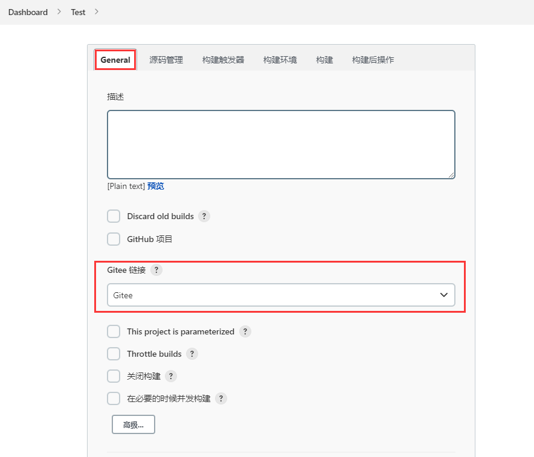

### 4.2 源码管理

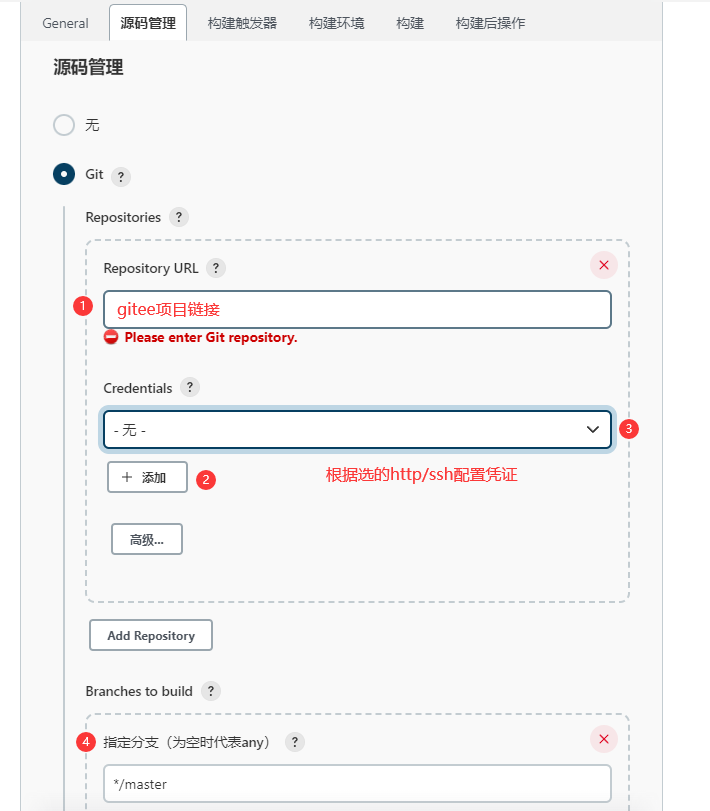

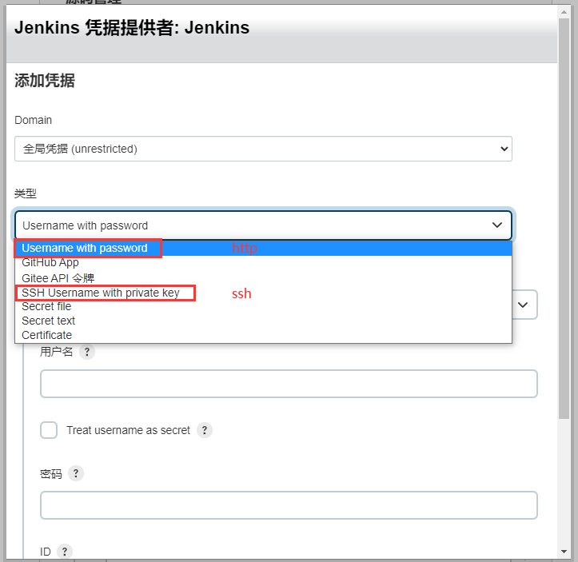

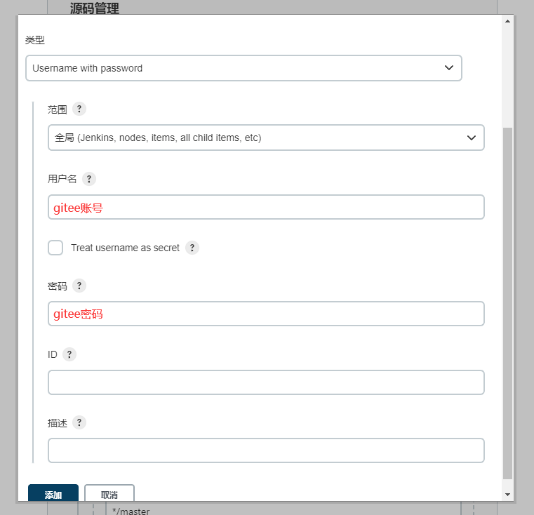

### 4.3构建

注意这里**GradleVersion要跟安卓项目中使用的Gradle版本一致**，否则编译可能会出错。

构建命令一般是先clean，然后assembleRelease-打Release版本的包，或者assembleDebug-打Debug版本的包。

构建 - Invoke Gradle script

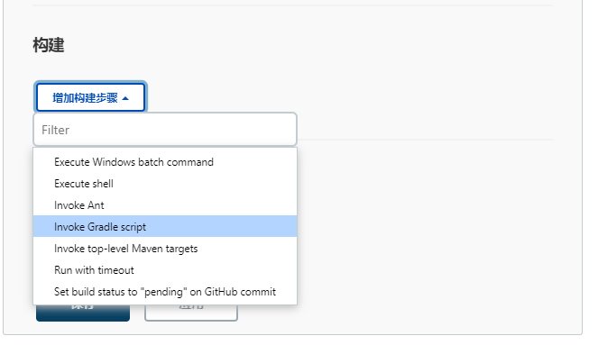
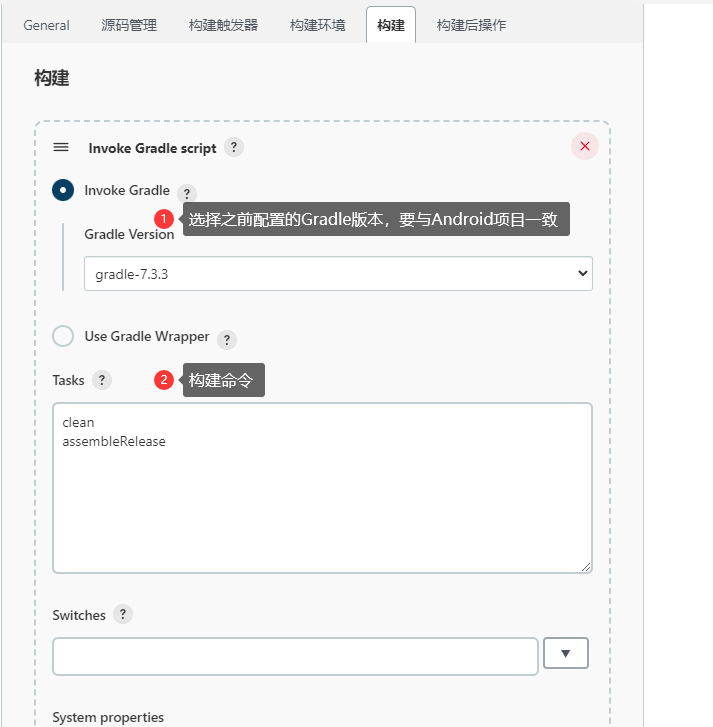

### 4.4 Build Now

点击 Build Now ，可以看到此时开始构建了

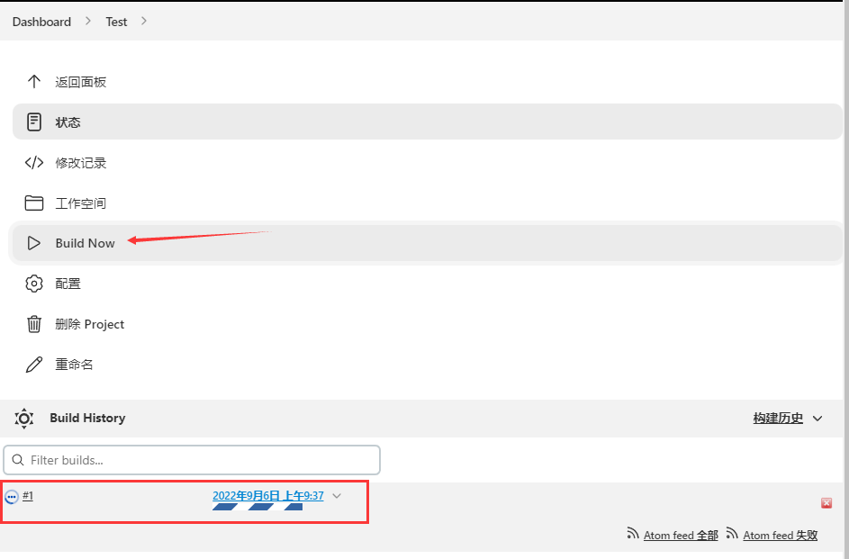

不出意外项目构建成功

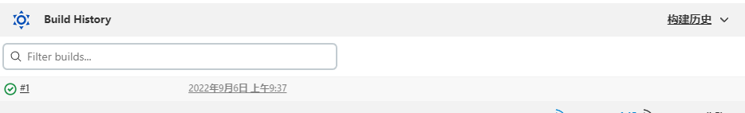

点击进去，选择控制台输出可查看构建日志

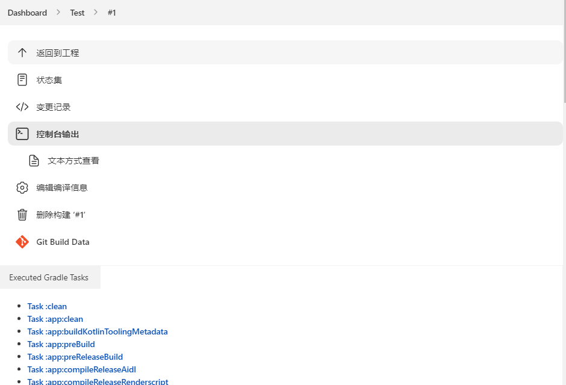


构建成功提示信息，若构建失败具体请查看日志

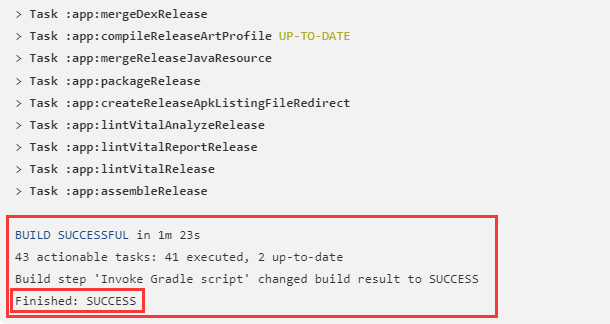


这时已经生成release包了，默认路径在:

`Jenkins\workspace\Test\app\build\outputs\apk\release`

但此时apk不能安装，因为： 如果你是使用android studio编译项目的化，在编译apk只会会自动给apk签名。 但默认配置下jenkins下编译出的apk是unsign的。需要一些额外的设置才能自动sign。

### 4.5 打包android应用时Release自动签名设置

这个功能需要我们修改下build.gradle配置文件，让gradle在编译之后执行签名。 当然你也可以在这里做一些其他的修改，比如修改编译出的apk的名字，让他加个当前时间的时间戳，编译类型的后缀什么的，方便识别。

1.首先要有一个key，没有就自己建一个

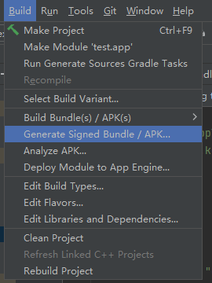

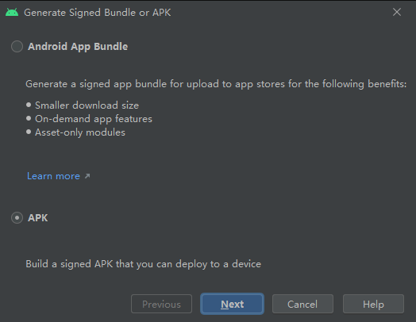

2.将key复制到app目录下

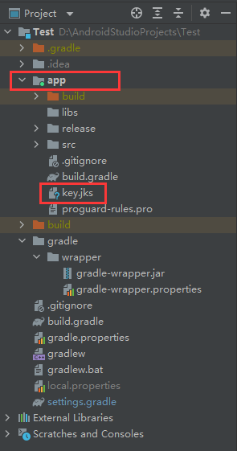

3.添加签名配置

```
signingConfigs {//签名的配置
        release {
            storeFile file("xxx.jks")
            storePassword '密码'
            keyAlias '别名'
            keyPassword '密码'
        }
    }
```

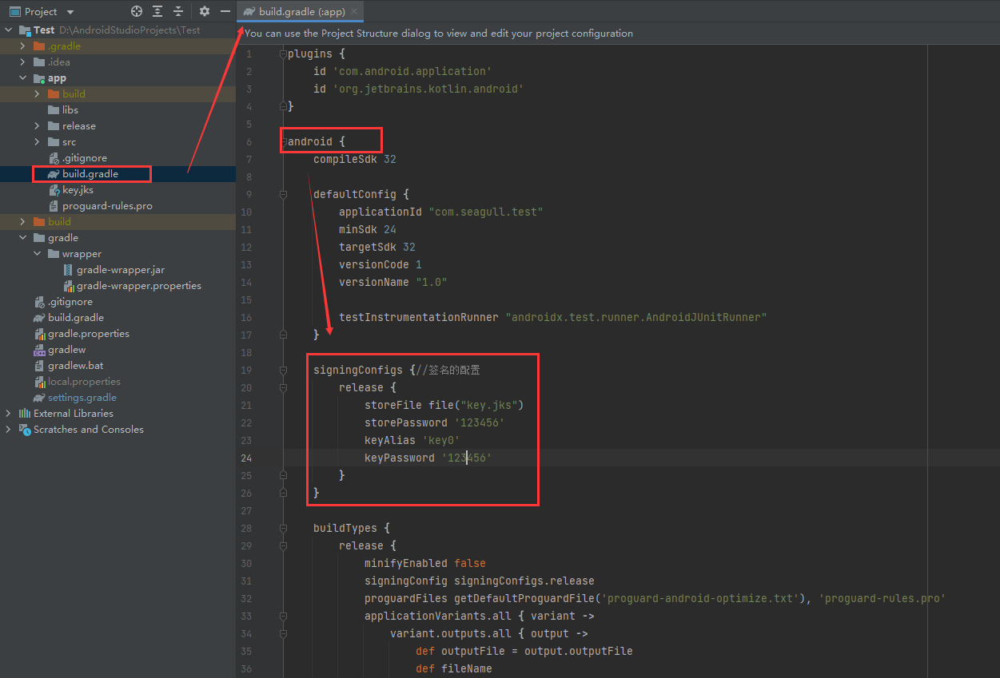

4.引用签名配置

```
buildTypes {
    release {
        minifyEnabled true
        //必须添加以下这句话
        signingConfig signingConfigs.release
        proguardFiles getDefaultProguardFile('proguard-android.txt'), 'proguard-rules.pro'
    }
}
```

5.(可选)生成的apk名加上当前时间 + 修改apk的发布路径

在build.gradle配置文件下的android配置段下的buildTypes下找到你的编译配置项一般就是release 在release段下面加上如下代码

```
applicationVariants.all { variant ->
                variant.outputs.all { output ->
                    def outputFile = output.outputFile
                    def fileName
                    if (outputFile != null && outputFile.name.endsWith('.apk')) {
                        if (variant.buildType.name.equals('release')) {//如果是release包
                            fileName = "appname_release_v${defaultConfig.versionName}.apk"
                        } else if (variant.buildType.name.equals('debug')) {//如果是debug包
                            fileName = "appname_debug_v${defaultConfig.versionName}.apk"
                        }
                        outputFileName = fileName
                    }
                }
            }
```

然后在build.gradle配置文件的末尾加上一个方法用来获取当前时间

```
def releaseTime() {
  // return new Date().format("yyyyMMdd", TimeZone.getTimeZone("UTC")) //年月日
  return new Date().format("yyyyMMdd HH-mm-ss", TimeZone.getTimeZone("GMT+8:00")) //年月日时分秒
}
```

示例：

```
plugins {
    id 'com.android.application'
    id 'org.jetbrains.kotlin.android'
}
​
android {
    compileSdk 32
​
    defaultConfig {
        applicationId "com.seagull.test"
        minSdk 24
        targetSdk 32
        versionCode 1
        versionName "1.0"
​
        testInstrumentationRunner "androidx.test.runner.AndroidJUnitRunner"
    }
​
    signingConfigs {//签名的配置
        release {
            storeFile file("key.jks")
            storePassword '123456'
            keyAlias 'key0'
            keyPassword '123456'
        }
    }
​
    buildTypes {
        release {
            minifyEnabled false
            signingConfig signingConfigs.release
            proguardFiles getDefaultProguardFile('proguard-android-optimize.txt'), 'proguard-rules.pro'
            applicationVariants.all { variant ->
                variant.outputs.all { output ->
                    def outputFile = output.outputFile
                    def fileName
                    if (outputFile != null && outputFile.name.endsWith('.apk')) {
                        if (variant.buildType.name.equals('release')) {//如果是release包
                            fileName = "test_release_v${defaultConfig.versionName}.apk"
                        } else if (variant.buildType.name.equals('debug')) {//如果是debug包
                            fileName = "test_debug_v${defaultConfig.versionName}.apk"
                        }
                        outputFileName = fileName
                    }
                }
            }
        }
    }
    compileOptions {
        sourceCompatibility JavaVersion.VERSION_1_8
        targetCompatibility JavaVersion.VERSION_1_8
    }
    kotlinOptions {
        jvmTarget = '1.8'
    }
}
​
dependencies {
    implementation 'androidx.core:core-ktx:1.7.0'
    implementation 'androidx.appcompat:appcompat:1.3.0'
    implementation 'com.google.android.material:material:1.4.0'
    implementation 'androidx.constraintlayout:constraintlayout:2.0.4'
    testImplementation 'junit:junit:4.13.2'
    androidTestImplementation 'androidx.test.ext:junit:1.1.3'
    androidTestImplementation 'androidx.test.espresso:espresso-core:3.4.0'
}
​
def releaseTime() {
    // return new Date().format("yyyyMMdd", TimeZone.getTimeZone("UTC")) //年月日
    return new Date().format("yyyyMMdd HH-mm-ss", TimeZone.getTimeZone("GMT+8:00")) //年月日时分秒
}
```

### 4.6 构建触发器

可根据实际情况创建，仅示例当gitee发生改变时自动构建：

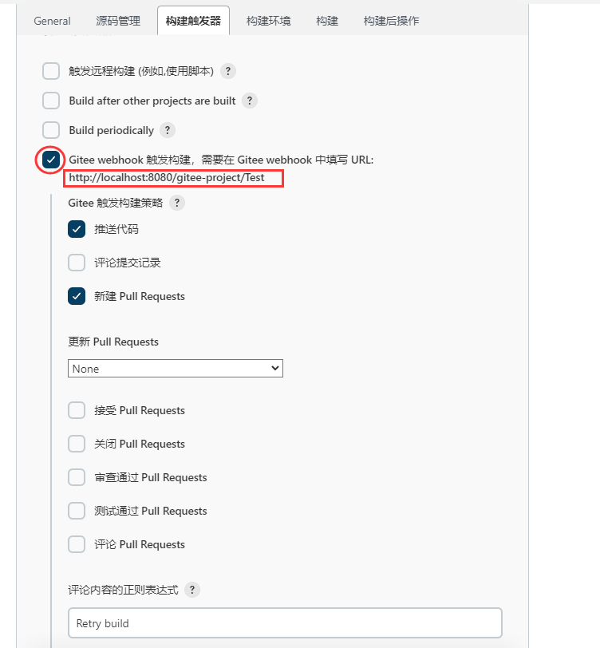

生成密码并复制
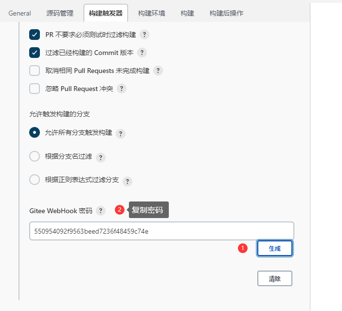

**Gitee中只能访问公有ip，无法访问本地的jenkins服务器，因此需要将内网转成外网域名**（推荐用内网穿透工具：ngrok）

进入[Gitee](https://gitee.com/ "Gitee")项目中,点击管理

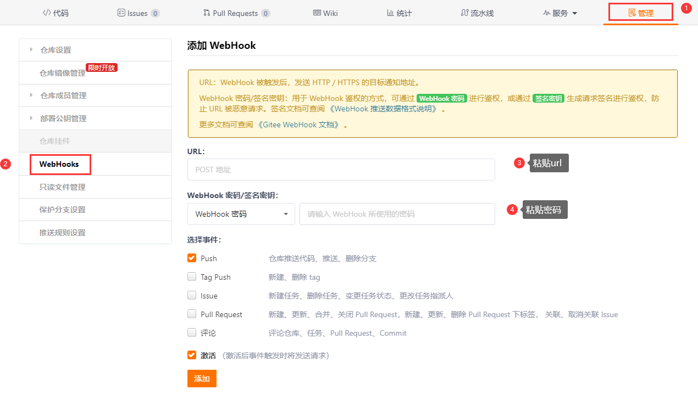

粘贴链接将内网穿透地址替换掉localhost

点击测试，请求结果为......has been accepted 说明配置成功

### 4.7 构建后操作

点击增加构建后操作步骤，选择Archive the artifacts
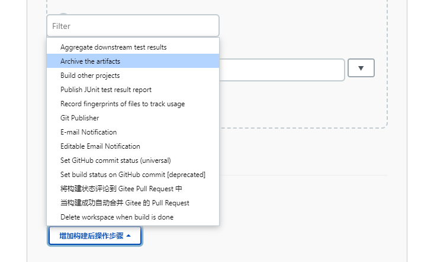

填入正则表达式路径，匹配用于存档的apk
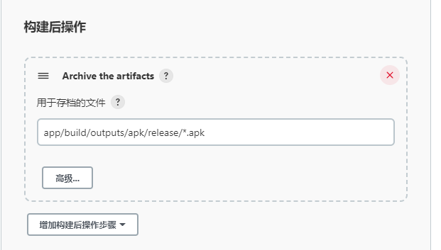

app/build/outputs/apk/release/\*.apk的意思是匹配app/build/outputs/apk/release路径下所有拓展名为.apk的安装包 看这路径是不是很熟悉，其实就是项目路径下apk的输出路径

存档后xxx-release-v1.0.apk就会显示在Jenkins项目最后一次成功的构建结果

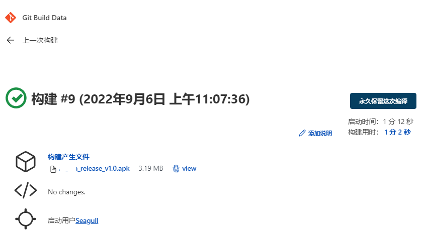


# 问题

### 1. connect err
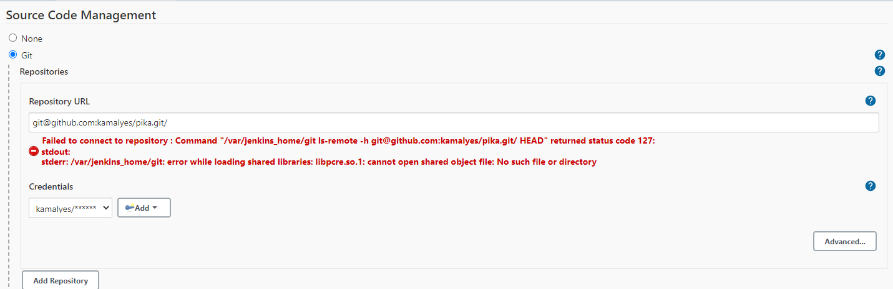
```
1. jenkins服务器上root用户生成密钥对
[root@node1 ~]# ssh-keygen -t rsa （一直回车）
2. 在gogs配置公钥
3. 在jenkins服务器上测试下是否能够正常获取代码 
```
