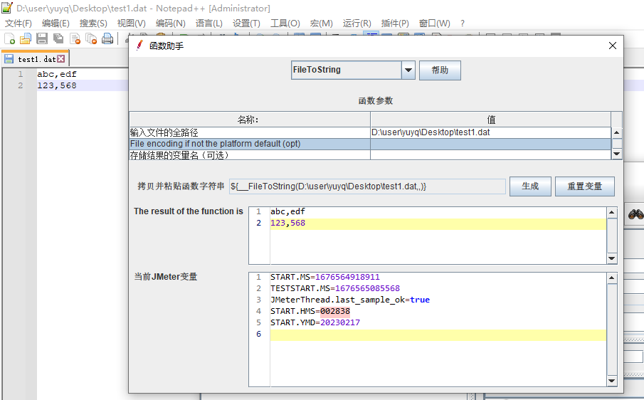

**如果你想查看更多 Jmeter 常用函数可以在这篇文章找找哦**
[Jmeter中有哪些常用的函数](./Jmeter中有哪些常用的函数.md)

作用
--

读取整个文件

语法格式
----

```
${__FileToString(C:\user\yuyq\Desktop\test1.dat,,)}
```

参数讲解
----

| 字段 | 含义 | 是否必传 |
| --- | --- | --- |
| File Name |  需要读取的文件名 | yes |
| File encoding |  *   读取文件的字符集 *   不传则用系统默认字符集 | no |
| Variable name | 返回值引用名称 | no |

实际栗子
----


