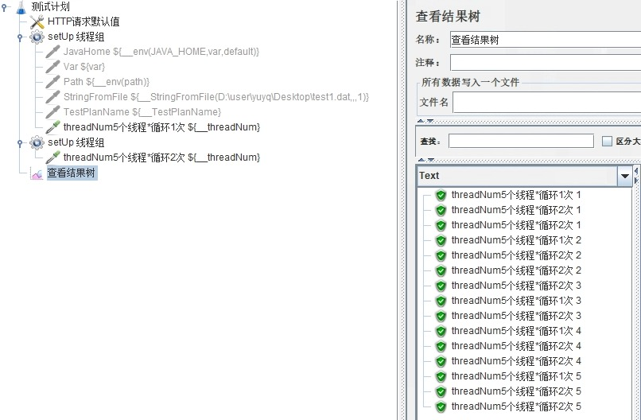

**如果你想查看更多 Jmeter 常用函数可以在这篇文章找找哦**
[Jmeter中有哪些常用的函数](./01.Jmeter中有哪些常用的函数.md)

作用
--

返回当前线程组产生的线程的线程编号

语法格式
----

```
${__threadNum}
```

实际栗子
----

#### 结论

*   线程编号跟线程数相关，设置了多少线程数，那么线程编号也会有相同的数目
*   不同线程组之间的线程编号是独立的，互不影响
*   线程编号是有序的，先启动的线程先拿到对应的编号，有点类似`__counter`
