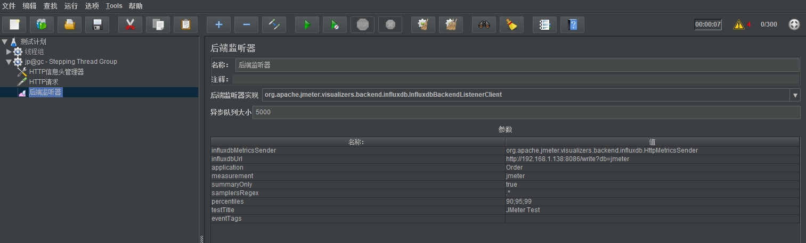
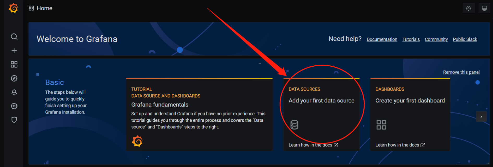
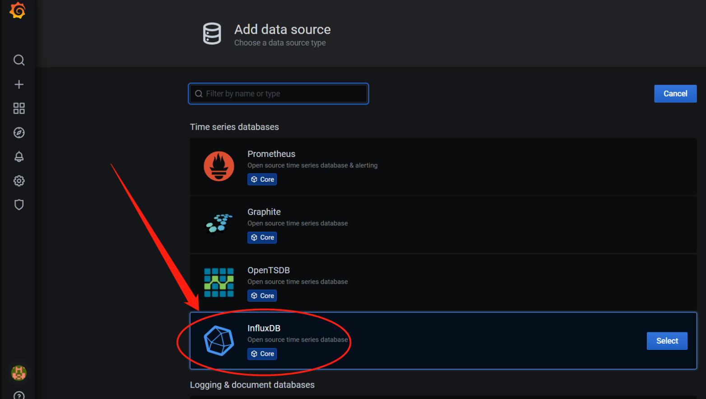
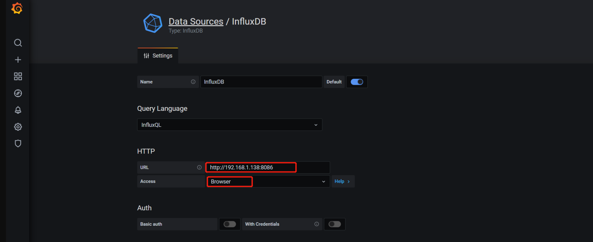
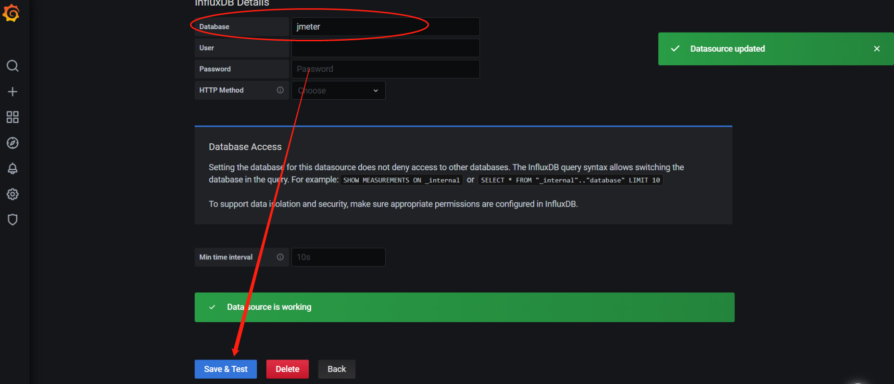
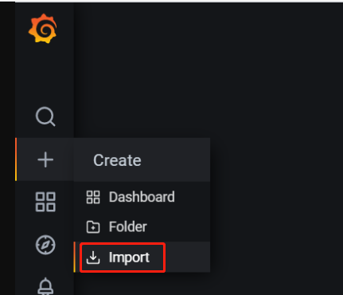
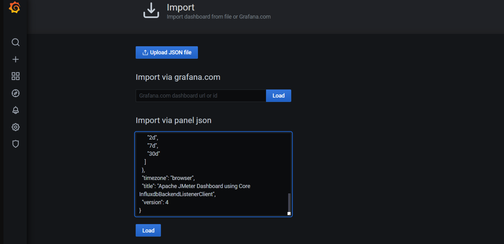
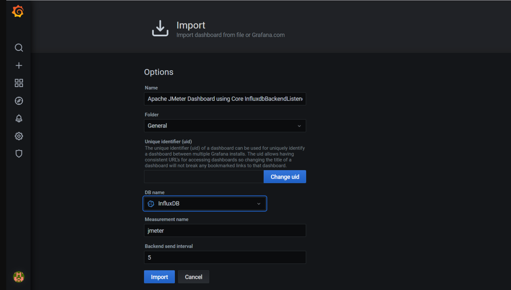
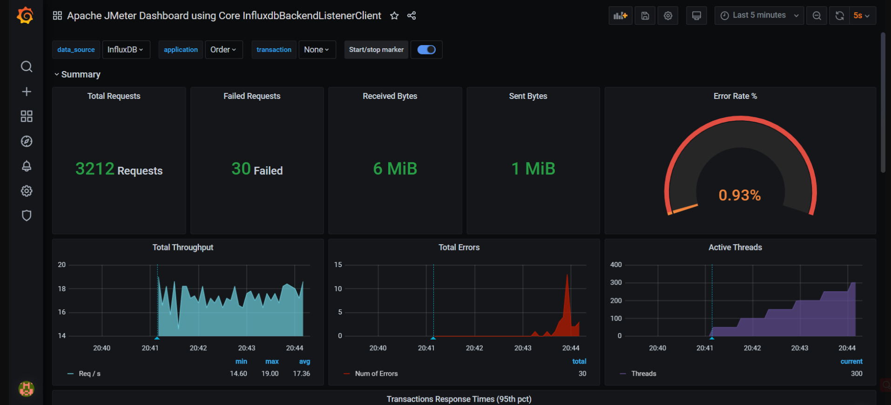

### 目录

- [一、Linux 安装 Docker](#一linux-安装-docker)
- [二、Docker 安装 InfluDB](#二docker-安装-infludb)
- [三、JMeter 配置 InfluDB](#三jmeter-配置-infludb)
- [四、Docker 安装 Grafana](#四docker-安装-grafana)

# 一、Linux 安装 Docker

1.卸载旧版本

```
sudo yum remove docker \
                  docker-client \
                  docker-client-latest \
                  docker-common \
                  docker-latest \
                  docker-latest-logrotate \
                  docker-logrotate \
                  docker-engine
```

2.使用存储库安装

```
sudo yum install -y yum-utils
sudo yum-config-manager \
    --add-repo \
    https://download.docker.com/linux/centos/docker-ce.repo
```

3.安装 docker 引擎

```
sudo yum install docker-ce docker-ce-cli containerd.io
```

4.启动 docker

```
sudo systemctl start docker
```

5.使用开机自启

```
sudo systemctl enable docker
```

6.使用阿里镜像

```
sudo mkdir -p /etc/docker

# sudo tee …… 到 …… EOF 这五行一起执行
sudo tee /etc/docker/daemon.json <<-'EOF'
{
  "registry-mirrors": ["https://2jakrmvh.mirror.aliyuncs.com"]
}
EOF

sudo systemctl daemon-reload
sudo systemctl restart docker
```

7.取消 sudo 运行

```
sudo usermod -aG docker root # root为当前用户的名字或$USER
```

# 二、Docker 安装 InfluDB

```
docker pull influxdb:1.8.6    # 拉取influxdb镜像
#  8083是管理工具端口、8086是HTTP API端口
docker run -d -p 8083:8083 -p 8086:8086 --name=jmeterdb influxdb:1.8.6    # 启动influxdb，并命名为jmeterdb
docker exec -it jmeterdb bash    # 进入容器
influx   # 进入influxdb数据库
create database jmeter;   # 创建jmeter库
show databases;    # 显示所有数据库，显示jmeter库就创建成功
use jmeter;   # 进入jmeter库
select * from jmeter;    # 查询库里面的数据，这时数据是空的正常
```

# 三、JMeter 配置 InfluDB

1.在线程组下添加后端监听器

```
线程组 > 监听器 > 后端监听器
Thread Group > Listener > Backend Listener
```

2.配置参数

```
Backend Listener implementation:org.apache.jmeter.visualizers.backend.influxdb.InfluxdbBackendListenerClient
influxdbUrl:http://192.168.21.230:8086/write?db=jmeter	# 换为自己的主机ip和创建的库名，上面建的库名为jmeter
application:Order	# 这里的名字自己随意定义即可
measurement:jmeter	# 数据库的名字，jmeter为上面在influxdb中创建的jmeter库
testTitle:JMeter Test	# 这个名字也自己随意定义即可

```

 配置完之后执行一次脚本，看 influxdb 中 jmeter 库里面有没有数据，有数据就没问题

# 四、Docker 安装 Grafana

1.grafana 安装

```
docker pull grafana/grafana
docker run -d -p 3000:3000 --name=jmeterGraf grafana/grafana
```

2.配置数据源  
访问 http:/localhost:3000，进入登录页，输入账号密码：admin/admin  


点击 Skip 跳过修改密码

在 grafana 添加数据源，选择 Add your first data source  


找到 influxdb，单击选择该 db  


配置 influxdb 数据源：  
url: http://192.168.1.138:8086 # 这里的 IP 输自己 influxdb 主机的  
Access: browser  


Database: jmeter
其余参数保持默认值，点击 Save&Test 按钮


点击左侧加号，选择 Import  


将 json 文本复制/粘贴到 paste JSON 文本框中，单机 Load 按钮导入（json 文件下载地址：https://grafana.com/api/dashboards/5496/revisions/1/download）  


在 DB name 中选择 influxDB，单机 Import 按钮完成 Dashboard 导入  


自动跳转至监控页面

JMeter 脚本跑起来！！！  

