# 阿里云与腾讯云性能对比性测试报告

# 1  概述

## 1.1  目的

- 验证改进的性能效果，需要和以前的测试结果进行比对。
- 新的业务上线，验证新系统能够满足系统的上线指标。
- 验证系统稳定性
- 验证系统的架构是否存在瓶颈

  1.2  背景

---

考虑到用户数量及数据的增多给服务器造成压力不可估计，因此 计划对`XXX项目部分核心业务`对应的 Api 进行负载性能测试，在系统配置不变的情况下，在一定时间内，服务器在高负载情况下的性能行为表现，便于对系统环境进行正确的分析及评估。

## 1.3  范围

本次测试主要是对`XXX项目项目`在`不同服务器供应商`进行性能差异性测试。

## 1.4 测试指标

指标 建议值

- CPU 占用 服务器 CPU 占用率 70%以内：`优秀` 70%-85%：`一般` 85%以上：`差`
- 内存占用 服务器内存占用率 70%以内：`优秀` 70%-85%：`一般` 85%以上：`差`
- 事务通过率 99.5%以上：`优秀` 98.6%-99.5%：`一般` 98.0%-98.6%：轻微隐患 97.5%及以下：`严重隐患`
- TPS 每秒成功完成的事务请求数，反应系统处理能力。一定情况下`业务量越大，TPS值越大`，若一个请求存在多个事务另外分析
- I/O 处理业务过程中磁盘存取数据的利用率，反应磁盘的处理能力，利用率越低，磁盘处理性能越好，一般建议在`80%`以下

  1.5  报告数据说明

---

| 内容                | 翻译         | 含义                                          |
| ------------------- | ------------ | --------------------------------------------- |
| 聚合报告-samples    | 执行数       | 某一请求/全部执行的次数                       |
| 聚合报告-average    | 平均相应时间 | 单个请求执行的平均相应时间 ms                 |
| 聚合报告-Median     |              | 50%请求的响应时间 ms                          |
| 聚合报告-90%Line    |              | 90%请求响应时间 ms                            |
| 聚合报告-95%Line    |              | 95%请求响应时间 ms                            |
| 聚合报告-99%Line    |              | 99%请求响应时间 ms                            |
| 聚合报告-Min        |              | 最小的响应时间 ms                             |
| 聚合报告-Max        |              | 最大的响应时间 ms                             |
| 聚合报告-Error%     | 错误率       | 错误的请求的数量/请求的总数                   |
| 聚合报告-throughput | 吞吐量       | throughput=总请求数/总时间 s;实际系统处理能力 |

<!--
下表列出了执行测试过程所引用的文档：
文档名称 | 版本号 | 作者 | 备注
:---: | :---: | :---: | :---:
腾讯云&阿里云（生产）性能差异对比测试方案 | V1.1.0 | 测试A | -->

# 2  测试概要

## 2.1  测试环境

下图描述测试该项目所需要的硬件环境：
机器归属 | 配置
:---: | :---:
`腾讯云压测机（一台Master、四台Slave节点）` | Operating System: Windows Server 2019 Datacenter 64-bit (10.0, Build 17763) </br>System Manufacturer: Tencent Cloud </br> Processor: Intel(R) Xeon(R) Platinum 8361HC CPU @ 2.60GHz (8 CPUs), ~2.6GHz </br> Memory: 16384MB RAM <br> Bandwidth 100M
`阿里云服务机（目前的生产机）` | 定时任务服务器 4 台 8 核 32GB 内存 100G 通用型 SSD 云硬盘<br> 应用服务器 4 台 8 核 32GB 内存 200G 通用型 SSD 云硬盘<br> redis 16G 内存一主一从 Redis5.0 标准架构<br> 数据库 一个读写库 16 核/128GB 两个只读库 16 核/128GB cynos db 总共三个节点
`腾讯云服务机` | 定时任务服务器 4 台 8 核 32GB 内存 100G 通用型 SSD 云硬盘<br> 应用服务器 4 台 8 核 32GB 内存 200G 通用型 SSD 云硬盘<br> redis 16G 内存一主一从 Redis5.0 标准架构<br> 数据库 一个读写库 16 核/128GB 两个只读库 16 核/128GB cynos db 总共三个节点

| 服务商 |       域名       |
| :----: | :--------------: |
| 腾讯云 | api-txy.xxxx.com |
| 阿里云 |   api.xxxx.com   |

```
C:\压测环境脚本>netsh int ipv4 show dynamicportrange tcp

协议 tcp 动态端口范围
---------------------------------
启动端口        : 49152
端口数          : 16384

C:\压测环境脚本>netsh int ipv4 show dynamicportrange udp

协议 udp 动态端口范围
---------------------------------
启动端口        : 49152
端口数          : 16384
```

注意：

- 因测试机与被测服务器在 SLB 下进行,排除网速限制及网速度不稳定性。

- 系统采用 B/S 架构模式，客户端通过中间件访问数据库，中间件和数据库分别部署在多个节点上。

- 不同环境下存在前置数据差异（`返回包体大小`、`sql begin`、`二级缓存` ）

  2.2  人力资源

---

下表列出了所有参与此项目的测试人员：
角色 | 配置资源数量
:---: | :---:
测试 | 测试 A、测试 B
开发 | 开发 A、开发 B
运维 | 运维 A、运维 B

## 2.1  测试工作量

| 任务 | 开始时间  | 结束时间  | 总计（天数） | 总计（人时） |
| :--: | :-------: | :-------: | :----------: | :----------: |
| 计划 | 2023-2-10 | 2023-2-11 |      2       |      16      |
| 实际 | 2023-2-10 | 2023-2-11 |      2       |      16      |

# 3  测试内容及方法

## 3.1  测试需求/目标

在大用户量、数据量的超负荷下，获得服务器运行时的相关数据，从而进行分析，找出系统瓶颈，提高系统的稳定性。

## 3.2  测试内容

|   接口名称   |           接口地址           | 说明 |
| :----------: | :--------------------------: | :--: |
| 查询店铺详情 |    `/xxx-api`/shop/detail    |
| 查询商品详情 |  `/xxx-api`/product/detail   |
| 查询商品库存 | `/xxx-api`/product/stock_new |
|   提交订单   |  /order-api/order/docommit   |

## 3.3  测试工具

- 主要：Jmeter 性能测试工具
- 辅助：自写程序、其它第三方工具

# 4  测试结果及分析

### 查询店铺详情

- 门店内较少活动

| Environment（环境） | LabelName（样本名称） | Samples（执行数） | Error%（异常率） | Transactions/s | 95th（ms） |
| :-----------------: | :-------------------: | :---------------: | :--------------: | :------------: | :--------: |
|      生产环境       |       店铺详情        |        500        |        0         |     279.3      |    1750    |
|       腾讯云        |       店铺详情        |        500        |        0         |     640.2      |    758     |
|      生产环境       |       店铺详情        |       1000        |        0         |     190.4      |    5093    |
|       腾讯云        |       店铺详情        |       1000        |        0         |      974       |    974     |

生产环境
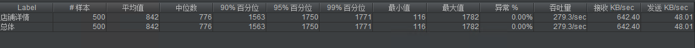
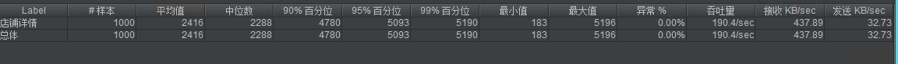

腾讯云环境
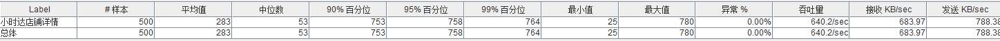
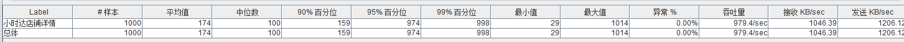

- 门店内配置有很多活动

| Environment（环境） | LabelName（样本名称） | Samples（执行数） | Error%（异常率） | Transactions/s | 95th（ms） |
| :-----------------: | :-------------------: | :---------------: | :--------------: | :------------: | :--------: |
|      生产环境       |       店铺详情        |       2000        |        0         |      73.5      |   26905    |
|       腾讯云        |       店铺详情        |       2000        |        0         |     2212.4     |    558     |
|      生产环境       |       店铺详情        |       5000        |        0         |      16.6      |   300006   |
|       腾讯云        |       店铺详情        |       5000        |        0         |     3037.7     |    1485    |

生产环境

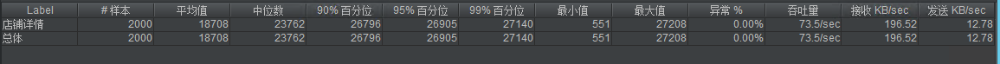
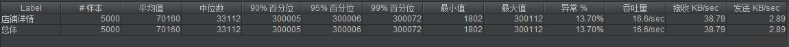

腾讯云环境
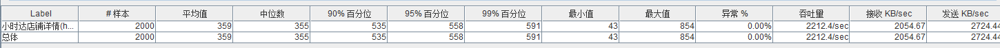
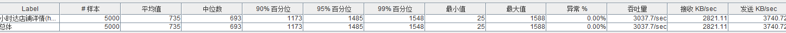

### 查询库存

| Environment（环境） | LabelName（样本名称） | Samples（执行数） | Error%（异常率） | Transactions/s | 95th（ms） |
| :-----------------: | :-------------------: | :---------------: | :--------------: | :------------: | :--------: |
|      生产环境       |       查询库存        |       8000        |        0         |     4054.7     |     87     |
|       腾讯云        |       查询库存        |       8000        |        0         |     3833.3     |     15     |
|      生产环境       |       查询库存        |       10000       |        0         |     3306.9     |     98     |
|       腾讯云        |       查询库存        |       10000       |        0         |     16835      |    401     |

生产环境
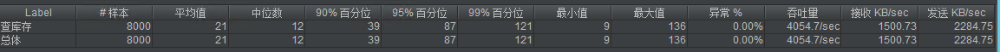
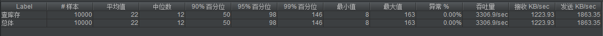

腾讯云环境
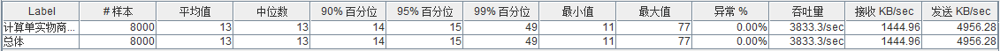
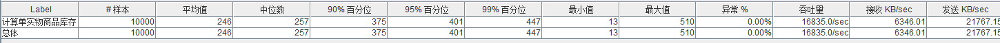

### 商品详情

| Environment（环境） | LabelName（样本名称） | Samples（执行数） | Error%（异常率） | Transactions/s | 95th（ms） |
| :-----------------: | :-------------------: | :---------------: | :--------------: | :------------: | :--------: |
|      生产环境       |       商品详情        |        500        |        0         |     139.5      |    3397    |
|     腾讯云环境      |       商品详情        |        500        |        0         |     316.7      |    1086    |
|      生产环境       |       商品详情        |       1000        |        0         |     117.4      |    8241    |
|     腾讯云环境      |       商品详情        |       1000        |        0         |     1028.8     |    893     |
|      生产环境       |       商品详情        |       2000        |        0         |     200.1      |    9743    |
|     腾讯云环境      |       商品详情        |       2000        |        0         |     1114.2     |    1661    |

生产环境
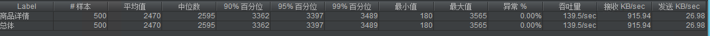
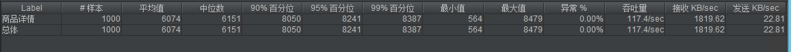
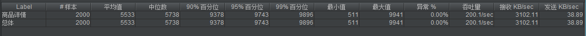

腾讯云环境
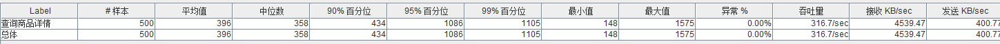

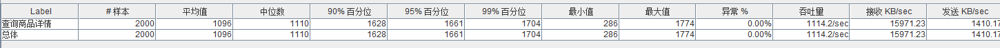

### 提交订单

| Environment（环境） | LabelName（样本名称） | Samples（执行数） | Error%（异常率） | Transactions/s | 95th（ms） |
| :-----------------: | :-------------------: | :---------------: | :--------------: | :------------: | :--------: |
|      生产环境       |       提交订单        |       1000        |        0         |      84.3      |   11660    |
|       腾讯云        |       提交订单        |       1000        |        0         |     198.3      |    4911    |
|      生产环境       |       提交订单        |       2000        |        0         |     165.2      |   11481    |
|       腾讯云        |       提交订单        |       2000        |        0         |     229.0      |    8533    |
|      生产环境       |       提交订单        |       5000        |        0         |     123.5      |   14567    |
|       腾讯云        |       提交订单        |       5000        |        0         |     203.3      |   24189    |

生产环境
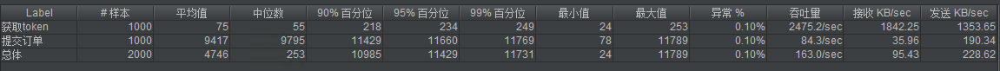
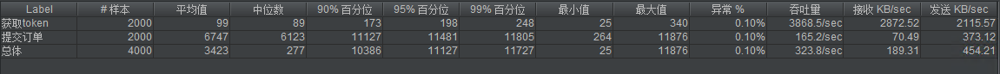
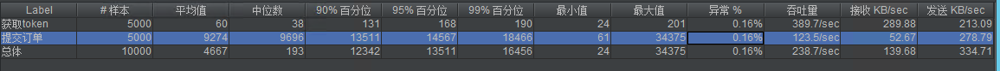

腾讯云环境
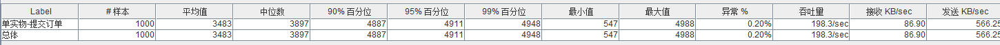
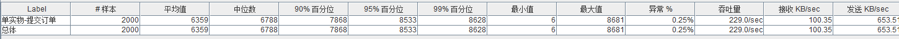
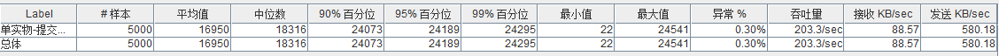

# 4 结果分析

## 4.1 资源消耗

### 腾讯云（单机压测时间为：2023/2/10 8:30~10:30）

- 应用服务器
  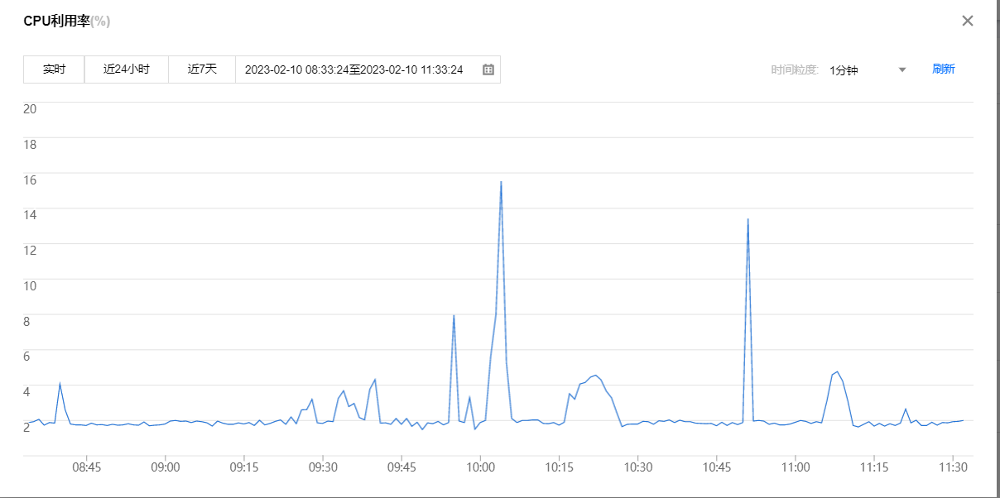
  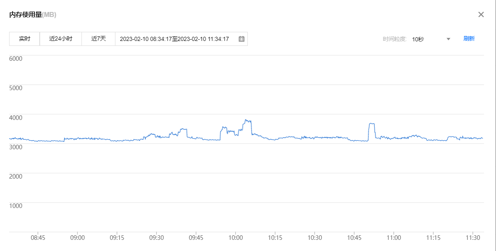

- redis
  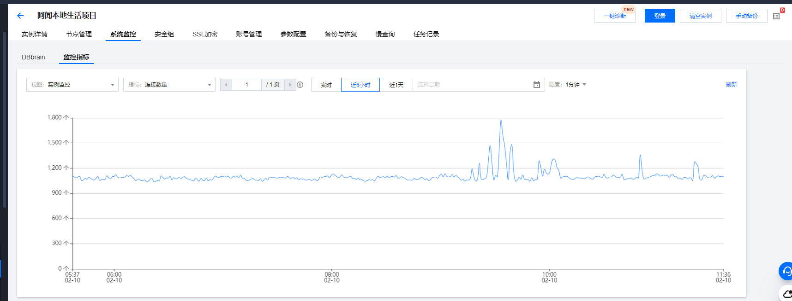
  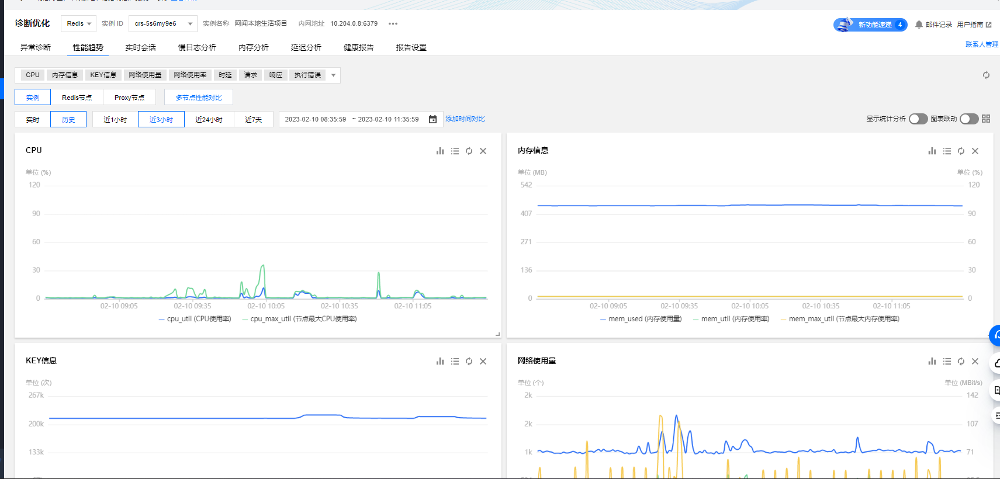

- cynos db
  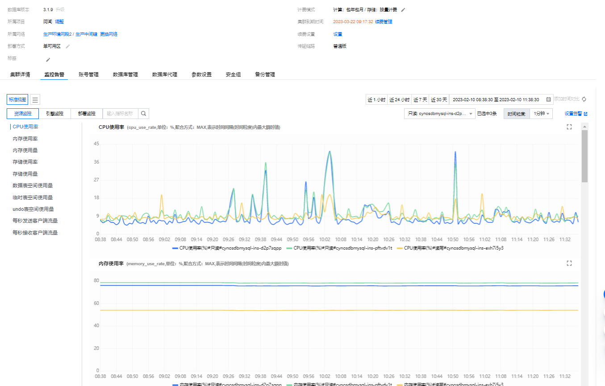

### 腾讯云（分布式压测时间为：2023/2/11 8:30~18:20）

- 应用服务器
  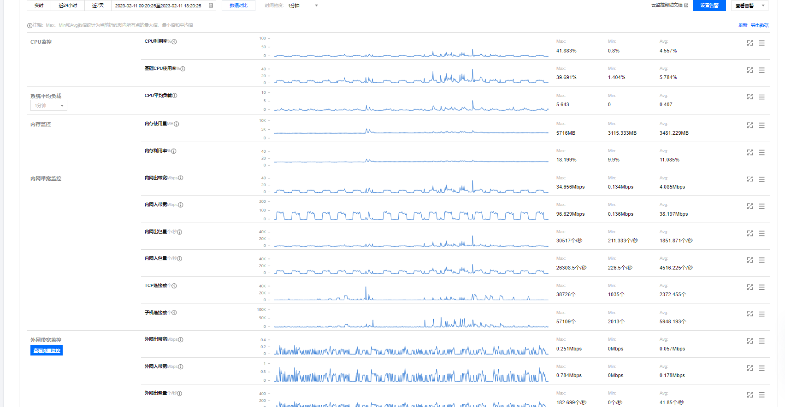

- redis
  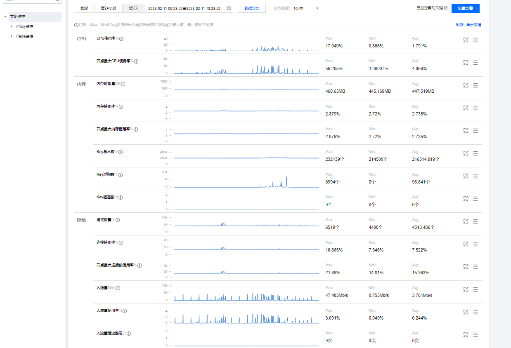

- cynos db
  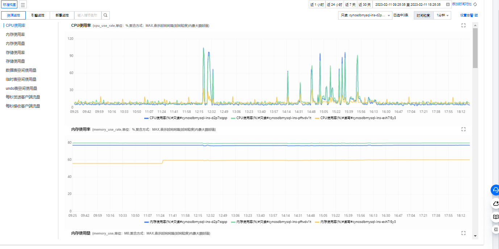

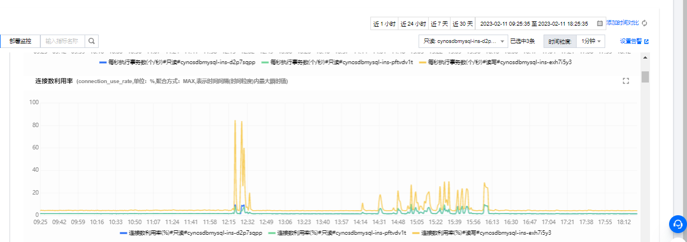

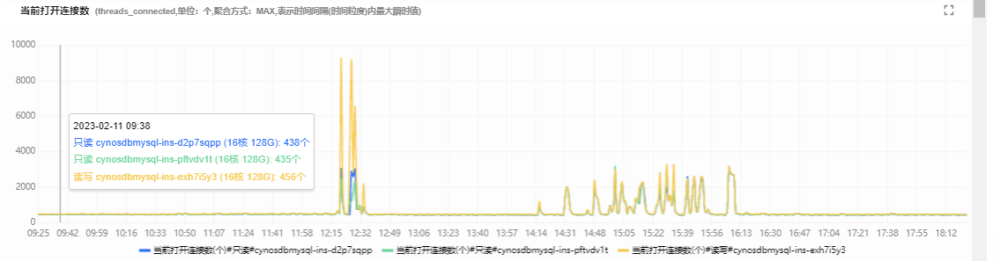

## 4.2  性能评估

|     指标     | 是否满足上线要求 | 系统是否有潜在风险？ | 日常运营和系统维护需要监控哪些内容？ |
| :----------: | :--------------: | :------------------: | :----------------------------------: |
| 接口性能测试 |       `是`       |         `无`         |                 `无`                 |
|  稳定性测试  |       `是`       |         `无`         |                 `无`                 |
