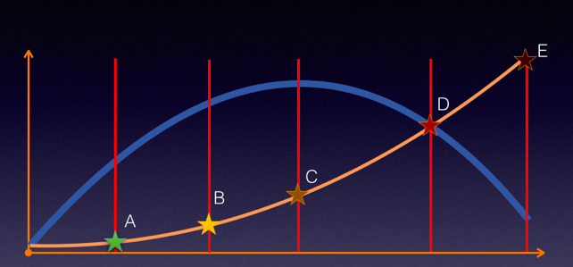
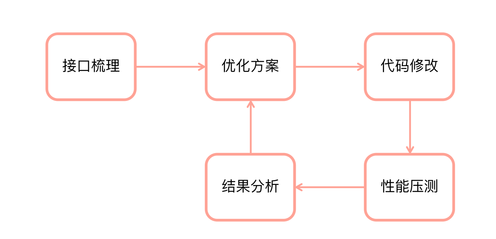
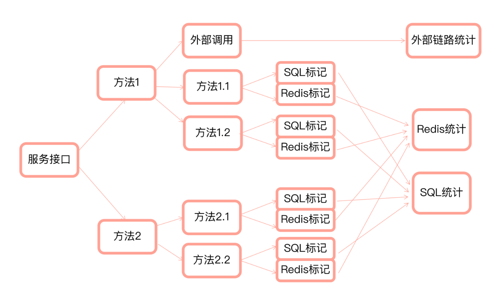
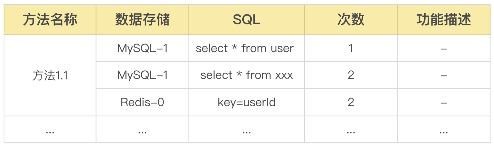
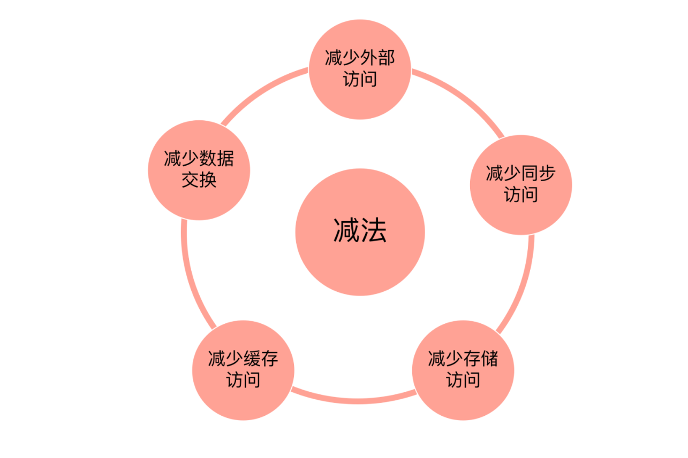
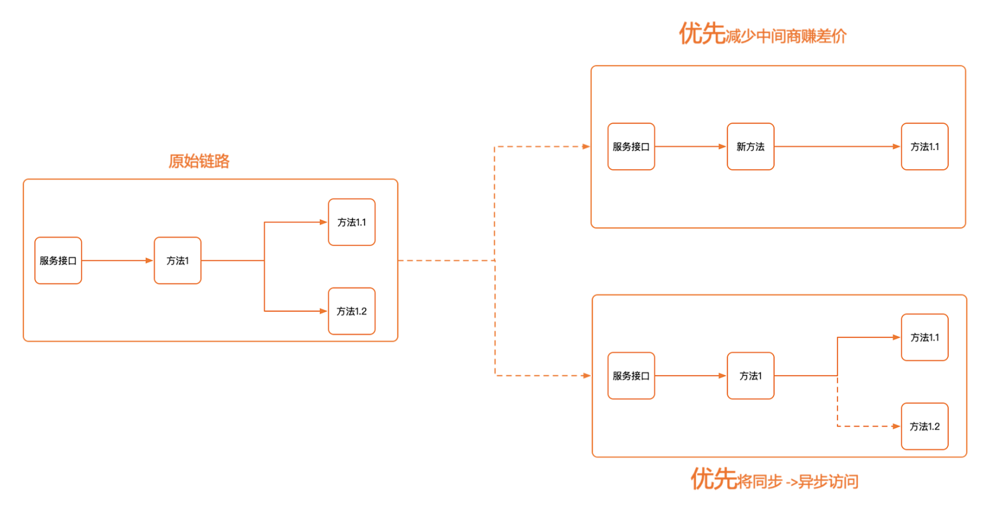
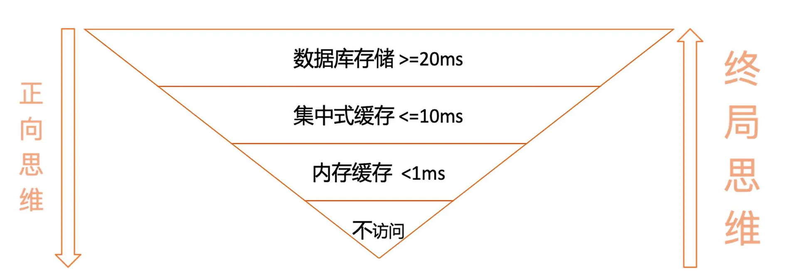

# 如何做好服务端接口性能优化？

## 背景

```
用户体验（UserExperience，简称 UE/UX）是用户在使用产品过程中建立起来的一种纯主观感受。当下，我们活在一个快节奏的时代，系统的响应度会极大地影响到产品的用户体验。当系统响应慢的时候，用户会在心理上暴躁不安，进行投诉。面对用户的投诉，业务和产品的同学要求我们在短时间内解决这个问题。同时每次面临的场景都不一样，而性能优化也不是能够经常接触到的任务，所以我们大多数伙伴不是特别擅长。在短时间顶着巨大压力，干一件我们不擅长的事会让我们很苦恼。
```

那有没有一种通用的方法让我们能够快速掌握性能优化方面的内容呢？
指定有，接下来我给你分享一下后端接口性能优化的内容。

## 接口性能指标

在优化之前，我们首先要明确优化指标，服务端的接口一般有两个性能指标 QPS（Query Per Second）与 RT（Response Time）。QPS 是每秒查询的次数，用来表示系统的整体承载量。RT 是接口的平均响应时间，用来表示系统的响应度。

理想中的系统是 QPS 越大越好，RT 越小越好，但现实中 QPS 与 RT 是相互影响的。随着 QPS 的逐渐增大，RT 也是逐渐增大的。在 A 点的时候 QPS 急剧拉上，RT 整体表现非常好。随着 QPS 进一步增长，RT 也有缓慢的增长。当到达 C 点的时候，QPS 到达了顶点，RT 有明显的增长。当到达 D 点的时候，QPS 减小了，RT 反而急剧拉上。当到达 E 点的时候，其实本质上系统已经崩溃，无法提供服务了。



注：蓝线是 QPS 黄线是 RT

从图中我们可以得出 C 点是最佳平衡点，在这个点，QPS 与 RT 整体上获得了最大的收益。接口性能优化的指标是确保 RT 能够满足业务体验，QPS 能够支持用户访问。例如：接口能够支持 5 万 QPS ，RT<500ms。

## 接口性能优化流程

前面我们详细阐述了接口性能优化的目标，在明确了接口的性能指标后，我们需要有一个可行的优化流程。一个完整的接口性能优化的流程包含接口梳理、优化方案制定、代码修改、性能压测、结果分析五个环节。接口梳理能够帮我们搞清楚现状，优化方案是规划未来，代码修改是从现状到未来，而性能压测是用来验证方案的正确性，结果分析用来做持续方案优化。



### 接口梳理

接口梳理是性能优化的基础，也是容易被我们忽略的环节。遇到问题的时候，我们本能地想着怎么修改，而忽略了搞清楚现状才能更好地作出决策。既然接口梳理如此重要，如何能够快速做好接口梳理呢？核心采用链路追踪法与标记整理法。

首先采用链路追踪方法把接口访问的每个方法按照访问的顺序标记下来，并按序号表示访问的先后顺序。通过思维导图可以将整个接口调用的方法拓扑出来，拓扑的维度到数据访问的级别。



然后对数据访问的方法进行 SQL 与 Redis 标记，标记出访问的具体内容与访问次数。最终整理汇总成表格，通过表格我们就可以清晰地知道最终访问了多少次存储。整体的结果如图中所示：



通过链路追踪我们能够清晰地画出我们整个接口访问的方法链路。最终对数据访问层的方法做 SQL 或 Redis 访问标记，最终整理出具体存储访问的明细。

### 优化方案

通过接口梳理我们可以清晰地知道接口访问链路与数据存储层访问的次数，为我们制定优化方案扫清了路障。有后端开发经验的同学都知道，整个后端接口的性能损耗主要是链路调用与存储访问造成的。所以核心优化策略就是做减法，尽一切可能减少方法调用与存储访问的次数。



#### 访问链路优化

在访问链路上，我们首先要思考接口调用的方法是否提供了一些用不到的功能。如果存在这种情况，大概率是代码复用带来的。那么就重新构建只有当前接口需要的新方法，避免中间调用复用方法带来的额外的性能损耗。其次我们要考虑调用的多个方法是否一定要同步调用，如果能异步调用，我们就尽可能通过消息队列的形式进行异步访问。这样就能减小同步访问带来的性能损耗。



#### 存储访问优化

在存储访问上的优化，大多后端工程师都会采用正向思维，如果访问的是数据库就改成 Redis，如果是 Redis 就改成本地缓存，这种优化思路我们都能想到。其实在大量实践后，往往同一个接口会经历“数据库到 redis，redis 到本地缓存”多次折腾。今天我在这里给你提供新的思考维度——终局思维。优先思考能不能不访问，其次思考能不能改成本地缓存，最后才是改成 Redis。



终局思维是从尽量能减少性能损耗的角度去思考的，能够极大地提高性能优化的效果。

### 代码修改

代码修改，基本上按照优化方案进行调整就可以了，唯一需要提醒的是，我们修改的方法要反复确认是否被其它地方调用了，如果调用了我们需要进行单元测试。

### 性能压测

接口通过功能测试之后可以进行性能压测。进行性能压测的时候可以借助 arthas 命令和 trace 命令来观察接口实际执行的情况。

常见的互联网架构中，一般都能看到 spring+mybatis+mysql+redis 搭配的身影，在我所服务的公司亦是如此。一般来说，应用内部的接口都是直接调用的，所谓的面向接口编程，应用间的调用直接调或者通过类似 dubbo 之类的服务框架来执行，数据格式往往采用 json，即统一也方便各数据间做转换和取值，缓存一般使用 redis 或 memcached，存储一些对象或 json 格式的字符串。对外提供的接口，一般都需要进行压力测试，以便估算其性能，并为后续的调优提供指导方向，以下接口便是在压测过程中出现的各种“奇怪现象”，所谓奇怪，指的是从表象上看与我们正常的逻辑思路不符，但其本质还是我们对压力下程序的表现出来的特征不熟悉，用惯用的知识结构试图去解释，这根本是行不通的。下文是我在一次全面压测过程后对数据进行的分析汇总，其中的现象是很多压测常见的，里面的分析过程及改进措施我认为有很大的参考意义。具体内容如下：（部分接口为了安全我省略了其名称，但不影响我们的分析，另外形如 1N3T 之类的表示的是 1 台 nginx，3 台 tomcat,具体的 tps 数值只是为了说明优化前后的比照，没有实际意义）

## 案例

#### 接口名称: 获取列表

1. 压测现象: 单台 tps700 多，应用 cpu 高负载

   问题分析：旧框架，平均响应时间长，应用 CPU 高，程序内部有大量的 bean 到 map 到 json 之间的转换，修改数据库连接数后，tps 没有提升。

   解决方案：重构系统，用 mybatis 替代之前的 dao 操作，减少 bean-map-json 之间的内部数据转换，减少程序内部的无用操作。

   改善后效果：tps 改进后能到 3000 左右，有较大提升，但压测时应用 cpu 几乎跑满，还有改善空间。

2. 压测现象：数据库资源利用率高
   问题分析：单台应用，数据库资源 cpu 都能到 50%，10 台 tomcat 在 1 万并发下数据库 cpu 跑满，load 值 700 多，但 db 的 qps 也不过 11554，并不算多，因此怀疑是 sql 执行耗费了 cpu，可能是某条 sql 没有按索引查找或者索引失效。

   解决方案：查看 SQL 文件发现如下 sql：select count(1) from orders where order_status_id !=40 ，将其改为 select order_id from orders 然后通过程序把 order_status_id!=40 的过滤掉。通过 list.size()来获取。order_status_id 即使加了索引，由于是！=比较，所以不会去按索引查找，导致 cpu 高

   改善后效果：相同环境下(1 台 nginx，10 台 tomcat，1000 并发)，tps 由 3000 变成 3727，略有增长，但是 db 的 cpu 明显下降，变为 30%，效果明显

3. 压测现象: 1N15T ,tps4552;10N15T,tps9608
   问题分析：后端都是 15 台 tomcat，前端 1 台 nginx 时 tps 为 4552,通过 lvs 挂 10 台 nginx 时为 9608，增长不明显，其 nginx 和 tomcat 都压力不大，集群结果不合理，怀疑是 nginx 转发配置的问题；

   解决方案：未进一步改进：可能是需要调整 nginx 的参数，之前发现过 nginx 不同的配置对后端集群环境的 tps 影响很大

#### 接口名称: 信息查询接口

1. 压测现象:单台 tps2000 多，应用 cpu 高，db 的 qps15000 左右

   问题分析：旧框架，程序内部有很多 Bo-map-json 相互的转换

   解决方案：删除冗余代码、更换连接池包，使用 mybatis

   改善后效果：Tps 由 2000 多增长为 8000 多，db 的 qps 为 9000 左右，优化后压测应用的 cpu 占用高，几乎跑满。

2. 压测现象：数据库无压力，应用增加多台后 tps 不变

   问题分析：1N1T 和 1N10T 的 tps 一样，都为 5000，增大并发时错误数增多，应用 cpu 耗费 70%，db 无压力，nginx 单台通过 ss –s 发现端口占满，即 nginx 到 tomcat 之间转发的连接端口 time-wait 状态 6 万多。Nginx 存在瓶颈。

   改进措施：调优 nginx 参数，将短连接改为长连接

   改进效果：1N3T 的 tps 能到 17376，tomat 的 cpu 压力 84%，db 的 qps18000，cpu69%，应用的资源基本使用到量。

#### 接口名称: 获取详情

1. 压测现象：单台应用 tps2600，10 台 tomcat 才 3700

   问题分析：增加应用服务器，tps 增长不明显，且 nginx、tomcat、db 的负载都不高，说明服务器本身不是瓶颈，考虑是不是网络的问题，通过监控网卡包流量发现网络数据跑满，因为此接口会有大量数据的输出，因此瓶颈在网络上。另外，测试过程中发现 redis 有报错，redis 服务器是虚机，可能服务能力有限。

   改进措施：开启 tomcat 的 gzip 压缩。

   改进效果：同等并发下(1 台 nginx，10 台 tomcat，1000 并发)，tps 由 3727 增长到 10022，增长了近 3 倍，效果显著。

2. 压测现象：1N10T 集群下 nginx 参数调优对 tps 提升效果明显
   问题分析：经过 tomcat 的启用 gzip 后，1N10T 下 tps 为 10022，需进一步提升。

   改进措施： 优化 nginx（关闭日志，nginx 进程数量 worker，由 24 改为 16，keepalive 数量由 256 改为 2048）

   改进效果：Tps 由 10022 提升为 13270。

3. 压测现象：1N5T 和 1N10T 的 tps 相差不大

   问题分析：1N10T 的 tps 为 1 万 3 千多，1N5T 的 tps 为 1 万 2 千多，相差不大，应用的 tomcat 资源利用没满，cpu 为 65%，Db 的 QPS 已经到 2 万多了，单台服务器 db 基本上到量了，因此再增加应用也没效果，只会导致响应的时间变长。

   改进措施：单台 db 已经无法改进了，要不提升服务器硬件，要不读写分离。

   改进效果：tps 显著提升

#### 接口名称: 促销

1. 压测现象：通过 redis 存取数据，tps 才 1000 多，CPU 有压力

   问题分析：此接口通过 redis 取数据，tps 不高才 1000 多，但 cpu 占用了 80%，说明程序内部有大量序列化反序列化的操作，可能是 json 序列化的问题。

   改进措施：将 net.sf.json 改成 alibaba 的 fastjson。

   改进效果：同等并发条件下 tps 由 1000 多提升为 5000 多，提高了近 5 倍。

2. 压测现象：参数多时 tps 下降明显

   问题分析：此接口根据参数从 redis 中获取数据，每个参数与 redis 交互一次，当一组参数时 tps5133，五组参数时 tps1169，多次交互影响了处理性能。

   改进措施：将从 redis 获取数据的 get 改为 mget，减少交互次数。

   改进效果：五组参数时 1N3T 压测 TPS9707，据此估算即使是单台 tomcat，tps 也能有三四千，性能比单次 get 的调用方式提升了 3,4 倍。

3. 压测现象：1N3T tps1 万多，在增大 tomcat 可能 tps 增长不会明显

   问题分析：此处说的是可能，因为 nginx 服务器的 cpu 虽然不高，但 pps 已经 800 多 k，此时应该是 nginx 的服务器网络流量成为了瓶颈。(只是猜测)

   改进措施：可以增加多台 nginx 负载，前端加 lvs

   改进效果：

#### 接口名称: 追踪接口

1. 压测现象：1N10T 的 tps 低于 1N3T 的 tps

   问题分析：1N3T 在 2000 并发下 tps 为 9849，此时 db 的 qps 为 90000，CPU80%，将 tomcat 增到 10 台，5000 并发下,tps 为 7813，db 的 qps 为 19000，cpu75%，load 1，说明压力增大情况下 db 的压力反而下来了，注意到 nginx 服务器的网卡流量达到 885M，说明是压力过大情况下，网络满了，发生丢包，导致 db 端压力反而下来了。

   改进措施：注意压测情况下部分接口由于数据量传输较大，会出现网络瓶颈。

   改进效果：

#### 接口名称: 回填接口

1. 压测现象：tps 不到 500，db 的 qps3500

   问题分析：虽然缺少应用的 cpu 及 db 的 cpu 利用率数据，较低的 tps 应该是应用的瓶颈，且需要关注是不是 db 在处理查询的时候缓慢。

   改进措施：

   ```
   1.连接池由dbcp改为hikar；
   2.减少了日志打印输出
   3.sql优化，将部分条件过滤改为在java代码中执行
   ```

   改进效果：Tps 由不到 500 增长为 1300 多。

#### 接口名称: 券查询

1. 压测现象：集群结果与单台应用结果相比不合理
   问题分析：查看是否存在瓶颈资源，可以看到 5 台 tomcat 集群下，tps 为 9952，但 db 的 qps 为 5-6 万，cpu 利用率为 37%，说明对数据库进行了大量的主键或索引查询，一般单台 db 的 qps 也就 4 万左右，再增加应用的集群数量，对 tps 也不会有太大影响。

   改进措施：可以考虑分库

   改进效果：

#### 接口名称: 推荐

1. 压测现象:nginx 长短连接差异
   问题分析：18nginx，2tomcat 时 tps8100，此时应用服务器的端口数满， 一般来说，Nginx 短连接在高并发下容易导致端口占满的问题。
   改进措施：将 nginx 改为长连接
   改进效果：tps 增长为 10733，TPS 稳定，起伏减少，但是 CPU 耗尽。说明 cpu 打满了，此时如果还要优化就的进行代码调优了。

#### 接口名称: 查询 2

1.  压测现象：18N20T 的 tps 才 6842
2.  问题分析：18 台 nginx，20 台 tomcat，tps 才 6842，此时应用 cpu 利用率 85%，说明 cpu 存在瓶颈，但检查此接口并未做大计算量的工作，有可能是日志的级别问题，cpu 在频繁的打日志。

    改进措施：将日志级别由 debug 级改为 info 级

    改进效果：同等环境 tps 由 6842 增长为 23592.坑爹的生产环境 debug 日志级别。

#### 总结

1、 刚开始压测报错，停了之后重新压测不报错
这种情况经常遇到，特别是重启服务之后，因为系统刚重启，需要做一些初始化的动作，如果一下上很多并发用户数难免会报错，只要压测几次之后不再报错，就是正常的，服务器也需要“预热”一段时间。

2、 少用户并发不报错，大用户并发报错
可能有两种情况引起这种问题，一是脚本的问题：参数设置不够或者错误；二是连接池设置的不合理。一定要先排除脚本的问题之后，再去查找其它问题，不要给开发人员带来不必要的麻烦。

3、 服务器资源利用率高
服务器资源利用最常见的是 CPU 利用率高，内存利用率高常见于数据库服务器，应用服务器的内存一般会在长时间压测时出现问题。I/O 一般常见磁盘被用完的情况，对于应用服务器可能是有大量的日志读写，对于数据库服务器可能是表空间增长过大，磁盘空间不足。这里主要是分析 CPU 利用率高的问题，分别对数据库 CPU 利用率高和应用服务器利用率高的情况进行说明。

4、 数据库服务器 CPU 利用率高
数据库 CPU 利用率高一般是大量的逻辑读或者物理读引起的，也有可能是解析比较复杂的 SQL，如果是 Oracle 数据库，可以通过抓取 AWR 报告进行，重点看下面两项：
SQL ordered by Gets
SQL ordered by Physical Reads (UnOptimized)

## 问题诊断错误码总结

#### 调用链路中的常见错误码

java.lang.Throwable 类的子类
java 中常见的运行时异常（不需要通过 try ……catch……进行处理）

|           异常类型            |                         说明                          |
| :---------------------------: | :---------------------------------------------------: |
|      ArithmeticException      |              算术错误异常，如以零做除数               |
| ArraylndexOutOfBoundException |                     数组索引越界                      |
|      ArrayStoreException      |              向类型不兼容的数组元素赋值               |
|      ClassCastException       |                     类型转换异常                      |
|   IllegalArgumentException    |                 使用非法实参调用方法                  |
|     lIIegalStateException     |            环境或应用程序处于不正确的状态             |
|  lIIegalThreadStateException  |           被请求的操作与当前线程状态不兼容            |
|   IndexOutOfBoundsException   |                  某种类型的索引越界                   |
|     NullPointerException      |          尝试访问 null 对象成员，空指针异常           |
|  NegativeArraySizeException   |                再负数范围内创建的数组                 |
|     NumberFormatException     | 数字转化格式异常，比如字符串到 float 型数字的转换无效 |
|    TypeNotPresentException    |                      类型未找到                       |

java 中常见的非运行时异常（需要通过 try ……catch……进行处理）

|           异常类型           |            说明            |
| :--------------------------: | :------------------------: |
|    ClassNotFoundException    |         没有找到类         |
|    IllegalAccessException    |        访问类被拒绝        |
|    FileNotFoundException     |         文件找不到         |
|    InstantiationException    | 试图创建抽象类或接口的对象 |
|     InterruptedException     |    线程被另一个线程中断    |
|     NoSuchFieldException     |       请求的域不存在       |
|    NoSuchMethodException     |      请求的方法不存在      |
| ReflectiveOperationException |   与反射有关的异常的超类   |

#### 压测报告中常见的错误

|                                           异常类型                                            |                                                                                                        说明                                                                                                         |
| :-------------------------------------------------------------------------------------------: | :-----------------------------------------------------------------------------------------------------------------------------------------------------------------------------------------------------------------: |
|                             java.net.SocketTimeoutException:null                              |                                 表示请求在等待响应或者读取中途（idle）超时。请检查服务端健康状况或者 PTS 的压测 API 超时时间的设置是否合理，另外还有可能是服务端处理能力出现瓶颈。                                  |
|                                java.net.ConnectException:null                                 |                                               表示请求在与远端（被压测端）建立 TCP 连接时就出现失败或者被远端拒绝。请检查服务端健康状况，或者是网络连接层是否有瓶颈。                                               |
|                          java.util.concurrent.TimeoutException:null                           |                                                表示请求在与远端（被压测端）建立 TCP 连接时就出现失败或者被远端拒绝。请检查服务端健康状况，或者是网络连接层是否有瓶颈                                                |
|                  org.apache.http.ConnectionClosedException:Connection closed                  |                                                                                      表示连接异常关闭，服务端主动关闭了连接。                                                                                       |
|                         java.io.IOException:Connection reset by peer                          |                                                                             表示连接被重置。若使用了 SLB，请查看 SLB 的配置是否有问题。                                                                             |
|           org.apache.http.ConnectionClosedException:Connection closed unexpectedly            |                                                                  表示数据尚未接收完毕，连接就已关闭。可能服务端未及时响应或者提前终止调试或压测。                                                                   |
|                   java.lang.RuntimeException:java.net.UnknownHostException                    |                                                            表示域名信息无法解析。请检查域名是否已经正常注册并可以解析、未注册的域名是否已进行域名绑定。                                                             |
| org.apache.hc.core5.http.ProtocolException:Header 'key: value' is illegal for HTTP/2 messages | 表示在服务端优先使用 HTTP2 协议的情况下，场景配置了 HTTP2 协议不支持的 Header，请移除相应 Header 后重试。HTTP2 不支持的常见 Header 有：Connection、Keep-Alive、Proxy-Connection、Transfer-Encoding、Host、Upgrade。 |

## 总结

在优化方案的制定上，核心是减法：减少无效调用，减少同步调用，减少缓存访问，减少数据库访问等

# 性能测试流程

- 简约版

  1. `必要性分析`：分析是否有必要进行性能测试；
  2. `被测对象分析`：确认被测对象，并根据被测对象性质确认测试方案；
  3. `测试技术准备`：根据被测对象准备测试技术不同协议测试工具、测试重点及方案是有区别的，例如 http 接口、rpc、websocket、udp 测试技术不同，应根据不同的测试对象准备不同的测试方案
  4. `目标评估`：评估被测服务性能指标预期结果

- 流水账版本

  1. 明确性能测试需求，千万别说没有需求。

  2. 要根据需求，分析性能测试关注的核心功能

  3. 编写性能测试方案

  4. 内部性能测试团队，项目经理，产品经理，开发人员等一起评审一下性能测试方案，如果对外就要跟客户或者业务确认。

  5. 根据方案，把性能测试用例转化为测试脚本

  6. 根据场景来性能测试，监控，发现问题，定位，调试脚本

  7. 与开发，架构，DB 一起去看测试过程，调优

  8. 最后满足性能测试目标，形成性能测试报告

- 工具选型
  1. web 端，用 jmeter 做压力测试，主要是看聚合报告，关注最大响应时间和平均响应时间，50%和 90%中位数的响应时间，还有吞吐量，并发数，压力值，负载值等
  2. app 端我们主要用性能检测工具 perfdog 来进行监控，监控软件的性能流畅度，fps，启动时间，静态渲染，cpu 占用率，内存泄漏，兼容性这些.
