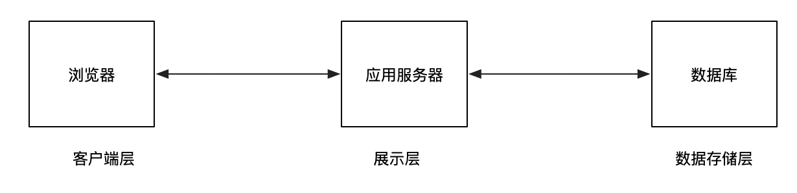
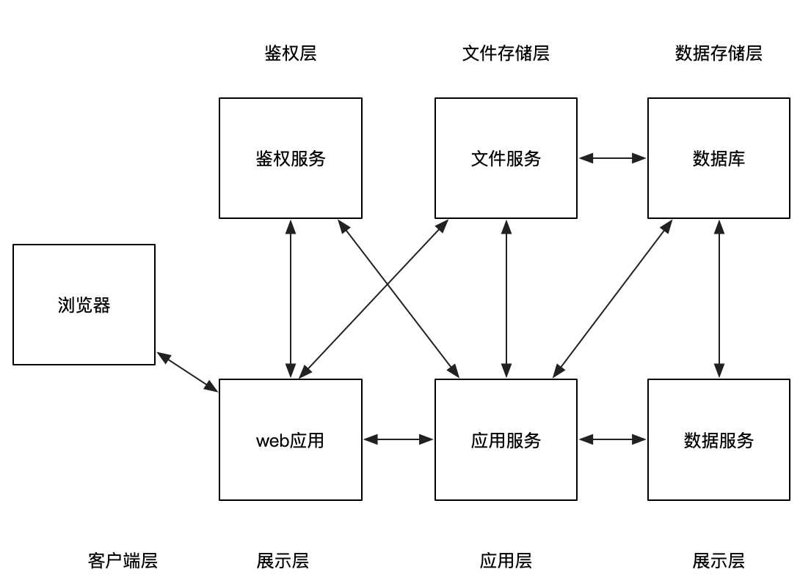
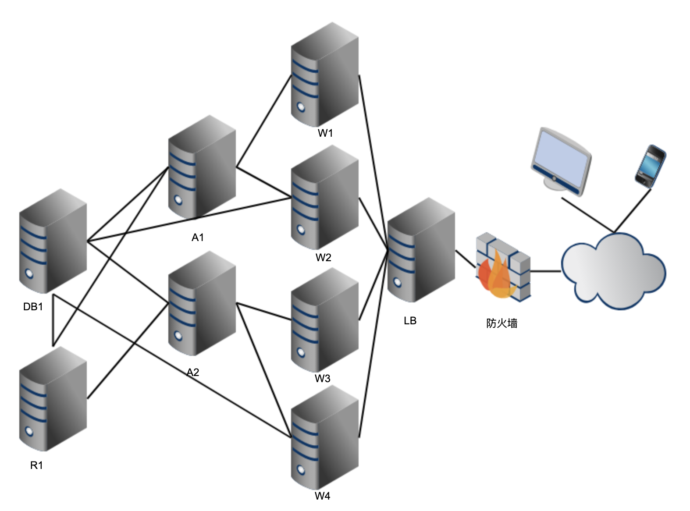
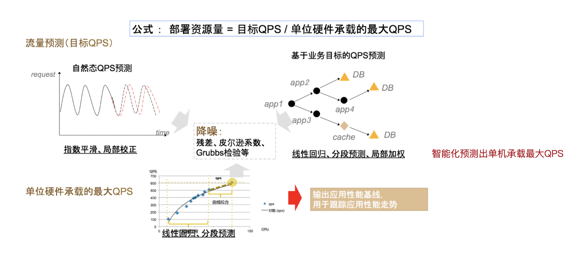
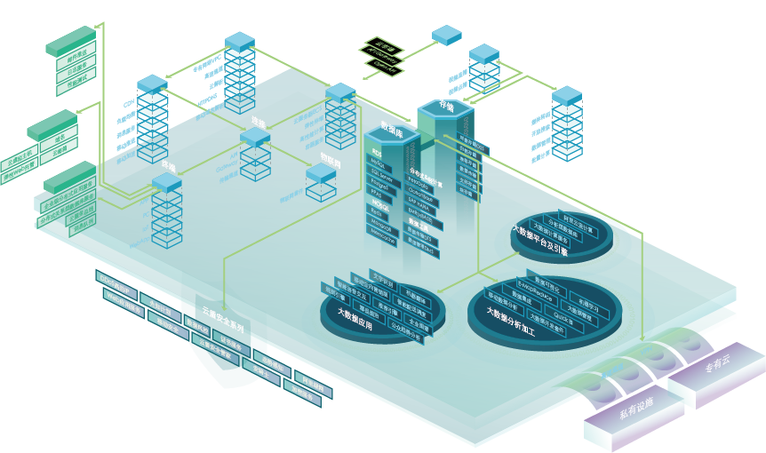
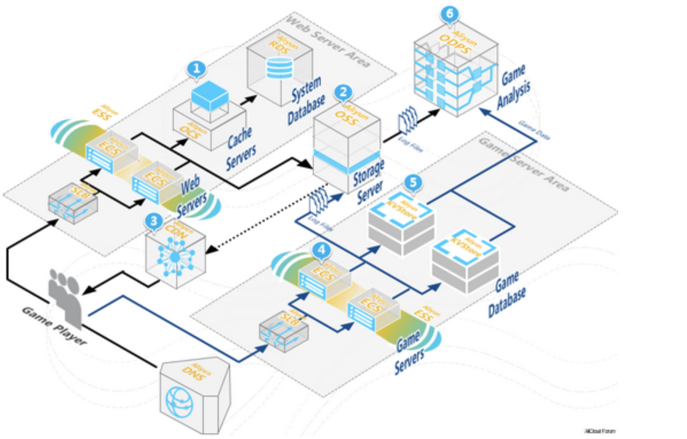
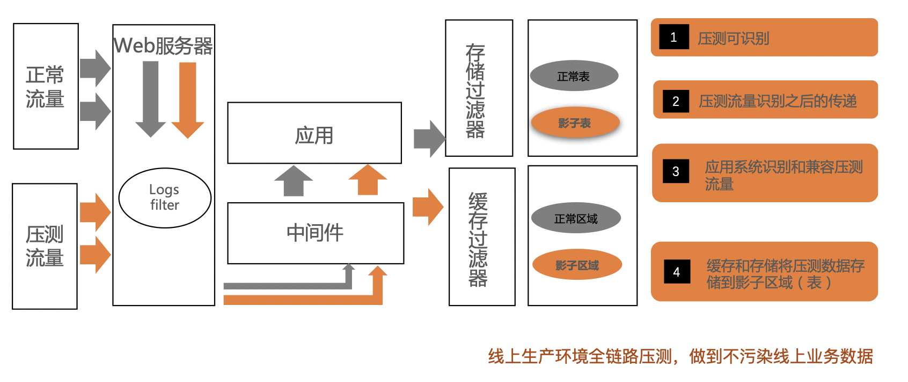

如何做好性能压测环境的设计和搭建
=======================

[性能压测](#)，是保障服务可用性和稳定性过程中，不可或缺的一环，但是有关性能压测的体系化分享并不多。从本期开始，我们将推出**_《Performance Test Together》_**（简称PTT）的系列专题分享，从性能压测的设计、实现、执行、监控、问题定位和分析、应用场景等多个纬度对性能压测的全过程进行拆解，以帮助大家**构建完整的性能压测的理论体系，并提供有例可依的实战经验。**

一般来说,保证执行性能压测的环境和生产环境高度一致是执行一次有效性能压测的首要原则。有时候,即算是压测环境和生产环境有很细微的差别,都有可能导致整个压测活动评测出来的结果不准确。

性能环境要考虑的要素
----------

**1\. 系统逻辑架构**

系统逻辑架构，即组成系统的组建，应用之间的结构，交互关系的抽象。最简单最基本的就是三层架构。  
  
  
三层逻辑结构图

*   客户层:用户请求端。
*   web层:处理客户端所有的业务请求逻辑和服务端数据。
*   数据库层:维护业务系统的数据。

更复杂的逻辑结构

以下是说明：

*   逻辑架构中的任意一层，有可能是在独立的物理集群机器上，也有可能跨多个物理机器或者跟其它逻辑层共享同一个物理集群
*   逻辑架构间的箭头是数据流，不是物理网络连接。

**2\. 物理架构**  
  
物理架构

**3\. 硬件、软件和网络**

*   软件:环境中涉及到哪里基础软件、中间件。
*   硬件:实体机/虚拟机,单机配置(CPU、内存、硬盘大小),集群规模。
*   网络:内网还是外网,网络带宽,是否有跨网段问题,是否隔离。

软件中对系统使用到的中间件有一个了解,不仅可以帮助设计更仿真的压测环境,也有助于在压测过程中,加快瓶颈,问题的定位和解决。

不同性能压测环境优缺点对比
-------------

##### 对比表格

| 压测环境方案 | 适用场景 | 优点 | 缺点 | 成本 | 阿里及阿里云客户应用情况 |
| --- | --- | --- | --- | --- | --- |
| 生产环境子集,少量服务器,低配置 | 项目开发交付初期,对应用本身进行性能问题探测 | 1.基于已有的测试环境搭建,相对难度小 2.成本较低 | 1.不完全仿真,无法压到全链路的问题,基础设施的瓶颈问题 | 低 | 阿里内部有一套独立完整的线下性能压测环境,与应用发布管理系统打通,被大量应用于项目开发前期的性能瓶颈探测场景 |
| 生产环境子集,少量服务器,同配置 | 服务器规模按照生产环境规模缩放,适用于容量探测 | 相比第一种压测结果更可信 | 1.按比例缩放的环境,压测结果也不能完全可信 2.底层基础设施的问题可能遗漏 | 较低 | 阿里内部智能容量规划系统所依赖的环境就是这种,按比例缩放的同配置压测环境 |
| 生产环境完全复制版 | 最理想的压测环境 | 1.压测效果能够保证 2.不受时间限制,随时可压 3.完全不影响生产环境的数据以及用户访问 | 1.成本相对高 2.单凭压测人员搭建,复杂度高 3.存在后续维护成本 | 高 | 阿里云上,PTS已有客户使用该复制环境进行全仿真的性能压测。阿里云上快速复制系统一样的环境用于压测,操作简单快捷 |
| 生产环境 | 评测生产环境性能的最直接真实的 | 1.压测结果易于被认可。2.节约成本 3.压测基础设施易于部署 | 1.影响线上真实的用户访问,所以需要在业务低谷进行 2.数据写入需要想办法进行隔离 | 较低 | 电商系的全链路压测,基于真实的线上生产环境进行 |

不管哪种压测环境方案，在落地成本，满足需求程度上都有区别，接下来对几种压测环境结合在阿里的应用进行介绍。

### 1、低配生产环境子集-研发阶段性能瓶颈发现

既然是低配环境,压出来的数据似乎完全不能用作生产环境运行的参考,但实际上,这种环境下的压测,也是非常重要的一环。主要体现在项目研发阶段的价值上。

**方案价值**

*   新应用上线前,应用代码本身的瓶颈发现。代码本身的性能问题,例如连接未释放,线程数过多,通过低配的环境,一定时长的压测完全可以提前发现很多。
*   应用维度基线数据。跑出来的数据不能给线上做参考,但是如果每次迭代,发布前,都在同一套低配环境运行性能压测,跟低配基线数据进行对比,也能起到衡量系统迭代的时候,性能是否有提升或者下降的参考。
*   帮助研发进行快速的性能调优。系统越复杂的时候,发生性能问题后定位的难度会指数增加。进行过性能调优的研发都有体会,有时候调优,就是改一个配置,然后重新部署,跑压测,看结果是不是改善了,直到找到最佳的配置。这个过程如果不能轻量起来,对于研发调优就是噩梦。

**存在的问题**  
构建低配环境,可以是普通的测试环境,跟线上完全隔离。但是要解决以下问题

*   压测会影响测试环境的功能测试。这一点很容易理解。压力大了,可能影响同一套测试环境的功能测试结果,所以性能压测环境最好独立。
*   依赖的基础应用在性能测试中没有。例如要压测的目标业务是发贴,肯定会依赖到用户相关的业务,用户中心就是一个基础应用(当然很多小型公司可能没独立这块业务)。
*   研发阶段无法快速部署要压的分支。有一点规模的互联网公司,一周的迭代,同一个应用可能会有多个分支,需要支持快速部署指定的分支到性能环境。

**如何解决**  
阿里内部有一套完整的系统用于支撑阿里内部每日成千上万的研发阶段的性能压测需求。

### 2、同配生产环境子集-容量规划

**方案的挑战**

*   容量规划是一个持续的过程,如何减少人力投入,如何才能“无人值守”。
*   成本和效果平衡:尽量贴近线上运行环境,同时容量规划的数据对线上容量布置有很好的指导作用。
*   完全独立不影响线上。
*   随时可运行,结果可跟踪。

**存在的问题**

容量规划不是直接在生产环境进行的,因为生产环境的最终容量配比,是参考自容量规划产出的数据。在生产环境进行的压测,是最后的验收阶段,在容量规划完成之后。  
提供一套独立的的生产环境子集-隔离环境,用于容量规划要解决的问题：

*   构建的环境集如何定义,规模和架构如何贴近线上。
*   流量如何走到隔离环境。
*   隔离环境写的数据是否需要清理，如何清理?

**解决方案**

现在隔离环境就是最新容量规划生态中的重要基础。隔离环境的支持，才能支撑常态化的容量规划运行，持续不断的改进。

*   首先,提炼机器比例。基于线上核心应用的现有规模情况,提炼出一个缩小版的完全模型。即线上机器之间的比可能是5000:2000:1000,整体比例缩放100倍,在隔离环境的机器比是50:20:10。使用这种方式,有效的保证了同线上机器同比例,同时成本上做了很好的控制。
*   其次,确定隔离目标流量。根据接下来线上的目标流量大小,同比例计算出隔离环境应该支撑的流量,作为隔离环境打压测流量时的目标流量。
*   然后,通过压测流量从小到目标流量探索,边压边弹。
*   最后,收集隔离环境达到目标流量后,新的机器比例及数据。应用间的比例关系很可能已经有了改变,有的应用可能缩容,有的应用可能扩容,作为线上机器关系的参考。

当然这里面的涉及的技术细节还有很多:

*   全链路压测新应用：整个压测流量其实是沿用了线上压测的全链路压测机制,带流量标,数据落影子库的方式, 所以隔离环境写的数据不需要特殊的处理。
*   环境标隔离环境：流量同时会带上一个“环境标”,通过环境标的识别,接入层会把流量导到隔离环境,从而做到流量的环境隔离。
*   PTS首创"RPS"模式施压：在系统整体的流量数据获取上,我们摒弃了一直依赖备受追捧的"并发量"的方式。众所周知,业务提出来的目标一般会是,"希望峰值支持xxxx个用户登陆"这种,进行容量规划的时候需要将并发的用户数跟系统能承受的QPS,进行一个映射关系。我们容量规划就直接使用阿里云压测平台(PTS)的"RPS"模式,压出来拿到的QPS数据,直接是系统维度的数据,不用转换,这样也更减少了转换过程中的失真。
*   边压边弹技术：在隔离环境压测中,何时弹新机器,弹多少机器,整个过程如何控制,这里面包含了一整套完整精密的算法。整个过程示意图如下。

### 3、生产环境复制版-云时代的优势

**面临的挑战**  
生产环境复制版面临的挑战非常多：  
其中,如果要对生产环境进行完全的复制,将要面临以下挑战

*   复制生产环境服务器的架构
*   复制生产环境网络基础环境
*   复制生产环境的所有应用分层
*   网络带宽
*   数据库以及所有的基础数据集
*   负载均衡
*   ......

**存在的问题**  
对于传统时代的压测工程师来说,这样一系列的操作,就是新搭建一套“影子系统”了,看起来有点像不可能完成的任务。要完成上述任务，压测工程师面临巨大的挑战：

*   沟通协调几乎所有的技术部门(开发、运维、网络、IT...);
*   如果即用即销毁,那么劳民损财只用个一两次,成本太大;
*   如果持续维护，那么维护成本显然同样不可忽略;

所以我们很少看到有公司进行这样的“生产环境复制”操作。小型公司可能没那么多人力实现,大中型公司，成本就更加难以接受了。但是现在云化趋势的潮流中,这种方案开始体现出优其越性了。

**解决方案**  
我们先看一下阿里云的产品架构图  

产品服务非常丰富,但是不太利于我们理解和复制线上环境用于压测这个主题。具体到某一个场景的系统在阿里云的落地:  

搭建一个云上应用的最小集应该需要用到：

*   SLB-用来负载均衡；
*   ECS-用来部署业务应用；
*   RDS-用来存储业务数据；

  
如果要在阿里云上复制以上线上系统。  
step1 购买跟线上集群同规模同配置的ECS,部署应用;  
step2 复制线上RDS；  
step3 SLB配置新入口,指向复制环境;  
step4 开始线上压测;  
  
  
在阿里云进行生产环境复制有以下优势：

*   操作便捷。可视化界面,系统所需要的组建配置安装即可。插播一下,阿里云上的压测服务PTS将来有机会提供一键搭建和销毁性能环境的功能，彻底解放压测工程师。
*   架构信息清晰。阿里云上有“架构感知”的功能，可以直观绘制除业务系统在阿里云上的整体架构，准确直观，压测工程师不用再花很长的时间梳理系统的架构，还面临可能不准确的问题。
*   即用即毁，节约成本。复制一套线上环境，如果是足够复杂的系统，使用的组件多，流量大，成本问题肯定要考虑。传统时代搭建的成本本身就高，继续维护和再搭建的成本同样也高。但是云时代，就是点几个按钮搭建，点几个按钮销毁的过程，按使用量付费，验证完就释放，对于资源成本的浪费可控性很好。
*   机器配比根据情况可自由调控。在云上显然也可以快捷进行低配、同配生产环境子集复制，相对于非云化的系统同样有明显的优势。

生产环境-老生常谈
---------

谈分布式性能压测，就离不开全链路压测技术。目前，也有不少互联网企业开始构建自己的全链路压测体系，我们将阿里的实践浓缩成一张全链路压测模型图。  

总结
--

*   仿真的性能压测环境，是执行有效性能压测的前提。
*   不同的压测环境都有不同的应用场景,企业应根据自身情况进行选择。
*   规模中小的公司独立搭建一套隔离的压测环境成本高昂,可维护性差。
*   云时代的性能压测，阿里云上的PTS给高效压测带来更大的可能性。
