字节跳动全链路压测(Rhino)的实践
===================

1. 背景
------

随着公司业务的不断扩张，用户流量在不断提升，研发体系的规模和复杂性也随之增加。线上服务的稳定性也越来越重要，服务性能问题，以及容量问题也越发明显。

因此有必要搭建一个有效压测系统，提供安全、高效、真实的线上全链路压测服务，为线上服务保驾护航。

关于全链路压测的建设，业界已经有了非常多文章，但是涉及到具体的技术实现方面，却很少介绍。本文想通过梳理全链路压测系统从设计到落地的整个实践过程，来详细介绍全链路压测系统具体是如何设计，以及如何落地的。希望能从技术落地实践的角度，给同行业的同学一些参考和启发。

2. 解决方案
--------

2.1 业内实践
--------

全链路压测在业内已经有了广泛的实践，如阿里的 Amazon、PTS，美团的 Quake，京东的的 ForceBOT，高德的 TestPG等等，都为我们提供丰富的实践经验，和大量优秀的技术方案。我们广泛吸收了各大互联网公司的全链路压测建设经验，并基于字节跳动业务需求，设计开发了一个全链路压测系统 Rhino。

2.1 架构图
-------

Rhino 平台作为公司级的全链路压测平台，它的目标是对全公司所有业务，提供单服务、全链路，安全可靠、真实、高效的压测，来帮助业务高效便捷的完成性能测试任务，更精确评估线上服务性能&容量方面风险。

因此在 Rhino 平台设计之初，我们就定下以下目标：

*   安全：所有压测都是在线上完成的，所以理论上所有的压测对线上用户都是有损的。压测平台将从服务状态，以及压测数据两方面去保证压测的安全性。
*   高效：较少压测脚本编写成本，数据构造和压测监控成本，尽量自动化完成压测过程的各个阶段。
*   准确：精确的压力控制，准确的链路压测监控，精确的压测报告结果，以及性能 & 容量数据。
*   高覆盖：需要支撑公司内不同的业务线的压测需求，如搜索，广告，电商，教育，游戏等等。

Rhino 是一个分布式全链路压测系统，可以通过水平扩展，来实现模拟海量用户真实的业务操作场景，对线上各种业务进行全方位的性能测试。它主要分为控制中心 (Rhino Master) 模块，压测链路服务模块，监控系统模块，压测引擎模块，如图。（每一个模块都是由多个微服务来完成的。如下图每个实线图都代表一个微服务或多个微服务）。

3. 核心功能介绍
----------

搭建全链路压测平台，最核心主要有：数据构造、压测隔离、链路治理、任务调度、压测熔断、压测引擎、压测监控等。下面我们将从这些方面详细介绍下，在 Rhino 平台中是如何设计和实现的。

### 3.1 数据构造

压测过程中数据构造是最重要，也是最为复杂的环节。压测数据的建模，直接影响了压测结果的准确性。

*   对于服务性能缺陷扫描，性能调优，以及新上线服务，推荐构造 Fake 数据，来压测指定路径。
*   对于线上容量规划，性能能力验证，以及性能 Diff，推荐使用线上真实流量，使压测结果更贴近真实情况。
*   对于涉及到用户账号，用户登录态保持的情况，推荐使用压测专属测试账号，避免影响线上真实用户。

#### 基础数据构造

为了高效的构造特定的 Fake 压测数据，Rhino 压测平台提供大量数据构造方式：

*   CSV 文件：按列分割数据，字段名取 CSV 文件第一行。数据读取方式是按行递增循环。如果一个压测任务会拆分成多个 Job，那么数据文件也会拆分，避免 Job 之间的数据重复。
*   自增：变量类型均为数字类型。每次发压时 +1，到最大值后从最小值循环使用。
*   随机：变量类型均为数字类型。每次发压时随机生成。
*   常量：Constant，可自定义为任意值。
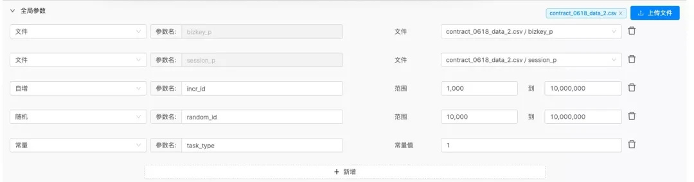
#### 压测账号

在压测过程中，有些压测请求需要进行登录，并保持会话；此外在很多压测请求中涉及到用户账号信息 UserID，DeviceID 等数据。用户账号的构造问题，一直是压测过程中非常棘手的问题。Rhino 平台打通的用户中心，设置了压测专属的账号服务，完美地解决了压测过程中的登录态，以及测试账号等问题。具体流程和使用界面，如下图。
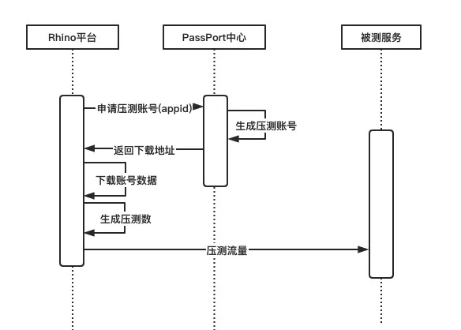
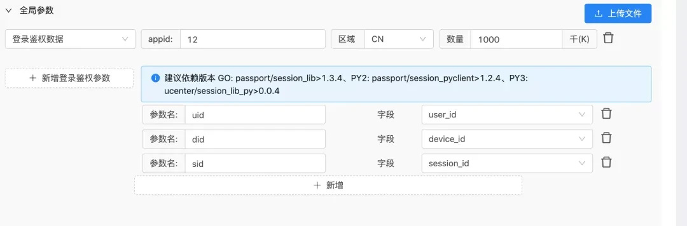

### 3.2 压测隔离

压测隔离中需要解决的压测流量隔离，以及压测数据的隔离。

压测流量隔离，主要是通过构建压测环境来解决，如线下压测环境，或泳道化 /Set 化建设，将压测流量与线上流程完全隔离。优点是压测流量与线上流量完全隔离，不会影响到线上用户。缺点：机器资源及维护成本高，且压测结果需要经过一定的换算，才能得线上容量，结果准确性存在一定的问题。目前公司内压测都是在线上集群上完成的，线上泳道化正在建设中。

压测数据隔离，主要是通过对压测流量进行染色，让线上服务能识别哪些是压测流量，哪些是正常流量，然后对压测流量进行特殊处理，以达到数据隔离的目的。目前 Rhino 平台整体压测隔离框架如图。
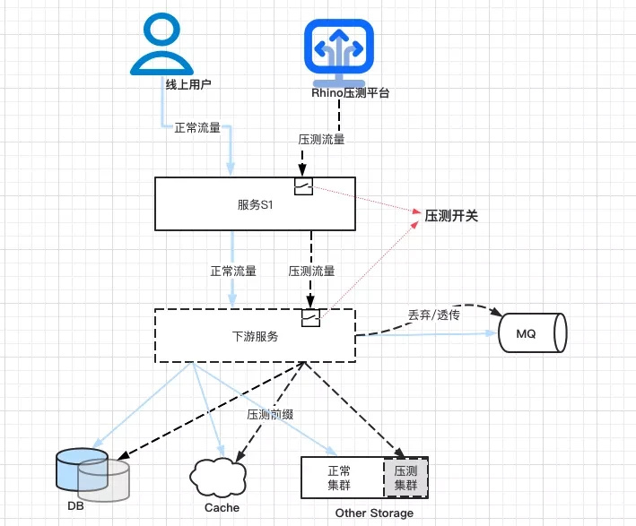

#### 压测标记

压测标记就是最常见的压测流量染色的方式。

*   对于 RPC 协议，会在请求的头部中增加一个 Key：Value 的字段作为压测标记。
*   对于 HTTP 和其它协议，会在请求头，自动注入一个 Stress 标记 (Key-Value) 。
*   压测标记 Key:Value，其中 key 是固定的 Stress_Tag 值，但是每个压测任务都有唯一的 Stress_Value 值，主要用于解决压测数据冲突，以及性能问题定位。

#### 压测标记透传

目前公司内各个基础组件、存储组件，以及 RPC 框架都已经支持了压测标记的透传。其原理是将压测标记的 KV 值存入 Context 中，然后在所有下游请求中都带上该 Context，下游服务可以根据 Context 中压测标记完成对压测流量的处理。在实际业务中，代码改造也非常简单，只需要透传 Context 即可。

Golang 服务：将压测标记写入 Context 中。

Python 服务：利用 threading.local() 存储线程 Context。

Java 服务：利用 ThreadLocal 存储线程 Context。

#### 压测开关

为了解决线上压测安全问题，我们还引入了压测开关组件。

*   每个服务每个集群，都有一个压测开关。只有打开压测开关时，压测流量才能流入到服务内，否则就会被底层微服务框架直接拒绝，业务层无感。
*   在每个 IDC 区域，都会有一个全局的压测总开关。只有打开了这个全局压测开关，压测流量才被允许在这个 IDC 内流转。
*   当线上出现压测问题，除了从源头关闭压测流量以外，关闭目标服务的压测开关，也能立即阻断压测流量。

#### 压测数据隔离

线上压测中，最复杂的问题就是压测链路中涉及到写操作，如何避免污染线上数据，并且能保证压测请求保持和线上相同的请求路径。业界有很多解决方案，常见的有影子表，影子库，以及数据偏移，如图 \[7\]。

Rhino 平台针对不同存储，有不同的解决方案：

*   MySQL、MongoDB：影子表。SDK 判断是否是压测流量，若是则根据配置映射至新表名。配置策略有两种，一是读写影子表，二是读线上表、写影子表。
*   Redis：Redis Key 加上 Stress 前缀。如 Stress_Tag=Valuex，那么读写 Redis 的 Key=Valuex_Key。这样可以解决多个压测任务数据冲突的问题。压测结束后，只需要对 Prefix=Valuex 做清除或过期操作即可。
*   MQ：对于消息队列，Rhino 平台有两种策略。一是直接丢弃，然后针对消息队列的性能，单独进行压测；二是在 Header 中透传压测标记，Consumer 根据压测标记和业务需求，再做特殊处理。默认走丢弃策略，业务方可根据需求进行配置。
*   其它存储，如 ES，ClickHouse 等，都有压测集群。压测时，会将压测请求打到指定的压测集群中。
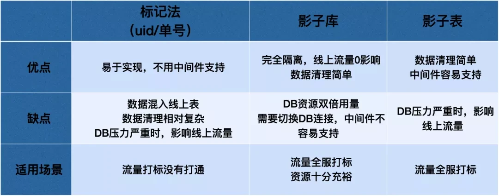

#### 服务压测改造

在压测之前，需要对服务进行压测验证。对于不满足压测要求 (即压测数据隔离) 的服务，需要进行压测改造。

1.  压测验证：对于存储服务，在不打开压测开关的前提下，通过压测请求，发送读写操作都是会被拒绝。如果没有拒绝，说明在操作存储服务时，没有带上压测 Context，需要进行改造。
2.  压测改造：压测改造是线上全链路压测推进中非常关键，而又非常困难的一个环节。对于已经上线的服务，压测改造还极有可能会引入新的 BUG，所以经常推动起来比较困难。因此为了解决这些问题，Rhino 平台有以下几个解决方案： a. 尽量减少代码改动，并给出完整的指导手册及代码示例，减少 RD 的工作量，降低代码错误的可能性。 b. 提供简单便捷的线上线下 HTTP&RPC 的压测请求 Debug 工具，方便代码改动的验证。 c. 对于新项目，项目开始初期，就将压测改造加入项目开发规范中，减少后期的代码改动。

### 3.3 链路治理

#### 链路梳理

请求调用链，对于线上压测是非常重要的：

*   提供清晰压测流量地图，并提供完整的链路监控。
*   完成服务依赖的梳理，检测压测所依赖的服务 / 中台是否具备压测的条件，是否需要压测改造。
*   链接压测开关管理，压测上下游周知等。

Rhino 平台通过公司的流式日志系统来完成调用链检索的。一个服务在被请求或者请求下游时，都会透传一个 LogID。RPC 框架会打印调用链日志（包括 RPC 日志 - 调用者日志，Access 日志 - 被调用者日志），所有日志中都会包含这个 LogID。通过 LogID 将一个请求所经过的所有服务日志串起来，就完成调用链检索。
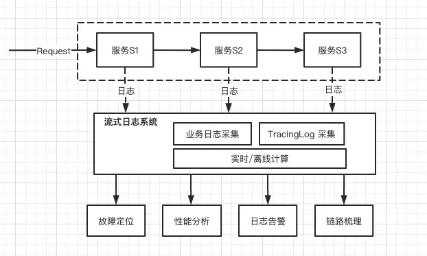

Rhino 平台在公司流式日志系统提供的链路梳理功能基础上，进行了进一步优化，以满足压测需要：

*   自动梳理：由于公司采用微服务架构，每个请求背后的调用链路及其复杂，单纯靠人工维护是无法完成的。用户只需要提供请求中 LogID，Rhino 平台就能快速梳理出该请求经过的服务节点，如图。
*   实时梳理：由于线上服务不断在变化，上线下线新增等，因此同一个请求的调用链也是不断变化的。Rhino 平台建议一般使用 1 个小时内的 LogID 进行梳理。
*   多调链路合并：同一个接口，不同参数下的调用链是不尽相同的。Rhino 平台会将多个 LogID 梳理的结果自动进行合并，来补全调用链，保证链路梳理结果的准确性和完整性。

#### 压测周知

虽然 Rhino 平台对于压测有很多的安全保障措施，但是对于大型压测，保证信息的通畅流通也是非常重要的。因此在压测周知方面，Rhino 平台也提供了很多解决方案：

*   一键拉群：梳理完链路后，在压测前可以一键拉群，将链路中上下游服务的 Owner 拉到同一个群里，同步压测信息。
*   压测周知：每个压测开始执行时，都会向压测周知群里推送消息，如压测 QPS，压测时长等信息。
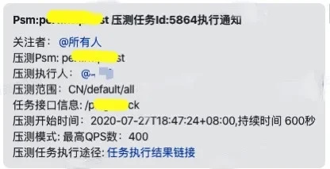

*   压测事件：在压测开始执行时，Rhino 平台还会向目标服务的事件队列中发送一个压测事件，方便快速评估 / 定位稳定性问题是否是压测导致，减少 RD 线上问题排查的干扰。

#### 压测开关管理

在压测之前，需要开启整体链路的压测开关的，否则压测流量就会被服务拒绝，导致压测失败。

*   一键开启：在压测执行之前，Rhino 平台可以一键开启链接上所有节点的压测开关。
*   压测开关开启周知：压测开关开启时，Rhino 平台会自动给对应服务 Owner 推送相关信息，确保服务 Owner 了解相关压测信息，上游会有压测流量会经过其服务。
*   静默关闭：压测开关到期后，Rhino 会自动静默关闭压测开关，以保证线上服务的安全。
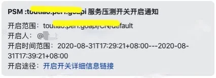

#### 服务 Mock

对于调用链中不能压测的服务 (敏感服务)，或者第三方服务，为了压测请求的完整性，就需要对这些服务进行 Mock。业界通用的 Mock 方案有：

1.  修改业务代码，修改服务调用为空转代码。优点：实现成本低。缺点：返回值固定，代码 & 业务入侵高，推动困难。如要 Mock 位置比较靠下游，超出部门覆盖业务范围，推动就非常麻烦。
2.  通用 Mock 服务。通用 MockServer，会根据不同用户配置不同 Mock 规则，执行对应的响应延时，并返回对应响应数据。优点：无代码入侵，业务方无感知。缺点：实现成本高。

由于字节整个公司都采用微服务架构，导致一次压测涉及链路都比较长，快速无业务入侵的 Mock。

方式成为了首选。Rhino 平台是通过公司 Service Mesh 和 ByteMock 系统来实现了高效的，对业务透明的服务 Mock。

压测执行前，Rhino 平台需要向 Service Mesh 注册染色转发规则，并向 Mock 服务注册 Mock 规则。然后在压测流量中注入 Mock 染色标记，才能完成服务 Mock：

a. 基于 Service Mesh 的染色流量转发。首先需要在压测流量中注入转发染色标记，并在 Service Mesh 中注册对应的转发规则。Service Mesh 检测到染色流量后，就会将其转发到指定的 Mock Server 上，如图。

b. 基于 Mock Server 的请求规则匹配。首先在 Mock Server 上注册 Mock 规则，以及匹配的 Response 和响应时延。当 Mock Server 接收到请求后，会根据规则进行响应，如图。
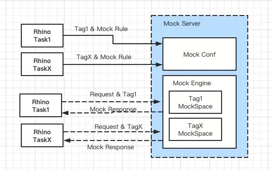

### 3.4 发压模式

#### 最小调度单元

Rhino 平台中，压测 Agent 就是一个最小调度单元。一次压测任务，通常会拆分成多个子 Job，然后下发到多个 Agent 上来完成。

*   最小化容器部署，减少资源浪费。压测对机器资源消耗是非常高的，通常 CPU &Memory 的使用率都在 80% 以上。但是没有压测执行时间内，机器资源使用率 <5%。如果长期占用大量的资源，将会对机器资源造成极大的浪费。压测 Agent 都采用容器化部署，并且每个容器的资源规格也尽可能小，这样既能满足日常压测需求，也不会占用太多的机器资源。
*   独占 Agent，增加压测执行稳定性：单个容器内只启动一个 Agent 进程，单个 Agent 同时只能被一个压测任务占用，避免多任务多进程的干扰和资源竞争，增加压测的稳定性。
*   动态扩容，支撑海量 QPS 发压：压测高峰期，Rhino 平台会临时申请机器资源，快速扩容，完成海量 QPS 的支撑。压测完成后，会立即释放机器资源，减少资源浪费。

2020 年春节抢红包压测中，Rhino 临时扩容在 4000+ 个实例，支撑了单次 3kw+QPS 的压测，但日常 Rhino 平台只部署了 100+ 个实例，就能满足日常压测需求。

#### 智能压力调节

*   动态分配压测 Agent：在压测过程，经常出现压测 Agent 的 CPU/Memory 使用率过高 (>90%)，导致压力上不去，达不到目标 QPS；或者压测延时过高，压测结果不准确的问题。Rhino 平台在发压的过程中，会实时监控每个压测 Agent 的 CPU/Memory 使用率，当超过阈值时 (>90%)，会动态分配额外的 Agent，以降低每个 Agent 的负载，保证压测的稳定性。
*   智能调节压力：在压测过程，通常需要不断的调节 QPS 大小，以达到性能压测目标。这过程非常耗费精力和时间。Rhino 平台，可以根据压测任务设定的性能指标，智能调节 QPS 大小，当达到压测目标后，会自动熔断，停止压测。

#### 压测链路模拟

Rhino 平台默认将全链路压测分为公网压测和内网压测。公网压测主要 IDC 网络带宽，延时，IDC 网关新建连接、转发等能力；内网压测，主要是压测目标服务，目标集群的性能，容量等。

*   对于内网压测，默认都要求同 IDC 内发压，减少网络延时的干扰。
*   对于公网压测，Rhino 平台在公司 CDN 节点上都有部署 Agent 节点，利用了 CDN 节点剩余计算能力，完成了公网压测能力的建设。

#### 同城多机房，异地多机房

Rhino 平台在各个 IDC 都有部署 Agent 集群。各个 IDC 内服务的压测，默认会就近选择压测 Agent，来减少网络延时对压测结果的干扰，使得压测结果更精准，压测问题定位更简单。

##### 边缘计算节点 Agent

除了多机房部署之外，Rhino 平台还在边缘计算节点上也部署了压测 Agent，来模拟各种不同地域不同运营商的流量请求，确保流量来源，流量分布更贴近真实情况。在 Rhino 平台上可以选择不同地域不同运营商，从全国各个地区发起压测流量。
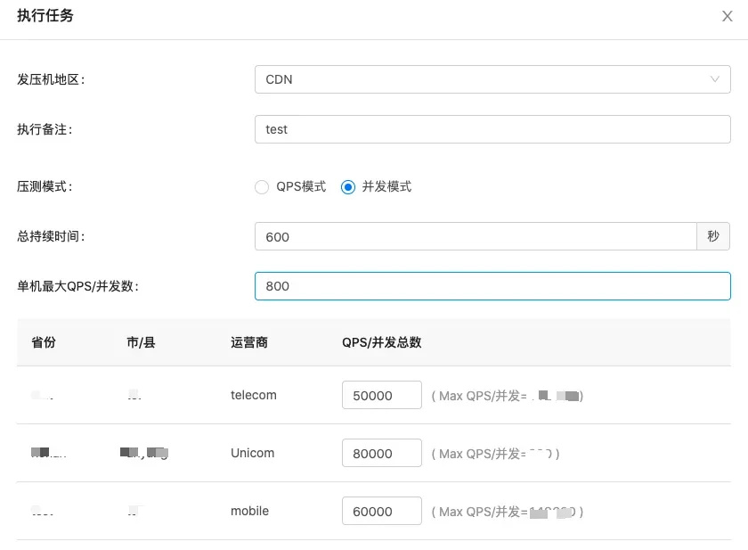
### 3.5 压测熔断

为了应对线上压测风险，Rhino 平台提供两种熔断方式，来应对压测过程中的突发事件，来降低对线上服务造成的影响。

#### 基于告警监控的熔断

每个压测任务，都可以关联调用链中任意服务的告警规则。在压测任务执行过程，Rhino 平台会主动监听告警服务。当调用链中有服务出现了告警，会立即停止压测。对于没有关联的告警，Rhino 平台也会记录下来，便于压测问题定位。
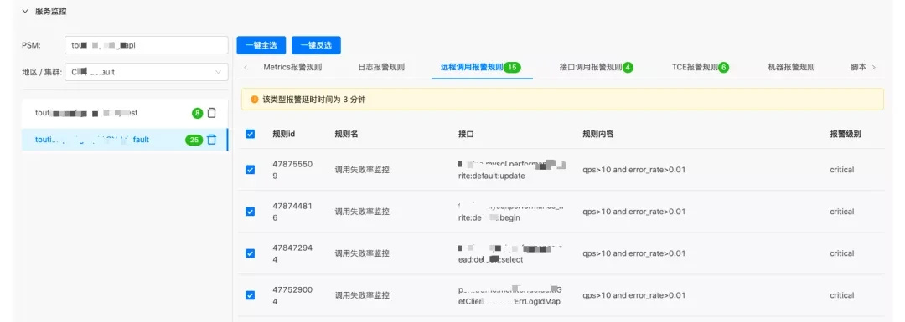
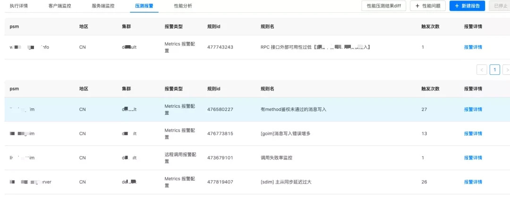
#### 基于 Metric 的熔断

自定义监控指标及阈值，到达阈值后，也会自动停止压测。目前支持 CPU、Memory、 上游稳定性、错误日志，以及其它自定义指标。

此外，除了 Rhino 平台自身提供的熔断机制以外，公司服务治理架构也提供了很多额外的熔断机制，如压测开关，一键切断压测流量；过载保护，服务过载时自动丢弃压测流量。

### 3.6 任务模型

#### HTTP 任务

对于 HTTP 协议，参考了 Postman，全部可视化操作，保证所有人都能上手操作，极大降低了压测的使用门槛和成本。
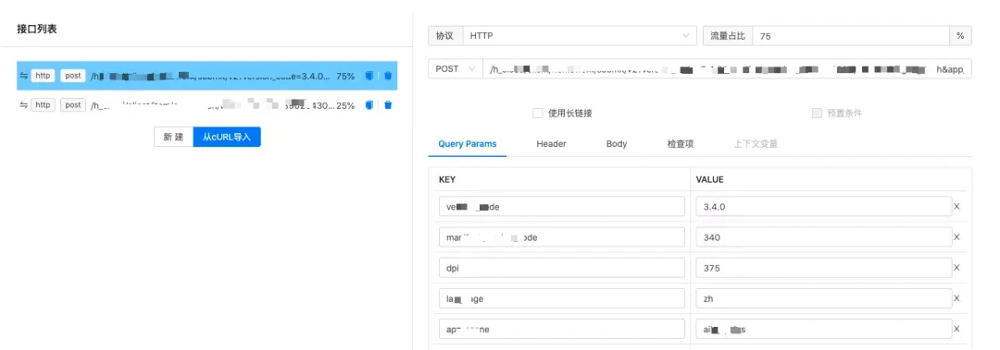
#### RPC 任务

对于 RPC 任务，Rhino 也自动完成了对 IDL 的解析，然后转换成 JSON 格式，便于用户参数化处理。
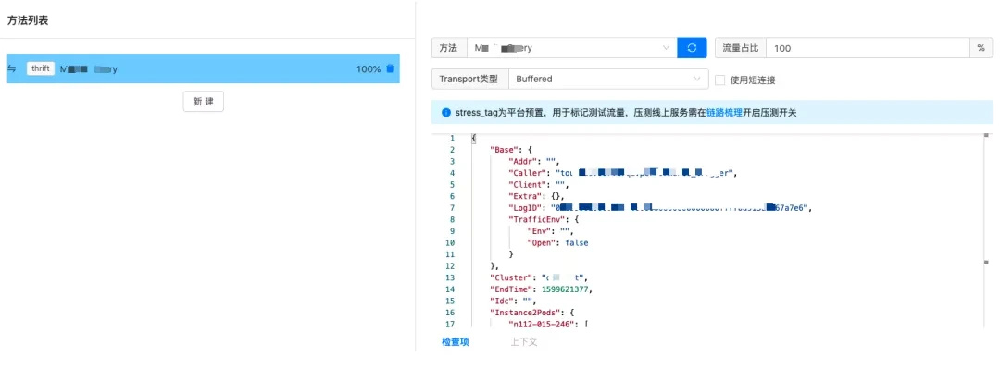

#### 自定义 -Go Plugin

对于非 HTTP/RPC 的协议，以及有复杂逻辑的压测任务，Rhino 平台也提供了完善的解决方案——Go Plugin。

Go Plugin 提供了一种方式，通过在主程序和共享库直接定义一系列的约定或者接口，就可以动态加载其它人编译的 Go 语言共享对象，使得主程序可以在编译后动态加载共享库，实现热插拔的插件系统。此外主程序和共享库的开发者不需要共享代码，只要双方的约定不变，修改共享库后也不再需要重新编译主程序。
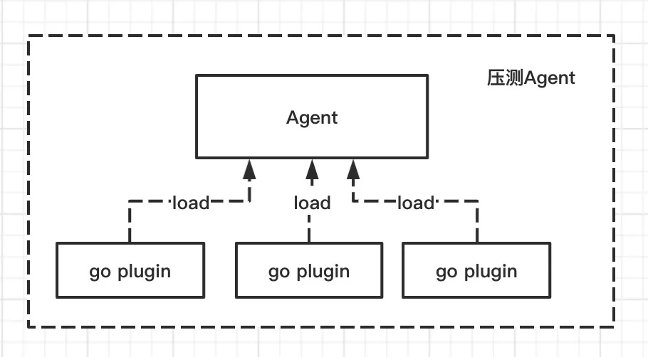
用户只要根据规范要求，实现一段发压业务逻辑代码即可。Rhino 平台可以自动拉取代码，触发编译。并将编译后的插件 SO 文件分发到多个压测 Agent。Agent 动态加载 SO 文件，并发运行起来，就可以达到压测的目的。此外，Rhino 还针对常见 Go Plugin 压测场景，建立了压测代码示例代码库。对于压测新手，简单修改下业务逻辑代码，就可以完成压测了。这样就解决了非常见协议，以及复杂压测场景等的压测问题。

### 3.7 压测引擎

#### 单 Agent 多引擎

压测调度的最小单元是压测 Agent，但是实际每个 Agent 中有挂载多种压测引擎的，来支撑不同的压测场景。Rhino 平台在压测数据和压测引擎之间增加了一个压测引擎适配层，实现了压测数据与压测引擎的解耦。压测引擎适配层，会根据选择不同的压测引擎，生成不同 Schema 的压测数据，启用不同的引擎来完成压测，而这些对用户是透明的。
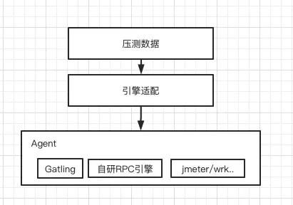
#### 压测引擎

在压测引擎上，我们有开源的压测引擎，也有自研的压测引擎。

开源压测引擎的优点是维护人多，功能比较丰富，稳定且性能好，缺点就是输入格式固定，定制难度大。此外 Agent 与开源压测引擎之间通常是不同进程，进程通信也存在比较大的问题，不容易控制。

自研压测引擎，优点是和 Agent 通常运行在单进程内，比较容易控制；缺点可能就是性能稍微差一些。但是 Golang 天然支持高并发，因此自研和开源之间的性能差距并不明显。

*   HTTP 协议：默认 Gatling ，单机发压性能非常好，远超于 Jmeter。对于智能压测，或动态调节的情况，会切换到自研压测引擎上。
*   RPC 协议：自研引擎，主要利用 Golang 协程 + RPC 连接池，来完成高并发压测。
*   GoPlugin 协议：自研引擎，利用 Golang Plugin 可动态装载的特性，自动装载自定义压测插件，来完成压测。

### 3.8 压测监控

#### 客户端监控

由于公司监控系统，最小时间粒度是 30s，30s 内的数据会聚合成一个点。这个时间粒度对于压测来说是比较难以接受的。因此，Rhino 平台自己搭建了一套客户端监控系统。

*   每个 Request 都会以请求开始时间为基准打一个点。
*   单个 Agent 内，会将相同任务相同接口，1s 内的打点数据在本地做一次汇总，上报到 Kafka 中。
*   监控服务会消费 Kafka 中的打点数据，将多个 Agent 上报的数据进行再次汇总，然后写入数据库中。
*   前端监控报表会实时拉取数据库中监控汇总数据，绘制实时监控曲线。
*   在监控数据汇总流程中，对于请求响应时间的 PCT99 计算，是比较难处理的：
    *   目前 Rhino 平台采用的 T-Digest 算法来计算 1 秒内的 PCT99。
    *   整个时间段内的 PCT99 的计算，则是以 PCT & AGV 的方式聚合。即单位时间内通过 T-Digest 计算 PCT99；整个时间段内的 PCT99，则是对所有点的 PCT99 取平均值。
    *   整体计算方案已与公司服务端监控算法对齐，目的是减少客户端监控与服务端监控之间的 Gap，减少压测结果分析的干扰因素。
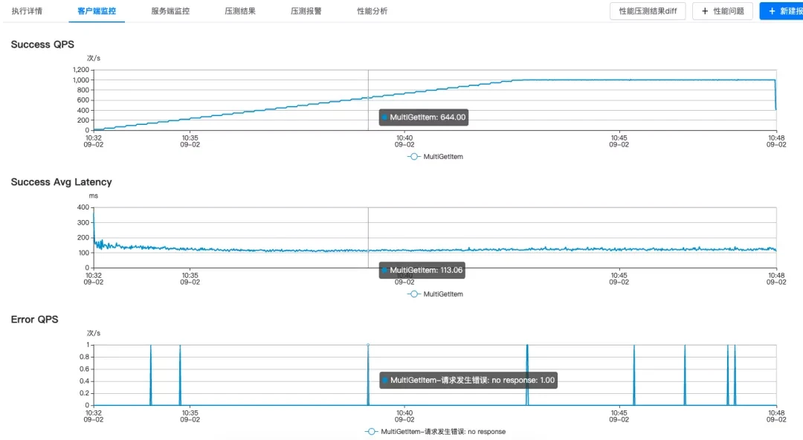
#### 服务端监控

服务端监控，直接接入了公司 Metric 系统。

*   在压测过程中，Rhino 平台会提供整条链路上所有节点核心指标的监控大盘，并高亮显示可能存在风险的节点，来提供实时预警。
*   对于每个节点也都提供了实时的，详细的监控曲线图。
*   对于每个节点默认提供 CPU、Memory、QPS 和 Error_Rate 等核心监控指标，用户可以在 Rhino 平台上修改监控配置，增加其它自定义监控指标。
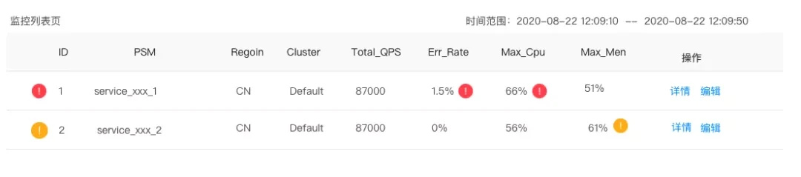
#### 性能 Profile

在压测过程中，Rhino 平台还可以实时采集目标服务进程的性能 Profile，并通过火焰图的方式展示出来，方便用户进行性能问题分析和优化，如图。

4\. 压测实践
--------

Rhino 压测平台是一个面向全字节跳动公司的，为了所有研发同学提供的一站式全链路压测的平台。Rhino 平台的研发团队，不仅负责 Rhino 平台的研发任务，还会配合 QA&RD 来完成公司大型项目，重点业务的性能压测工作。

### 4.1 重大项目支撑

公司内重大项目的压测，Rhino 平台都会积极参与，全力支撑的。其中，比较典型的项目有抖音春晚，西瓜百万英雄，春节红包雨等活动。

其中字节春节红包雨活动，完成是由 Rhino 团队来负责和完成的。字节春节红包雨活动是在春节期间，所有字节客户端发起的，诸如抽卡分现金，红包锦鲤，红包雨等一系列的超大规模的红包引流活动。其流量规模巨大，流量突发性强，业务逻辑和网络架构复杂度高等等，都对 Rhino 平台提出不小的挑战。

在春节红包雨活动中，所有用户流量都经过运营商专线接入到网络边缘的汇聚机房，然后经过过滤和验证后，再转发到核心机房。其中各个 IDC 互为备份，其具体流量路线如图。在这里，不仅要验证后端各服务是否能承载预期流程，还要验证各个专线带宽，各个网关带宽及转发能力，各 IDC 承载能力以及之间带宽等等。

为此，我们将整个压测拆分成多个阶段，来简化压测复杂性，也降低压测问题定位的难度：

*   通过拨测 /CDN 压测来分别验证各个汇聚机房的承载能力，带宽，以及网关性能。
*   在各个汇聚机房部署压测 Agent，来模拟用户流量分布，来压测部署在核心机房的后端服务性能。
*   单接口单实例压测，单接口单机房压测，场景化全链路单机房压测，场景化全链路全资源压测，分阶段来验证后端服务性能。
*   最后会通过全网拨测，来模拟真实春节红包雨高峰期流量，整体验证全系统性能。
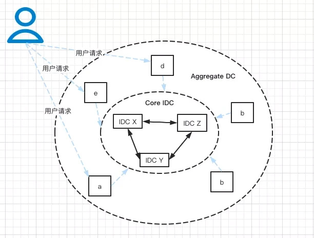
在这些大型项目的支撑中，Rhino 团队不仅学到了大量的业务和架构设计知识，还了解到业务研发同学如何看待压测，如何使用平台，帮助我们发现更多平台的问题，促进平台不断迭代优化。

### 4.2 日常压测任务支撑

日常压测支撑，也是 Rhino 平台非常重要的一项任务。对于日常压测中遇到的各种问题，我们采用了各种方案来解决：

*   专人 Oncall 值周，一对一指导。
*   详细完善的压测知识库，不仅介绍了平台如何使用，还包括压测如何改造，压测方案如何制定，压测问题如何定位。
*   完善的性能培训体系：定期开展性能测试相关分享，并对于 QA&RD 团队，也会开展专业的压测培训。

### 4.3 线上流量调度

Rhino 平台还实现了线上流量的定期调度，以达到线上实例自动压测的目的 ：

*   将线上流量逐步调度到目标实例上，来测试服务实例性能极限，并给出实例性能 Profile，分析出实例性能瓶颈。
*   通过长期的流量调度，来观察服务实例性能变化，以监控服务性能的变化趋势。
*   通过不同资源水位下的实例性能，来预估出整个集群容量。完成对服务容量预估，以及线上风险评估。
*   基于泳道化的流量调度，可以精确的预估服务集群容量。

其具体实现方案如下：

*   修改负载均衡中目标实例的权重 Weight 值，逐步调大该 Weight 值，将更多流量集中打到目标实例，直到达到设置的停止阈值。

目前已经有 500+ 微服务接入，每天定时执行流量调度，来监控线上服务性能变化趋势，如下图。

### 4.4 常态化压测

Rhino 平台目前还在公司内推行常态化压测，通过周期定时化的自动化全链路压测，来实现以下目标：

*   实时监控线上服务集群容量，防止服务性能劣化。
*   实时监控线上链路容量，防止链路性能劣化。

目前 Rhino 平台上的常态化压测，会周期定时，以无人值守的方式，自动执行压测任务，并推送压测结果。在压测执行过程中，会根据调用链自动完成压测开关开启，发起压测流量。实时监控服务性能指标，并根据 Metric 及告警监控，自动完成压测熔断，以保证压测安全。

目前已经有多个业务方接入常态化压测，以此保证线上服务的稳定性。

### 4.5 DevOps 流水线中的压测

服务在上线时，都会经过预发布，线上小流量灰度，线上全量发布。在这个过程中，我们可以通过线上测试 Case 以及灰度发布，来拦截服务线上功能缺陷。但是对于性能缺陷的拦截，却不够有效。

从线上故障跟踪系统里就可以发现，由于上线前没有做好性能压测，很多性能缺陷都逃逸到了线上。

为了拦截各种性能缺陷，Rhino 平台完成了 DevOps 平台的打通。将压测服务在 DevOps 平台上注册成一个原子服务 ，研发人员可以将压测节点编排在任意流水线的任意位置，实现上线前的例行压测。DevOps 流水线中的压测，不仅可以帮助 RD 发现代码中的性能问题，还能与性能基线进行 Diff，来发现代码性能变坏的味道。

5\. 总结与展望
---------

### 5.1 总结

Rhino 压测平台从立项到现在，不到两年的时间内，其发展已经初具规模，如图（每月压测执行统计）。这个期间，非常非常感谢公司内所有合作团队，尤其是架构团队，中台团队对压测平台的支撑，没有他们的支撑，全链路压测建设是难以完成的。
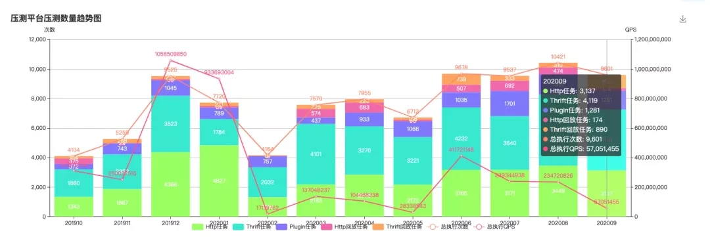
### 5.2 未来发展

#### 业务深层次定制化

通用压测平台已经初步搭建完成，基本上能满足业务线日常压测需求。但在日常压测支撑过程中，发现不同业务线在压测时，但是仍然有大量的前置和后继工作需要人工来完成。

如何更进一步降低业务方压测改造的成本，如何减少压测环境数据预置成本，如何快速完成压测数据清理，如何快速定位出性能问题等等，Rhino 压测平台后续将更进一步深入业务，与各大业务方开展更深入的合作，提供更深度的业务定制，为研发提效，助力业务线发展。

#### 压测与容量规划

业务目前资源是否充足，其具体容量是多少；按照目前业务增长，其机器资源还能支撑多久？

目前服务资源利用如何，是否可以优化，如何更进一步提升资源利用率，降低机器资源成本？

某大型活动，需要申请多少资源？是否不需要压测，或者自动化利用线上流量数据，或者利用日常压测数据，就可以给出上述问题的结论？

#### 压测与 SRE

如何保证服务稳定性，如何监控服务性能劣化并及时预警，限流、超时、重试以及熔断等服务治理措施配置是否合理？以及如何配合混沌测试进行容灾演练，保证服务稳定性等等，这些 Rhino 平台都会做更进一步探索。
