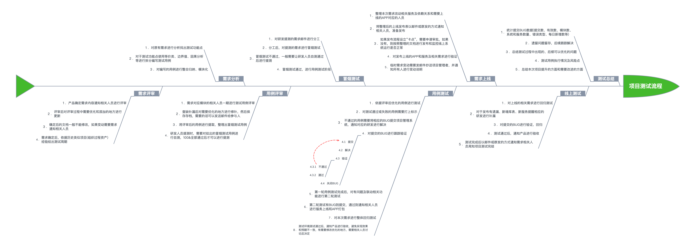
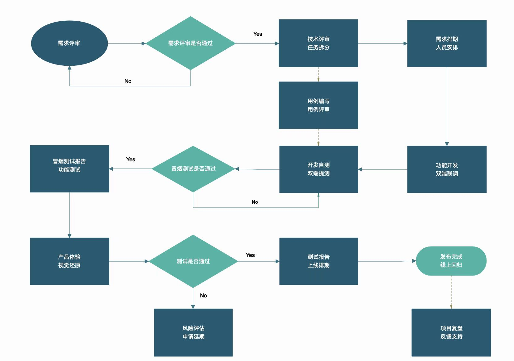
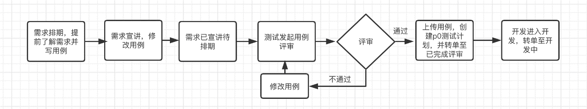

## 一、测试流程、计划和方案
# 
# 
# 
> **关键事项说明**：
- 在【需求评审会】上，产品标注需求优先级，确定技术Owner和测试Owner。技术Owner预估【技术评审会】时间，技术评审包括接⼝设
计、数据库设计、中间件设计、缓存设计等；测试Owner需要在技术评审前熟悉需求，并预估测试⼈⼒。
- 在【技术评审会】上，进⾏任务拆分，并确定前端、后端、QA的最终参与⼈员。
- 在【项⽬排期会】上，确定整体的迭代计划，包括前端开发时间、后端开发时间、联调时间、提测时间、⽤例编写时间、⽤例评审时间、测试截⽌时间、产品验收时间、发布上线时间。当需求较⼤时，不建议按照细分的开发任务进⾏提测（时间不好把控），可以按照需求优先级分两批进⾏提测，两批提测的需求和各时间点也要在排期会上确定好。
- QA需要组织【⽤例评审会】，⼀般要在联调开始前进⾏，并在会议结束后给到最终版本的测试⽤例，相关产品和主要研发⼈员预留好时间，
最好都能参与。
- QA需要在开始联调前将冒烟⽤例提供给研发⼈员（必须通知到技术Owner），技术Owner在联调过程中负责安排相关研发同学执⾏冒烟⽤例，并在Tomato（项目管理平台）对应迭代⾥将状态改为【联调中】，在执⾏冒烟⽤例的过程当中，有疑问及时联系产品、QA。同时QA需要在前端和后端研发联调时，关注联调进展，如果联调不顺利，需要提前介⼊，并及时上报风险⾄项⽬⼲系⼈，push问题解决。
- 联调完成后，技术Owner负责发送提测申请（邮件或者企微群），包括提测需求列表、测试环境、配置地址、代码分⽀关键信息等，并在Tomato（项目管理平台）对应迭代⾥将状态改为【待提测】
- 提测后，QA在1-3⼩时内，完成冒烟⽤例的执⾏，冒烟测试不通过，QA回复提测申请确认拒测（实际上继续在测试可测部分），并记录拒测次数，在测试报告和项⽬复盘时体现；冒烟通过，QA回复提测申请确认通过，并在Tomato（项目管理平台）对应迭代⾥将状态改为【测试中】，并进⾏后续测试。如果测试⼈⼒是⼤于等于3⼈⼒，QA需要每⽇在项⽬群⾥发送每⽇进度报告，同步进度和风险。
- 进⼊测试阶段后，QA视测试进展，提前预约产品和设计同学进⾏产品体验和视觉还原的时间（⼀般在测试环节的中后期），产品体验和视觉还原发现的问题，汇总问题list并发到项⽬群⾥，测试Owner负责跟进问题的解决进度，待全部问题解决并测试通过后，在Tomato（项目管理平台）对应迭代⾥将状态改为【验收】，通知产品和设计同学进⾏最终的验收⼯作，产品和设计同学验收通过后，发送验收通过结论。
- 测试完成后，QA需要发送测试报告，包括但不限于：测试结论、缺陷分析、上线步骤、舆情风险等
- 技术Owner收到测试报告后，在Tomato（项目管理平台）对应迭代⾥将状态改为【已完成】，上线前在产品研发群⾥预告，确保通知到项⽬⼲系⼈，研发确认发布完成后，及时通知QA进⾏线上验证。
- QA进⾏线上验证，验证完成后，同步结论到项⽬群⾥。
- 项⽬复盘，准备复盘材料，包括各个时间节点是否延期、需求变更次数、技术变更次数、缺陷分析

## ⼆、缺陷相关

**缺陷来源**：前端、后端、产品、设计
**缺陷类型**：界⾯错误、跳转错误、兼容问题、代码错误、需求缺失、需求歧义、配置相关、环境问题、安全相关、性能问题、其它
**缺陷状态**：待处理、处理中、已解决、已关闭、已拒绝、重新打开、延期处理
**缺陷概率**：必现、偶现

## 三、降低沟通成本

- 通过正确的方式进行沟通，让表述更容易理解，如果不确定BUG产生原因，直接说操作过程和现象，尽量一句话说清楚
  
    備註：注意沟通方式，礼貌沟通。如果沟通对象很忙，约个时间，约时间只需要几秒就能搞定

- 建立“共识”、避免对立，树立共同的任务目标，为了让产品顺利上线，为了不用加通宵班修复BUG

## 四、用例先行
# 

> **事項說明**：人力都在上一个迭代ing，后续又来了一个需求且排期比较赶，仅`宣讲`了需求->`开发完成`便展开了测试

此方案中需将在Tomato对应的需求单中新增一个五个状态（`待宣讲`，`已宣讲`，`待排期`，`待评审`，`已评审`）；`待宣讲`转单至`待排期`状态的权限仅`产品同学`拥有；从需求`已宣讲待排期`转单至`已评审`状态的权限只有`测试同学`拥有，也可以跳级改变状态，需有操作日志，便于后期跟踪

- 待宣讲：需求单（迭代单）建立之后自动赋予状态`待宣讲`
- 已宣讲：需手动将`待宣讲`状态变更为`已宣讲`
- 待排期：需手动将`已宣讲`状态变更为`待排期`
- 待评审：需手动将`待排期`状态变更为`待评审`
- 已评审：需手动将`待评审`状态变更为`已评审`

**整体流程：**提前一天时间获知产品即将宣讲的需求（产品需创建需求单以及拉群告知），安排相应人力进行需求测试用例书写，当需求正式宣讲后，根据宣讲情况对用例进行修改。此后，产品同学将需求单状态转为已宣讲待排期，测试同学拉起测试用例评审。当测试同学发起用例评审之后，如果评审通过，可以将需求单转单至已评审状态，转单的时候，会在评论字段中添加本需求的评审参入人员、时间、意见等评审信息以及p0测试计划链接。只有当需求单到达已评审的状态之后，开发同学才能转单至开发中。

**综合：**通过转单状态，来强行控制测试用例先行，通过转单的必填字段，来保证每一个需求的用例评审都有记录。

**疑难杂症：**
问题 | 解决方案
--- | :---
 获知需求排期难 | 推动产品提前给出预宣讲的需求以及优先级，测试同学提前介入了解需求 
 部分测试&研发同学走整个流程耗费时间比较长 | 先熟悉，试运行
 因不确定因素测试人力变更 | 加个评估写用例的时间和排期进去，写用例时间不要插其它需求进来测
 测试人力暂未释放，需求就来了 | 判断后者优先级，是否能抽一部分人进入下一个需求，或是否延期 
 时间紧，大版本且需求不明确情况下不能按时完成用例| 产品需提供合理的需求
 交互搞未即时定稿，后期优化体验问题| 需要规范 
 用例评审什么时候群内看，什么时候会议室评审 | 划分界限 
 单据状态转单不及时 | 强调项目Owner 
 没有评审，直接进入开发 | 测试同学可先转单，评审名单均写测试同学自己名字，同时在评审记录中填写未评审原因
 不需要测试介入的需求，如自测需求等 | 可联系测试业务接口人直接转单，转单时备注清楚即可。
 需求宣讲了很久才进入开发怎么办 | 现实中存在需求宣讲之后，需要很久或者被取消开发。建议只要是要做的需求，都进行用例先行，及时将单的 状态转到用例已评审。若有大量需求宣讲了而不开发，可统计数据反馈至产品最高负责人
 一句话，复用逻辑的需求 | 需产品将之前的逻辑也宣讲或协调人力为上一版接触过的人，避免未知模块踩雷
 到了发布节点，Bug数仍然过多或不确定因素导致无法在预期节点内测试完 | 通知项目Owner告知问题以及目前存在的风险
 耦合度很高的业务测试时间长且有后遗症 | 从代码修改范围精准缩小测试范围，定期解构

 ## 五、增强专业化测试团队建设

 1. 建立团队资源可视化协作共享平台（任何技术文档与经验总结都是可以共享化的）。
 2. 建立分类明确定义的文档体系（任何流程上的、可以记录的、具有步骤的过程都是可以文档化的）。
 3. 建立接口规范说明的测开平台（开发测试协同工作平台）：

　　1）上行参数+下行参数：在平台上可以编辑与显示接口的上行参数和下行参数的参数名称、类型、是否必须、含义、备注信息；

　　2）接口逻辑概述：在平台上要将接口代码的逻辑自动化整理并显示出来，也就是将接口代码中的注释段落内容按序进行显示；

　　3）接口代码项目地址、接口类名、接口方法名：测试人员可以在git上下载项目代码并找到相应的类和方法对接口信息进行查看；

　　4）接口代码开发注释规范化：接口代码中的注释要按指定规则进行编写，并且清晰的表述相应代码段落的逻辑；

　　5）接口测试自动化：针对接口逻辑编写测试代码并进行Jenkins持续构建。

### 六、增强开发测试意识

1. 开发人员也承担了质量的重任，质量从来就不仅仅是一些测试人员的问题。头衔有测试字样的人的任务是让那些头衔里没有测试字样的人更好的做测试。

2. 写一段代码就要测试一段代码，不要等着都写完了再写测试。Google测试人员少是因为保证质量是开发的事。如果某个产品出了问题，第一个跳出来的必是导致此问题的开发者，而非漏测该bug的测试人员。

3. 质量更像是一种预防行为，而不是检测。质量是开发过程的问题，而不是测试问题。

4. 开发者对自己开发的代码负责，比专职测试人员更适合做测试工作。

5. 测试人员的存在是为了让开发人员的工作更有效率，测试开发的工作是提高代码可测性，至于编写测试代码是开发的事。测开主要关注开发人员，确认开发人员在测试方面的工作是否到位。

6. 没有集成测试和系统测试，只分小中大型测试。小型的是开发完成的，对某个函数而言，针对单个模块进行。中型测试是测试开发写的自动化测试，关注涉及二个以上模块间的交互行为。大型测试针对三个以上功能模块展开，验证是否满足用户最终需求，属于结果驱动的模块集成测试。非自动化进行的测试叫探索式测试。咱们的checklist走查属于超大型测试了（第四级别的测试）。

7. TDD是开发者做的，他要针对自己即将编写的代码写测试代码，这就是测试先行。这里要注意，测试先行绝对不是测试人员的工作，而是开发者的工作。

8. 测开者的任务是负责开发出合适的测试框架，给开发人员使用，让他们编写测试代码能够更方便、更轻松。测开要指导开发写测试。测开要针对开发写的代码提出测试意见，指出哪些地方需要写测试，如果不好写测试就是代码写的有问题，得重构，这是必须的。 为什么要重构？就是让你的代码每一个部分都能够有充分的测试来保驾护航，这才是重构的意义。

9. 尽量不要做侵入式的修改，这种侵入式的修改多了，而且没有配套的测试保障，一定会引来bug。要对单个功能模块的逻辑非常清楚的前提下，才能够进行重构，在拆解出单元后立刻配套编写充分的单元测试用例不是最好的方法，最好的方法是在拆解单元前把单测写好，然后进行重构，这才是TDD，测试先行。有测试代码保驾护航的代码，才是质量的体现。

10. 每一个重要缺陷的修复，都要有一个测试用例与之对应。我们要尽量尝试把重要缺陷的发现过程写成自动化测试用例。

### 开发人员自测阶段需要保证
- 单元自测
- 接口测试，保证接口功能无误。（写清测试用例：请求数据及返回结果）。
- 功能流程走通，不出现页面报错，页面不存在等错误

### 软件提测标准
1. 确保本次涉及到的代码已code review
2. 提测前需开发人员自己走通所提测模块中所有功能，由开发人员和测试人员共同走通一遍基本流程后，交由测试人员测试。
3. 切换环境（如服务从dev切换到test或pro），需要开发人员自测一次，走通流程后，再提交测试人员测试。
4. 提测单写明提测模块，涉及相关的功能，页面，所需sql等一些前置条件。
5. Tomato修改对应状态，邮件抄送所有相关人员。

### 测试人员测试阶段需要保证
项目启动后，依据项目排期与开发人员协调，完成测试计划，提交项目负责人。
依据需求文档，编写基本测试用例。
Bug修改后依据测试用例完成回归测试。
测试结束后出具测试报告，确认所有Bug状态关闭或遗留有效。
