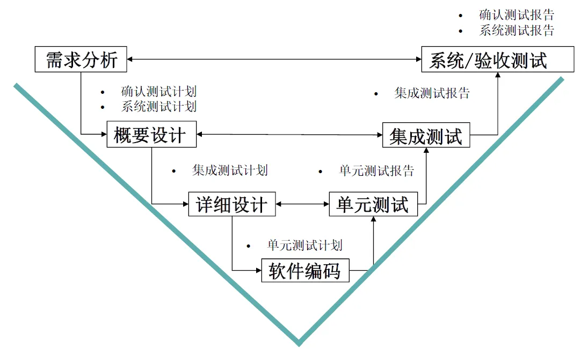
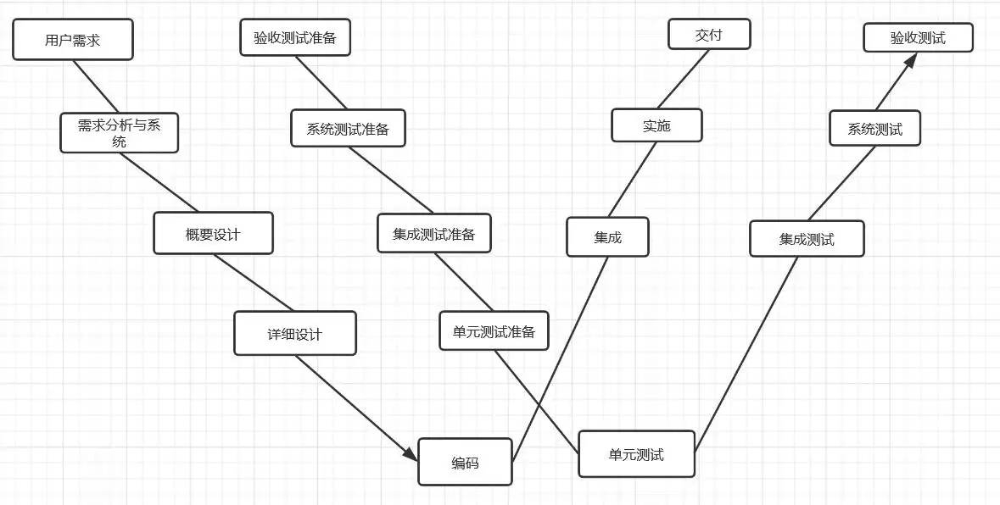
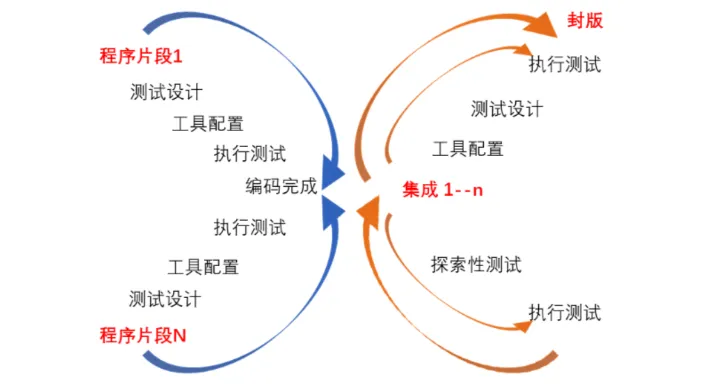
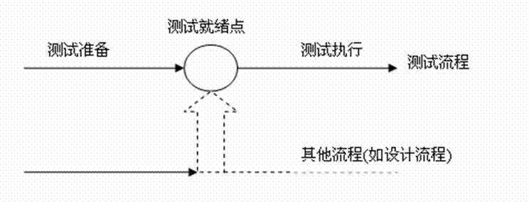

## 软件测试的常用模型：

### 一、V模型：将设计分为两个模型，将测试分为四个模块
- 优点：从左到右，非常明确地标明了测试过程中存在的不同级别，描述了基本的测试阶段和开发过程期间的各个阶段。
- 缺点：把测试作为编码之后的一个活动，不利于尽早的发现bug，测试风险大。

### 二、W模型：让测试同步参与开发过程。

- 需求分析-》概要设计-》详细设计-》软件编码-》单元测试-》集成测试-》系统测试-》验收测试
- 需求测试-》概要设计测试-》详细设计测试-》-》单元测试-》集成测试-》系统测试-》验收测试
- 优点：尽可能早的执行测试，增加了针对前期文档的测试，有利于尽早的发现问题，减少开发成本。
- 缺点：不支持迭代，仍然把开发活动看成是从需求开始到编码结束的串行活动，上一阶段完成后，才能开始下一阶段的活动

### 三、X模型：单独的单元设计开发测试，测试完成后凭借接口集成在一起。支持探索性测试。
- 优点：支持需求不断变化，并且加入探索性测试，便于发现测试计划之外，发现更多的缺陷。

### 四、H模型：强调软件测试活动完全独立，贯彻于整个产品的周期，与其它流程并行，只要测试准备点就绪，就可以开展测试。

### 五、敏捷测试AT模型：与敏捷开发模型对应

- 优点：支持高度迭代，有周期性，并且能够及时交付。
- 缺点：对测试人员要求高。
- 特点：
  - 开发与测试并行，项目周期快，模块提交快，测试时比较有压力
  - 注重团队沟通，测试人员几乎要参加整个项目组的讨论决策会议
  - 独立完成各项测试计划，测试执行工作
  - 具备良好的自动化测试框架支持进行快速测试
  - 在活动中关注产品需求，产品设计，解读源代码
