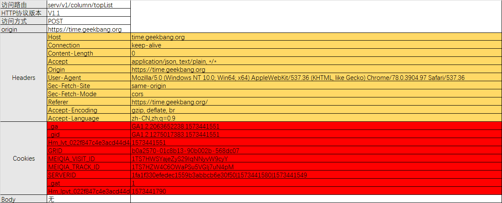

什么是接口？
------

接口就是**有特定输入和特定输出的一套逻辑处理单元**，而它不用知道自身的内部实现逻辑，也可以叫做接口的黑盒处理逻辑

由于服务对象不同，接口又可以分为两种

*   一种是系统或服务的内部接口
*   一种是外部依赖接口

### 内部接口

系统内部调用的接口

#### 内部接口的实际场景

购物流程，从登录系统，到加入购物车，再到支付订单，这一长串的流程中，都是通过系统内部接口来完成的

### 外部接口

外部系统对外提供的接口

#### 外部接口的实际场景

你在购物后点击付款时，页面会跳转到支付系统，等你完成支付流程后，再跳转回订单页，在这样的流程中，都会涉及系统对外的接口，还比如说付款工程的支付接口、配送过程的物流接口等等

### 接口的本质

**其实就是一种契约，遵循这样一种形式：**在开发前期，我们约定接口会接收什么数据；在处理完成后，它又会返回什么数据

什么是接口测试？
--------

接口测试，其实就是验证接口内部处理逻辑是否正确；我们既要保证**单接口的正确性**，也要保证接口的**业务逻辑正确性**，主要体现在两方面：

*   输入**正确**的测试数据，验证接口**正常处理后返回的结果**是否正确（数据结构&数据内容）
*   输入**异常**的测试数据，验证接口能否**正确处理异常数据并返回特定提示**，是否合理，是否健壮

#### **简单来说**

*   正确接受合法 Request 入参
*   正确拒绝非法 Request 入参

这两种情况都是要验证的，都属于正向测试

### 反向测试

*   正向测试相对应的是反向测试
*   **反向测试是指：** 测试流程的反向测试或者是功能的反向测试，这是一个在业务测试里的概念，例如：支付付款是正向测试，那么退款是反向测试

为什么说接口测试如此重要？
-------------

从它对项目的影响来说，**接口测试直接测试后端服务**，更加接近服务器上运行的代码程序，也更能发现影响范围广泛的 Bug。

### 越接近底层的 Bug，影响用户范围越广

随着中台化、服务化的发展，一套服务支持多种终端，例如 Android 端、iOS 端、Web 端等，这些服务都是由一套后端服务支持的。

如果在Web端发现一个界面问题，影响的只是Web端用户，倘若一个服务宕掉，影响的就不止是Web端，还有Android 端、iOS 端

目前流行的测试模型
---------

分层测试可以看到现在流行的模型更多偏向于接口测试

在质量保障过程中，我们的测试工程师会**不断增大接口测试的测试深度和测试广度**，往下逐渐覆盖一些公共接口的单元测试内容，往上则逐渐覆盖应该由 UI 层保障的业务逻辑测试，这么做的主要目的，就是为了更好地完成质量保障工作，交付一个可靠的、高质量的项目。

所以，从接口测试这一环节开始，测试工程师就变成了质量保障工作的主要推动者，接口测试也变得愈发重要。

### 接口测试的优越性

*   接口测试更容易和其他自动化系统相结合；
*   相对于界面测试，接口测试可以更早开始，也可以测试一些界面测试无法测试的范围，因此它使**测试更早的投入**这句话变成现实；
*   接口测试还可以保障系统的鲁棒性，使得被测系统更健壮。

不同协议形式的测试
---------

*   HTTP 协议的接口
*   RESTful 格式的接口
*   WebService 的接口
*   RPC 协议的接口

其实无论是哪一种形式的接口，它们都是通过某一种传输协议，在 Client 端和 Server 端之间来完成数据传递的。

假如测试的是 Web 端网站，那么 Client 端就是浏览器，Server 端就是 Web 服务，那么浏览器和 Web 服务之间，就是通过 HTTP 协议传输的；

测试的是移动端的app，那么 Client 端就是你的设备上安装的极客时间应用，Server 端就是 RESTful 格式的接口服务，那么极客时间的应用和 RESTful 格式的接口服务，就是通过 JSON 格式的数据来传递的。

**结论：**接口测试其实就是模拟调用方，比如 Client 端，通过接口通信来检测被测接口的正确性和容错性

接口测试工作场景
--------

### 单接口的测试

单接口测试的重点，其实就是保证该接口的正确性和健壮性。也就是说，你既要保证这个接口可以按照需求，正确处理传入的参数，给出正确的返回；也可以按照需求，正确的拒绝传入非正确的参数，给出正确的拒绝性返回。

**总结：**需要有足够的用例保证接口能正确处理各种正常情况和异常情况

### 业务流程的接口测试（多接口测试）

主要是保障通过多个接口的串联操作可以完成原来需求中提出的业务逻辑

**总结：**重点在于业务流程是否能跑通

**拓展：**我们更需要关心**业务流和数据流的关系**，并不需要再过度关心如何用业务流的方法覆盖更多的代码逻辑异常

### 多个接口串行分析

在大部分的测试场景中，我们都需要串行多个接口，才能完成一个完整的业务逻辑；多个接口之间并不是随意组合的，而是按照业务逻辑、通过数据传递来完成的。所以要完成整体业务逻辑的接口测试，需要理清每个流程的数据流程，而数据流程驱动了业务流处理

### 工作实践

分层测试中为什么在单元测试和界面测试之间要加入一层接口测试的主要原因之一。

*   通过单接口测试，可以更加接近于单元测试；
*   通过业务流的接口测试，可以更加接近于界面所承载的交互中的业务流验证

这也是为什么现在很多人在提倡将测试模型由原来的金字塔形往菱形转变的依据之一了。

### 接口测试总结

**接口测试的执行方式、设计思维都和业务测试不完全一致，它们既有交集又有差异。**

交集部分是它们都会涉及到业务逻辑测试，但是接口测试更加关注有数据流驱动的业务流程，而不再着眼于代码异常、代码边界等，这些边界问题在接口测试过程中已经由单接口测试完成了。

接口测试在单接口测试的设计思维上也更加贴近于代码的单元测试，但它还是站在 Client 端的角度来完成测试；而接口测试的业务逻辑测试更加靠近手工业务测试，但却更加聚焦于业务逻辑本身，不再将一些非法业务异常放到该部分进行测试。

**在测试手段上，接口测试算是技术驱动和业务驱动双管齐下的工作（界面测试却是业务驱动为主的工作）**

因此，你需要借助一定的工具来完成它。这个工具既有可能是成熟的工具，也有可能是你自己写的代码，因此，测试技术会在接口测试阶段，变得和业务知识一样重要。

关于接口测试中的Cookie
--------------

Cookie 中传递的参数很多都是用来确认用户身份、鉴定角色权限等需要的参数。

Cookie 内容是完成接口测试必须要模拟并传递的一些信息，因此，我们必须要尽可能完善它，使它成为接口测试的必要输入条件之一。

一般来说，当你测试一个接口的时候，你可以将接口的信息弄成一个表

被标注为白色背景的部分，是这次访问的基本信息；

被标注为黄色背景的部分，是访问的头信息，同时也是我们已知的内容，因为字段&值都是统一的

被标注为红色背景的部分，就是 Cookie 信息，是我们未知的内容（针对Cookie的各项参数我们需要向开发询问他们的含义）

需要了解Cookie哪些信息？
---------------

### 参数的含义以及来源

要知道参数的含义是拿来干嘛的，也要知道这个参数的赋值是从哪里来的，是从其他页面的返回值中得到的？还是 JS 生成的？如果是其他页面或者接口返回的，那么，是哪一个接口返回的哪个字段？这样，当你开始做接口测试的时候，你就知道去哪里拿到这个参数的赋值了。

### 参数的作用域

是指这个参数在这个接口中是做什么用的，它在哪一个访问周期里是一直存在的，它是否导致了业务逻辑分支等。比如说，这个参数是用来验证用户权限吗？它的验证算法是什么？之所以要搞清楚这些内容，是为了你在做接口测试的时候，可以设计更小的参数组合来覆盖更多的业务逻辑，这是测试用例去除冗余的一个很好的方法。

### 返回值的含义

针对接口返回的 JSON，你要搞清楚在返回值中，每一个 JSON 的 Key 所对应的含义，这样，当你需要和这个接口产生交互的时候，就可以快速地拿到对应参数的含义，完成业务逻辑上下文的参数串联了。 
