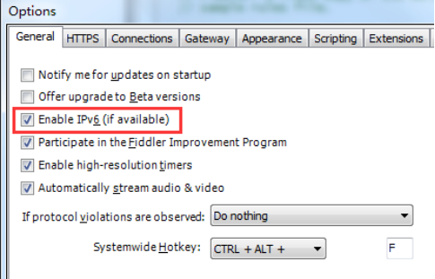
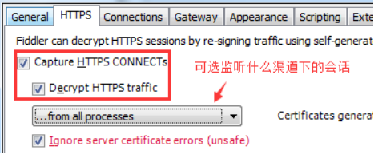
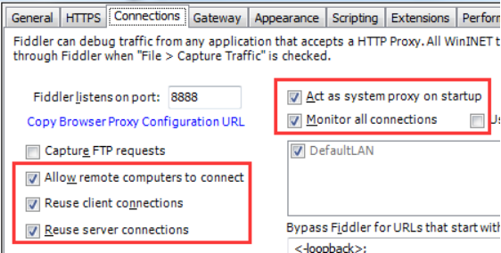
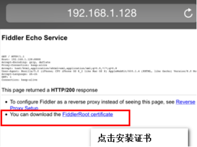
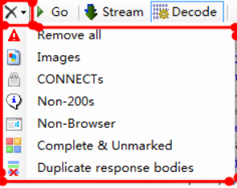
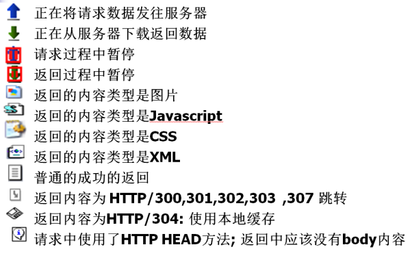
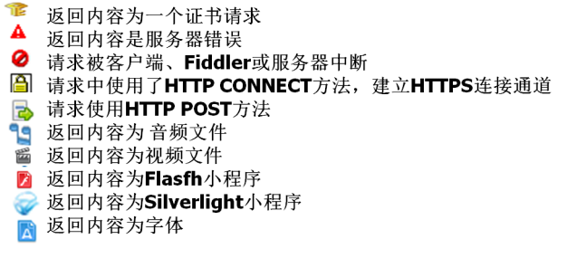
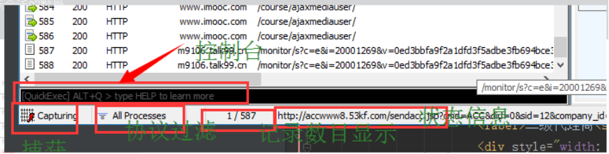
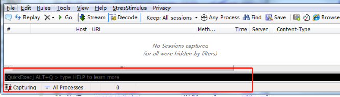

### 一、Fiddler常见设置

Options位置：Tools->Options

 

 

 

### 二、移动端连上Fiddler作为代理

注意：因为Charles也是默认8888端口，小心同时打开两个应用导致端口冲突。

#### 1\. IOS端连接Fiddler

##### 1.1 iOS 手机设置代理步骤：

a.点击wifi蓝色感叹号 ->点击底部配置代理 ->点击手动 ->输入服务器（IP）和端口（8888）

##### 1.2 iOS 安装步骤：

a.浏览器输入网址，提示是否允许显示描述文件，允许 ->安装描述文件

b.打开设置 ->通用 –>关于本机 ->证书信任设置

#### 2\. Android端连接Fiddler

##### 2.1 Android 手机设置代理步骤：

a.长按wifi修改网络 ->高级选项，代理，手动 –>输入服务器主机名（IP）和服务器端口（8888）

然后，手机浏览器访问IP：端口号安装证书

 

##### 2.2 Android 安装步骤：

a.浏览器输入网址 ->命名证书，确认即可

Fiddler界面介绍使用
-------------

### 一、基本界面


```

1、备注，添加之后在会话栏的Comment列中显示备注内容
2、Replay：再次发送对应请求【常用】
3、清除会话面板
4、Go：断点调试，点击go，执行下一步【常用】
5、Stream：代理模式。默认：缓冲模式。点击进行切换。
a.流模式streaming：将客户端的请求数据实时的传给服务端，更接近于浏览器本身的真实行为。
b.缓冲模式buffering：将客户端的请求数据缓冲起来，等数据写完之后再传给服务端。
6、Decode：解压请求。解压http请求里面的东西，帮助查看响应内容【常用】
7、 Keep：保持会话的数目
```

**清除列表**

 

```
清除所有对话
清除加载图片的请求
清除使用http connect方法的请求
清除状态码非200的请求
清除非浏览器发出的请求
清除已响应请求且未标记的请求
清除响应body一样的请求，只保留一个
```

 

1、Any Process：捕获请求，只看需要的请求。将“靶心”投向需要的请求

2、Find：查找请求，可以高亮所查找的请求【常用】

3、Save：保存会话

4、：截图，默认5秒后截图（电脑全屏）

5、：计时器

6、Browse：点击会话，再点击Browse，启动浏览器发送此请求，快速启动浏览器

7、Clear Cache：清空浏览器缓存

8、TextWizard：编码、解码文本内容，一般包含中文的请求都需要解码才能看到，所以复制url到TextWizard，然后选择URLDecode【常用】

9、TearOff：浮窗

10、msdn搜索：.net开发

### 二、会话图标





### 三、状态面板功能



1、控制台：可以输入一些命令行；输入help:可以看到常见的命令行；

2、capturing：fideler左下角，显示capturing表示正常工作；1、控制台：可以输入一些命令行；输入help:可以看到常见的命令行；

3、All Processes：过滤会话来源，web brower对会话进行过滤；

4、M/N 记录当前展示会话的数量；

5、状态信息：状态条显示。

### 四、命令行工具

 

#### 基础命令

```
<4k 筛选响应大小小于4kb大小的会话
<4000 筛选响应大小小于4000字节大小的会话
\>4k 筛选响应大小大于4kb大小的会话
\>4000 筛选响应大小大于4000字节大小的会话
?searchtext 筛选包含searchtext 内容的请求
\=status 筛选响应状态\=状态的会话
\=method 筛选请求方法\=方法的会话
@host 筛选包含host的会话
g、go 恢复所有断点会话
cls、clear 清除会话列表
start 开始监听会话
stop 停止监听会话
quit 退出fiddler
```

#### 命令行设置断点命令
```
bpu str 给包含str的url设置一个请求断点，只拦截请求，不拦截响应
bpu 清除请求断点
bpafter str 给包含str的url设置一个响应断点，只拦截响应，不拦截请求
bpafter 清除响应断点
bps 404 给状态码是404的请求设置一个断点
bps 清除状态码断点
bpm post 给请求方法为post的请求设置一个断点
bpm 清除请求方法断点
bold str 给包含str的url加粗
bold 清除加粗
```
