**Fiddler的功能面板**
----------------------------

**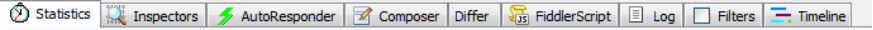**

**1、statistics：**请求的性能指标；全世界范围的性能测试；

RTP：一个请求的从发送出去到返回的时间；

Show chart可以看出图表的示例；

**2、inspectors:对请求解包：**

*   header：请求头信息。UA,cookie,发送请求来源。
*   textView:可以看到返回的数据；
*   imageview:可以看到返回的图片（如果有图片返回的话）
*   webforms:看到请求传递的信息；
*   cookies：请求携带的cookie；
*   response header：响应报文的头文件

**3、autoresponder:** 文件代理：可以使用fiddler来自定义请求返回的文件。

    当我们线上的出现bug的时候，可以使用线上返回 的文件在本地做一个修改，看看bug是否解除。

**4、composer：**前后端接口联调：可以将条目拖到composer然后进行模拟执行；伪造请求。不写js实现跟服务器交互。类似postman。

**5、log :** 使用fiddler的日志；

**6、filters：**过滤功能，可以很好帮助只显示我们关心的请求或者隐藏掉我们不关心的请求。

**7、timeline:** 网站性能分析，一个网站的请求多个网站请求进行，选中查看timeline查看请求详情。

**一、Statistics****数据****统计面板，性能****分析**
---------------------------------------

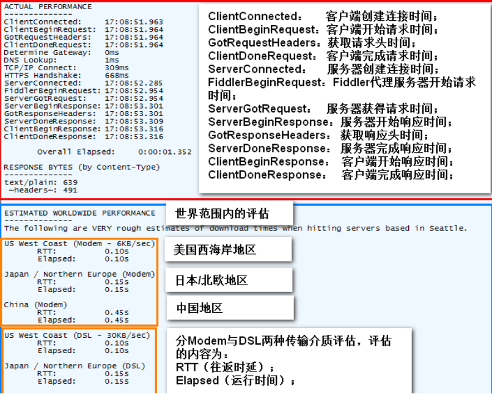

**重点****：**主要关注RTT，体现一个请求从发送到返回响应的时间

1.  反映一个请求的性能指标，其中主要需要关注RTT
2.  会展示全世界范围的请求平均数据
3.  show chart按钮，从饼状图中分别出哪些资源的请求耗时最多，从而对页面的访问进行访问速度优化

**二****、****Inspect****ors****查看****请求与响应**
-------------------------------------------

**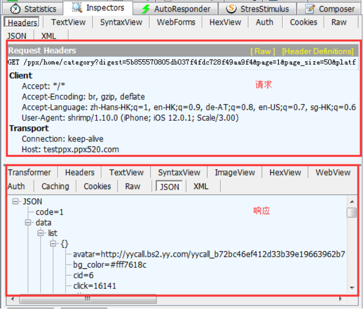**

**Headers****：**查看Header

**WebForms：**用表格的形式查看body的值和请求参数的值

**TextView/WebView：**无格式化查看数据

**Cookies****：**查看header中cookie的值

**Raw：**查看完整的消息结构

**JSON：**以JSON格式查看数据（类似Charles默认显示响应数据的格式）

**三****、****Filters****过滤器**
----------------------------

### 1、User Filters启用

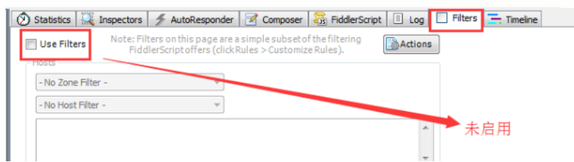

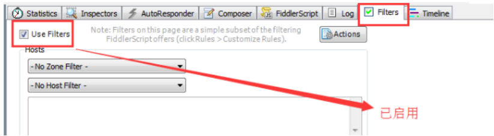

### 2、Action

Action：

*   Run Filterset now运行过滤器
*   Load Filterset导入过滤规则
*   Save Filterset保存过滤器到本地

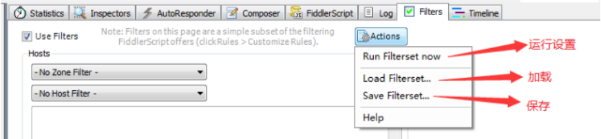

 **如下截图：**

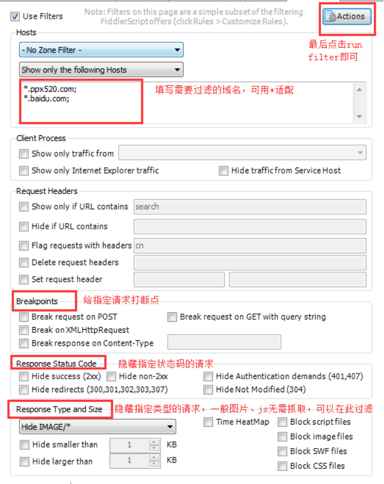

过滤监控会话，筛选和标记会话，或进行一些轻量级的修改；fiddler默认会检查http头中设置的host，标记或隐藏部分会话，选择隐藏的时候，fiddler仍然会代理通信的主机，只是将对应会话隐藏在监控面板

**（文本框内输入需要标记或过滤的域名，多个域名使用”;”分号分割）**

### 3、过滤器实际应用

#### 3.1 过滤器实际应用一：只根据域名进行过滤

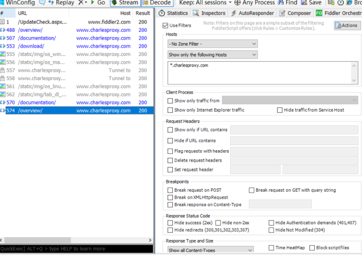

#### 3.2 过滤器实际应用二：根据域名进行过滤，并过滤掉图片类型的请求

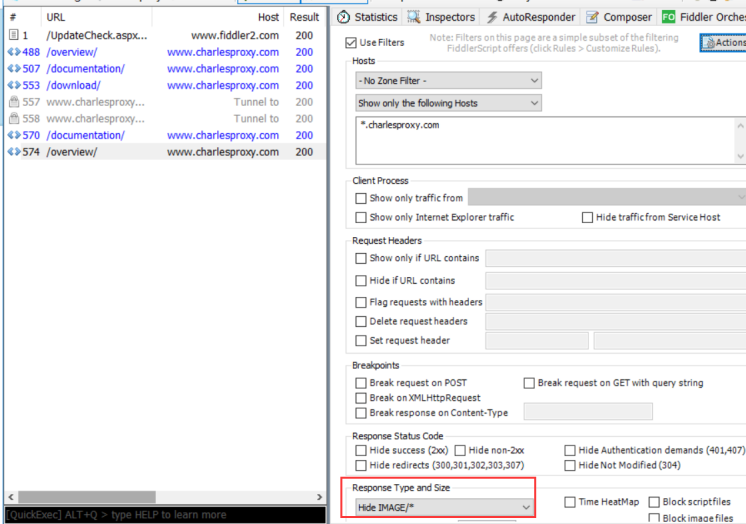　　

**四、****AutoResponder****请求重定向**
--------------------------------

**目的：**允许从本地返回文件，代替服务器响应，而不用将文件发布到服务器【可用正式环境验证本地文件】。

关于Fiddler的AutoResponder重定向功能，主要是时进行会话的拦截，然后替换原始资源的功能。

### 1、什么是请求重定向？

所谓请求无非就是需要调用到的一些资源(包括JS、CSS和图片等)，所谓重定向就是将页面原本需要调用的资源指向其他资源(你能够控制的资源或者可以引用到的资源)。

### 2、为什么要用这个功能？

*   AutoResponder类似于Charles的MapLocal功能，但是更强大，因为可以用正则去匹配；
*   平时我们可能需要观察某个请求返回特定的响应数据，但是该请求可能每次都会带有唯一的请求参数（如：时间戳），那就可以通过AutoResponder的正则去匹配该请求，无需url里关心唯一的请求参数，而且也可以根据Header的属性去匹配url；
*   甚至Fiddler还提供了多种response，不一定要自定义一个response。

**接下来，就是页面介绍：**

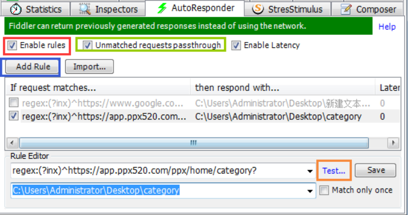

*   红色圈：执行匹配规则，就是用来启动AutoResponder
*   绿色圈：不匹配请求失败的url
*   蓝色圈：添加匹配规则
*   橘色圈：因为正则较为复杂，可以用Test去测试自己写的正则能否匹配上对应url

### 3、使用方法

**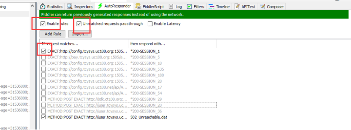**

1.  需要勾选enable rules、unmatched requests passthrough选项
2.  将左侧监控面板中截获到的请求，拖到Autoresponder面板中，选中该请求-右键-Edit response-textview，可修改服务端返回的内容（建议格式化之后再做修改，返回的内容结构会更清晰），点击【save】按钮，并勾选该请求前方的复选框——客户端重新发起该请求的时候，就会返回修改的内容。
3.  [http://www.bejson.com/](http://www.bejson.com/)    json校验格式化工具

**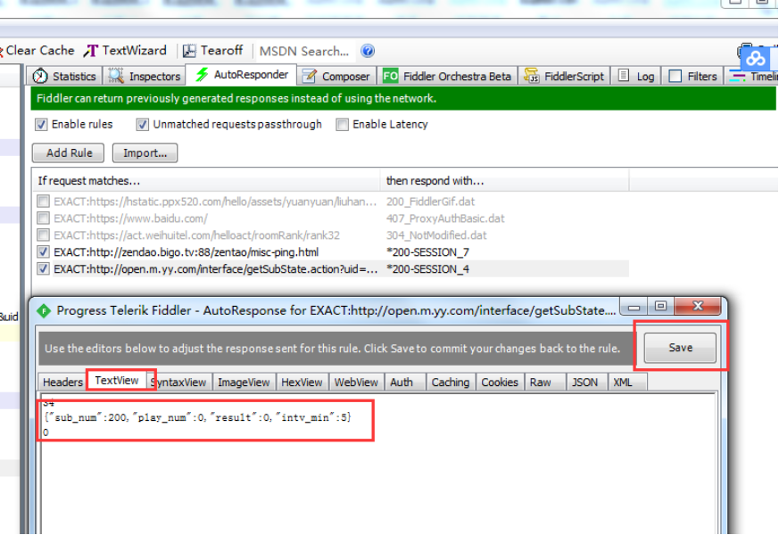**

**下方规则编辑框：**默认精准匹配，完全相同的请求地址才会被拦截，该编辑框支持正则表达式进行模糊匹配，如regex:(?insx).\*\\.(css|js|[**PHP**](http://lib.csdn.net/base/php "PHP知识库"))$  表示匹配所有以css,js,php结尾的请求url

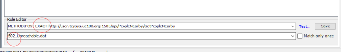

**下方规则下拉框：**可选择服务器返回不同的code值或返回一个本地文件；Fiddler支持的拦截重定向的方式：

**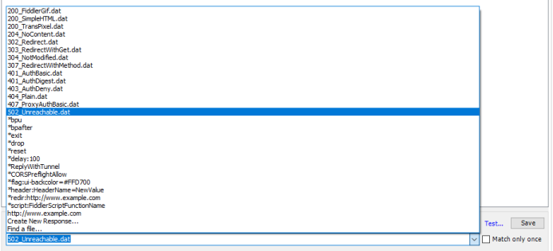**

### 4、AutoResponder具体匹配规则写法（重中之重）

**注意：**如果Test URL输入框中显示绿色代表匹配成功，显示红色则匹配失败

#### 4.1 字符串匹配（相当于模糊匹配）

**匹配规则：path1/** 

http://www.example.com/\*\*Path1/\*\*query=example

http://www.example.com/returnUrl=\*\*Path1/\*\*OtherPlace

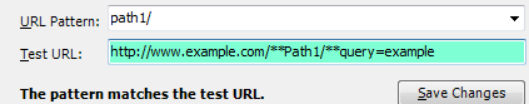

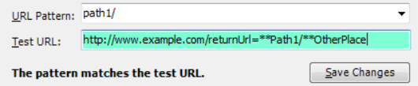

#### 4.2 NOT匹配

**匹配规则：NOT:path1/** 

http://www.example.com/Path2/query=example

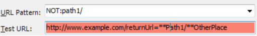

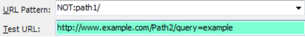

#### 4.3 EXACT精确匹配（完全匹配）

**匹配规则：EXACT:http://www.example.com/path** 

http://www.example.com/path

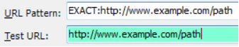

http://www.example.com/Path 

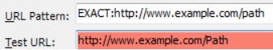

http://www.example.com/path/query=""

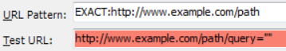

#### 4.4 regex正则表达式匹配  

.+ 一个或多个

.\* 零个或多个

（？insx）不区分大小写

\\ 转义

**匹配规则：regex:(?inx)^https://.+\\.gif$**

**简单理解：**https开头，.gif结尾的url

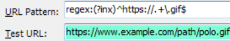

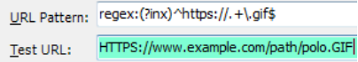

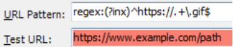 

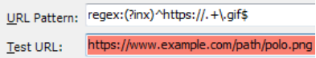

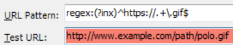

### 5、AutoResponder实际运用

#### 5.1 场景设计：返回404给客户端（Fiddler有自带的404响应可选择）

返回不同状态码可用于校验客户端是否正确处理错误码的展示效果

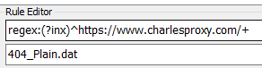

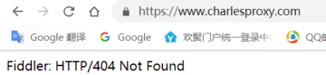

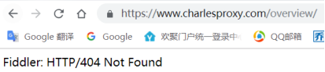

#### 5.2 场景设计：返回200给客户端（Fiddler有自带的200响应可选择）

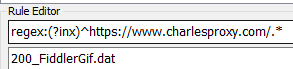

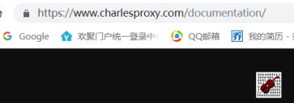

#### 5.3 场景设计：返回自定义response

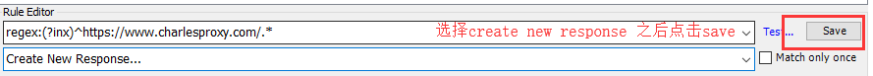

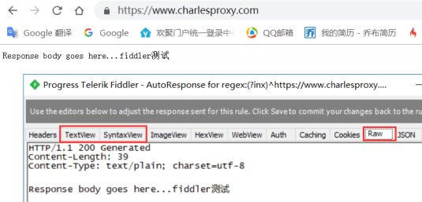

#### 5.4 场景设计：返回原始响应文件修改之后的本地响应（类似Charles的MapLocal）

首先，选中对应的请求》saveresponse》response body》本地修改响应

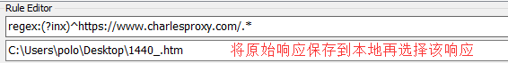

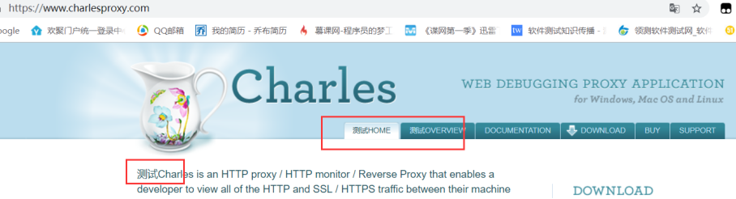

**五、Composer构造器**
-----------------

Fiddler Composer的功能就是用来创建HTTP Request 然后发送。你可以自定义一个Request, 也可以手写一个Request，你甚至可以在Web会话列表中拖拽一个已有的Request，来创建一个新的HTTP Request。

简单来说，Composer可以用来接口测试，支持前后端接口连调，支持多种类型的请求，如GET、POST。其中，POST请求的参数写在request body中、一般协议选择HTTP1.1。

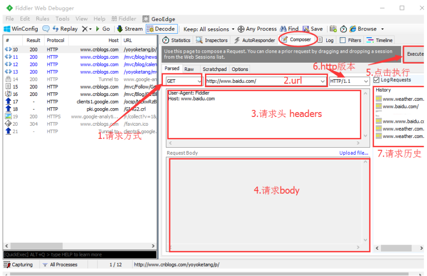

**Composer使用操作如下：**

1.  将左侧监控面板中截获到的请求，拖到composer面板中
2.  修改parsed框Request Body（post请求需要修改，get请求不需要修改）中的值
3.  点击右上角【Execute】按钮，即可按照修改后的请求头和参数值重新发起一次请求，重新发起的请求在左侧监控面板中可查看，修改后的请求内容在右侧history中有记录

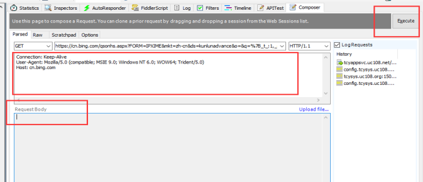

### 1、Fiddler Composer的优势

*   能从"Web会话列表"中，拖拽一个先前捕获到的Request，可以进行篡改数据；
*   发送Request后，可以设置断点，继续修改Request；
*   支持在Request中上传文件；
*   支持重复发送多次Request。

### 2、Composer的实操

**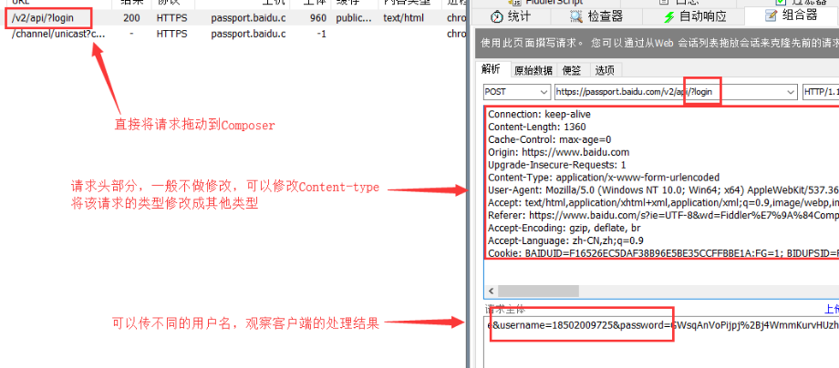**

**六、****timeline****网站性能分析**
----------------------------

选中多个请求，进行网站性能分析

1.  Y轴：发送的请求列表
2.  进度条为多线条型，则为缓冲模式；进度条为平滑的柱状，则为流模式
3.  绿色圆圈：连接被重用；红色圆圈：新创建的连接
4.  顶部圆圈：客户端连接到fiddler，下部圆圈：fiddler连接到目标服务器
5.  灰色箭头图标/红色！图标/绿色闪电图标：服务器返回一个错误代码（3XX，4XX，5XX）
6.  结尾处的红色X:意味着服务器发送了一个连接，连接被关闭或为private类型

 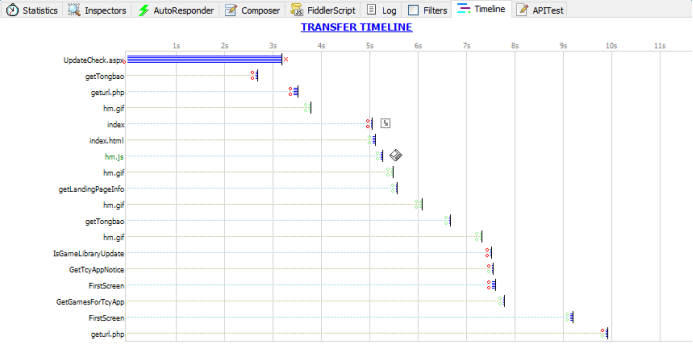
